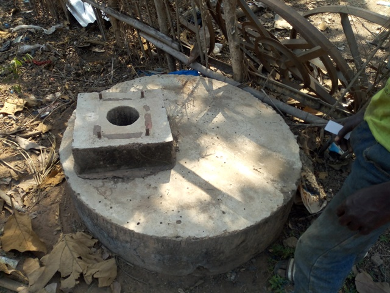
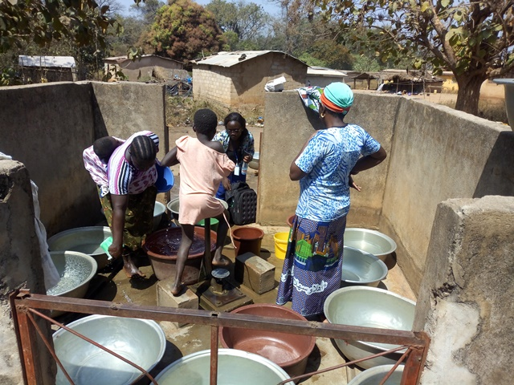

template: article
title: Assankouadiokro
iddbb: Assankouadiokro
slug: assankouadiokro
tags: Rural
authors: BROU Yves Oscar Kouadio, SORO Doba, MAILLARD Thomas, DIAKITE A. Cheick, KOHE A. Christelle, OUATTARA Mafine, SERI A. Jonathan, N'GUESSAN Firmain Kouakou
date: 2019-01-22
latitude: 7.82325
longitude: -5.0492
zoom: 16
localisation: Nord de Bouaké

|Informations générales||
|:--|--:|
| Nom de la localité : | Assankouadiokro | 
| Population : | 750 habitants | 
| Dessertes en eau potable | Pas raccordé au réseau SODECI | 
| Gestion des excrétas | Assainissement autonome | 

## Présentation de la localité
Le village de Assankouadiokro est situé à 9 km de la ville de Bouaké sur l’axe Bouaké-Katiola, il est donc accessible par une large route bitumée de 2 voies. C’est un village d’environs 600 habitants. 
Le village ne dispose ni d’une école ni d’un centre de santé. Les enfants se rendent au groupe scolaire de Bamoro, village situé à 1 km. C’est dans le centre de santé de ce même village que les populations vont se faire soigner. L’habitat dans le village est composé de maisons en terre crue ou en brique recouverte de paille ou de tôles. L'activité à Assenkouadiokro est essentiellement agricole avec des productions vivrières marchandes et la culture de rente d’anacarde.

## Socio-Anthropologie

Ansakouadiokro est un village Baoulé situé au nord de Bouaké. Le village est peuplé des Baoulés Fahafouè ou Pharis. Il appartient au canton de Konankankro. En ce qui concerne les infrastructures, le village ne dispose d’aucune école et d’aucun point de collecte d’ordures ménagères. Cette situation oblige la communauté à déverser les ordures ménagères dans la forêt juste derrière le village. De plus, il faut noter que la majorité des villageois ne disposent pas de toilettes dans leurs maisons. En effet, les anciennes constructions (cases) ne prévoyaient pas de toilettes, du coup, les villageois vont faire leur besoin dans la forêt. On observe également des excréments d’animaux partout dans le village et également à proximité des points d’eau.
L’organisation sociale reste identique à celle des autres communautés aboulées. Le chef de village avec sa notabilité, la présidente des femmes et son bureau et le président des jeunes. À cette organisation s’ajoute le comité de gestion de la pompe.

## Etat des lieux des infrastructures d’alimentation en eau
### Existants 
Le village de Assankouadiokro n’est pas encore raccordé au réseau de la SODECI. Le village possède deux forages équipés de pompe dont l’un est en panne depuis plusieurs années.
Nous nous sommes intéressés, pour notre étude, à la seule pompe fonctionnelle. 

Le forage a été construit en 1998 et est équipé d’une pompe à pieds. Le point d’eau a été financé par les habitants eux-même. Il a été placé à un espace public ainsi tout le monde peut venir puiser de l’eau.

La pompe tombe en panne environ deux fois dans l’année, car, unique point d'eau du village, elle est fortement sollicitée.
Le taux de vulnérabilité du point d’eau aux risques de contamination est moyennement élevé avec un score de 4,  à cause de la présence de broussailles et d’eau stagnante autour du point d’eau et des craquelures et fissures sur la dalle et la clôture.

Au niveau de l’analyse de la qualité de l’eau, nous n’avons trouvé aucune pollution majeure dans l’eau de la pompe. Néanmoins, nos analyses n’ont révélé aucune présence de chlore dans l’eau ce qui signifie que l’eau de la pompe n’est pas traitée.

### Pratiques et modes d’approvisionnement en eau
Le village n’étant pas connecté au réseau de la SODECI, toute la population utilise la pompe. Ils la considèrent comme potable. Les pannes récurrentes du forage les incitent à utiliser l’eau du marigot et de puits.  
### Gestion des points d’eau
La pompe de Assankouadiokro est gérée par un comité composé essentiellement de femmes. Elles s’organisent entre elles pour l’entretien et la surveillance de la pompe.
La cuvette d’eau est vendue à 10 FCFA et ce prix est valable pour tous les habitants du village. Ces fonds sont mis en caisse pour faire face aux éventuelles pannes. 

## Gestion des excréta
Ansakouadiokro ne dispose pas d’un réseau de drainage des eaux de pluie et usées. Ces eaux sont généralement déversées dans les cours des maisons.
L’assainissement y est autonome, chaque habitation gère ses eaux usées domestiques.

Moins de la moitié de la population dispose de toilettes à proximité des maisons. De ce fait, les personnes n’ayant pas de toilettes défèquent à l’air libre dans la forêt. Il faut également noter la présence d’animaux dans tout le village. N’ayant pas d’enclos, ceux-ci défèquent et urinent dans le village.

## Desiderata des habitants

| Type d'entretien | Date | 
| :-- | :--: | 
| Entretien individuel Chef de village Ansakouadiokro|22 janvier 2019| 
| Entretien individuel Présidente des Femmes Ansakouadiokro|22 janvier 2019|
| Entretien individuel Présidente du comité de gestion Ansakouadiokro|22 janvier 2019|  
| Focus group hommes Ansakouadiokro|22 janvier 2019|
| Focus group femmes Ansakouadiokro|22 janvier 2019|

La population de Ansakouadiokro souhaiterait:

1. être raccordé au réseau d'eau de la SODECI,
2. la réhabilitation de leur seconde pompe en panne,
3. obtenir des latrines et un point de collecte d’ordures.

## Tensions ressenties lors des entretiens
 
### Tensions générales

Aucune tension signalée. 

### Tensions autour de l'eau

Aucun conflit signalé autour des points d'eau malgré leur rareté.

### Tensions avec les localités voisines
Aucune tension signalée.

