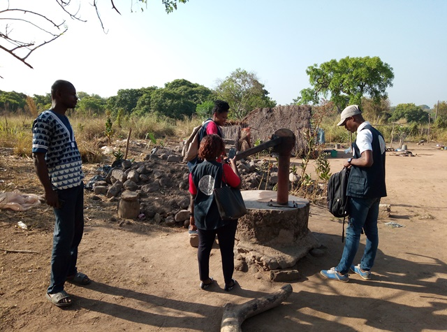
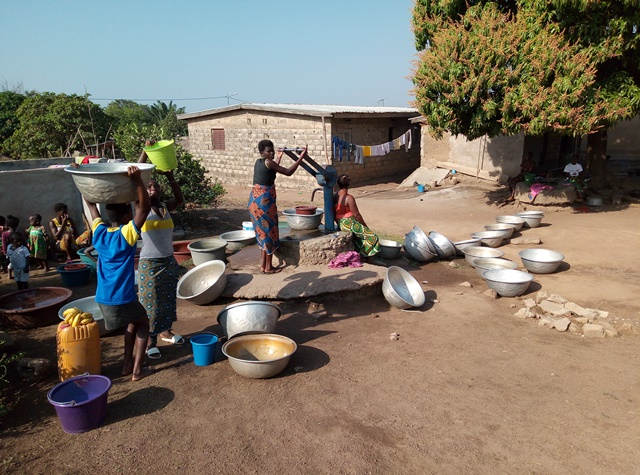
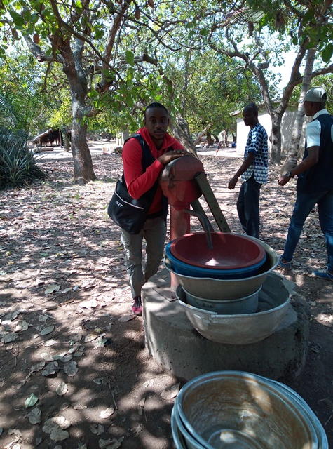
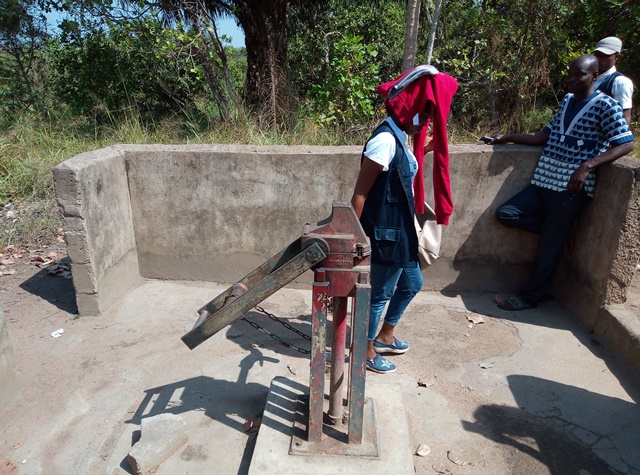
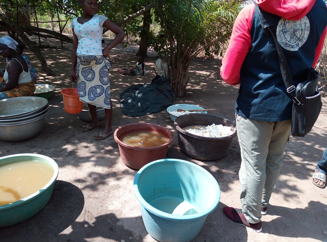
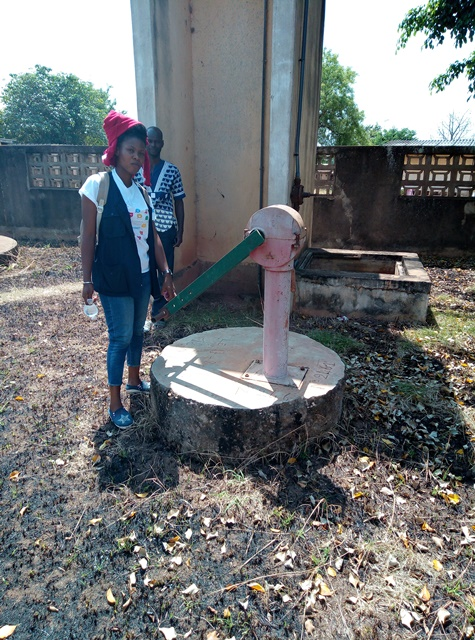

template: article
title: Bamoro
iddbb: Bamoro
slug: bamoro
tags: Rural
authors: BROU Yves Oscar Kouadio, SORO Doba, MAILLARD Thomas, DIAKITE A. Cheick, KOHE A. Christelle, OUATTARA Mafine, SERI A. Jonathan, N'GUESSAN Firmain Kouakou
date: 2019-02-06
latitude: 7.83092
longitude: -5.04844
zoom: 16
localisation: Nord de Bouaké

|Informations générales||
|:--|--:|
| Nom de la localité : | Bamoro | 
| Population : | 2000 habitants | 
| Dessertes en eau potable | Non raccordé au réseau SODECI | 
| Gestion des excrétas | Assainissement autonome | 

## Présentation de la localité
Bamoro est un grand village situé à 10 km de la ville de Bouaké sur l’axe Bouaké-Katiola. C’est un village de plus de 2000 habitants, facilement accessible par une route en terre battue à partir de la route nationale 3. 
Le village possède une école qui accueille les villageois des alentours et un centre de santé. **Bamoro accueille un important marché hebdomadaire.**

 Le type d’habitat est assez moderne. On y retrouve majoritairement des maisons en briques couvertes de tôles, mais aussi des maisons en terre battue couvertes de tôles ou de pailles.

Il n'y a pas de système de gestion des ordures ménagères, aussi celles-ci sont déposées en marge du village à la lisère de la forêt. Les habitations sont rarement équipées de latrines, aussi les habitants pratiquent la défécation à l'air libre à l'écart des habitations.

L'activité principale du village est l'agriculture vivrière (igname, manioc, riz et autres productions maraîchères tomates, piments et aubergines) et la culture de rente de l'anacarde. Chaque ménage élève quelques moutons ou quelques chèvres. Durant la saison des pluies, les animaux sont gardés dans des enclos pour qu'ils ne divaguent pas dans les espaces cultivés. On observe également des excréments d’animaux partout dans le village et également à proximité des points d’eau.
## Socio-Anthropologie

Le village est peuplé des Baoulés fahafouè ou pharis. Bamoro était autrefois un point de logement des ouvriers qui construisaient le chemin de fer. Village stratégique dans la zone avec un marché, Bamoro est électrifié, mais n'est pas raccordé au réseau de distribution de l'eau de la SODECI. 

Important bourg commercial, Bamoro accueille en plus des activités agricoles de nombreuses boutiques et artisans (garages, ateliers de couture, mototaxis).

L'organisation sociale du village est similaire à l'organisation classique des communautés villageoises Baoulé. Les affaires du village sont gérées par les notables formant une chefferie hiérarchisée qui intègre aussi des représentants des organisations de femmes et de jeunes. La chefferie intervient dans le règlement des conflits (intracommunautaires et extracommunautaires) et joue un rôle d'interface entre la communauté villageoise et les administrations publiques et collectivités territoriales.

Les habitants sont majoritairement issus des lignages fondateurs du village et les ménages sont constitués de famille nucléaire associant parfois des membres collatéraux (parents, cousins ou fratrie célibataire). Les tâches ménagères et en particulier l'approvisionnement en eau du ménage demeure l'apanage des femmes.

## État des lieux des ouvrages d’alimentation en eau potable
### Existant 
Le village n’est pas encore raccordé au réseau de distribution de l'eau de la SODECI, mais possède plusieurs pompes et des marigots. 
Les forages appartiennent pour la majorité à des particuliers. Les pompes construites par l’État ont été toutes abandonnées suite à des pannes répétées. En effet, certains chefs de famille ont installé une pompe dans leur maison suite à un programme d’hydraulique villageoise dans les années 1980. La gestion de ces pompes est du ressort des membres de la famille.  Ces pompes sont vétustes. Certaines sont en panne, d’autres abandonnées, et quelques-unes continuent de fonctionner. Les pompes tombent en panne en moyenne 3 fois dans l’année. Ce sont généralement des pannes liées à la tuyauterie. 

Nous avons inspecté pour notre étude  trois forages et un marigot.

 Le taux de vulnérabilité au niveau de ces points d’eau est faible avec des scores variant entre 0 et 2. Ce qui signifie que les points d’eau ne sont pas sujets à des risques de contamination. 
Au niveau de l’analyse de la qualité de l’eau seulement un forage sur trois a montré un taux élevé de nitrate. Nous n’avons trouvé aucune trace de *E. coli* dans ces eaux.

Le marigot est généralement utilisé par les personnes du troisième âge ou ceux qui n’ont pas les moyens de s’acheter de l’eau à la pompe. L’eau de marigot est aussi utilisée pour les travaux champêtres ou toute autre activité qui ne demande pas forcément une eau de qualité.
Les données au niveau du marigot ne révèlent aucune vulnérabilité aux risques de contamination et aucune pollution au niveau de la qualité de l’eau.

### Pratiques et modes d’approvisionnement en eau
La population de Bamoro s'approvisionne majoritairement aux forages, dans des puits communautaires et des marigots. Les pannes récurrentes des forages les incitent à privilégier l’eau du marigot.  Il faut souligner qu’il existe 9 PMH dans le village dont 3 fonctionnelles. Ces équipements sont largement insuffisants pour un village de cette taille.

### Gestion des points d’eau
La majorité des PMH sont privés et la gestion revient à la famille qui en est la propriétaire. Il existe cependant un comité de gestion des pompes. Les forages sont gérés par chaque famille auxquelles ils appartiennent. La fixation du prix de la bassine d’eau est laissée à l’appréciation de chaque gérant : les tarifs varient entre 10 et 50 FCFA la bassine. Chaque famille est chargée de l’entretien de sa pompe ainsi que de la réparation en cas de panne. 

 Les marigots sont éloignés du village, mais perçus par les femmes comme délivrant une eau de très bonne qualité. 
## Personnes ressources 
* L’artisan réparateur
* La présidente des femmes
* les membres du comité de Gestion

##Gestion des excrétas
L’on retrouve dans le village plusieurs types de latrines. Ce sont des latrines avec chasse d’eau, des latrines avec fosse septique et des latrines à fosse directe.
## Desiderata des habitants

| Type d'entretien | Date | 
 | :-- | :--: | 
Entretien individuel Chef de village |06 février 2019|
Entretien individuel Présidente des femmes|06 février 2019|
Entretien individuel Artisan réparateur|06 février 2019|
Focus group membres du comité de Gestion|06 février 2019|
Focus group hommes |06 février 2019|

La population souhaite:

1. être raccordé au réseau de distribution de la SODECI 
2. Réparer la pompe en panne et former les membres d'un nouveau comité de gestion
3. Apprendre à entretenir les puits et marigots du village
4. Obtenir des latrines et un point de collecte des ordures.

## Tensions ressenties lors des entretiens
 
### Tensions générales
Accueillir un marché hebdomadaire peut être une source potentielle de désordres. Cependant les habitants n'ont pas fait état de graves débordements.

### Tensions autour de l'eau

Ponctuellement des disputes éclatent autour des points d'eau à propos du respect des tours de passage dans la file d'attente ou du refus de payer le prix de l'eau au propriétaire de la pompe.

### Tensions avec les localités voisines
La fusion des trois villages limitrophes (Bamoro, Djèkro et Béssérikro) a entrainé des conflits de légitimité entre les différents chefs de village, qui peuvent entraver des projets d'intérêt commun.
