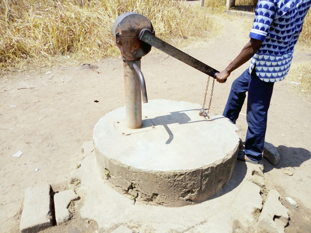
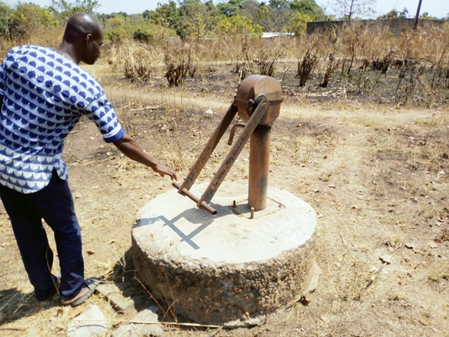

template: article
title: Gbéssérikro
iddbb: Gbesserikro
slug: gbesserikro
tags: Rural
authors: BROU Yves Oscar Kouadio, SORO Doba, MAILLARD Thomas, DIAKITE A. Cheick, KOHE A. Christelle, OUATTARA Mafine, SERI A. Jonathan, N'GUESSAN Firmain Kouakou
date: 2019-05-19
latitude: 7.83624
longitude: -5.04309
zoom: 16
localisation: Nord de Bouaké

|Informations générales||
|:--|--:|
| Nom de la localité : | Gbéssérikro | 
| Population : | 600 habitants | 
| Dessertes en eau potable | Non raccordé au réseau SODECI | 
| Gestion des excrétas | Assainissement autonome | 

## Présentation de la localité
Gbéssérikro est un village de la sous-préfecture de Bouaké. Il est désormais inclus dans le village de Bamoro, mais des conflits de légitimité demeurent entre les différents chefs de village. Sa population est estimée à 600 habitants et il dispose seulement d’une école. Par ailleurs, ce village n’est pas connecté au réseau de la SODECI. Les habitations à Gbéssérikro sont de type traditionnel : cases en terres battues. En ce qui concerne les activités économiques dans ce village, elles sont principalement agricoles. On y retrouve des cultures telles que l’igname, le riz, l’anacarde qui sont destinées à la commercialisation. D’autres cultures à savoir les cultures vivrières y sont pratiquées.
## État des lieux des ouvrages d’alimentation en eau
### Existants
Dans ce village, 2 sources d’approvisionnement en eau sont exploitées. Ce sont 3 forages équipés de PMH et des marigots. Seuls 2 forages sont opérationnels. Les ouvrages datent de 1976. Sur les 2 pompes fonctionnelles, seulement une pompe est communautaire. Cette pompe est la plus exploitée par les populations. Les types de pannes les plus fréquentes au niveau des pompes endommagées se situent au niveau des tuyaux. Les frais d’entretien sont soumis d’une part à la charge du Comité de gestion de l’eau pour la pompe publique et d’autre part à la famille  pour la pompe privée.
 Les paramètres chimiques de l’eau des forages présentent une concentration élevée en nitrate dans l’eau (66 mg/l).

La population utilise aussi l’eau des marigots située aux alentours du village. Un comité de gestion des marigots s’assure du respect et du paiement du tarif (10 FCFA par bassine), mais aussi de l’entretien bien que les feuilles mortes, les racines menacent sa qualité. Les populations utilisent ces eaux de marigots pour des usages domestiques et pour l’arrosage de leurs cultures.

### Pratiques et modes d’approvisionnement en eau
Les populations utilisent l’eau provenant des pompes et des marigots pour les besoins domestiques

### Gestion des points d'eau
La gestion des points d’eau est assurée pour la pompe communautaire par le comité de gestion de l’eau dans le village et pour la pompe privée par la famille où est installée cette pompe.

En ce qui concerne les marigots, les populations y ont recours en cas de forte pression sur la pompe communautaire. Ils sont entretenus par un comité créé par les jeunes du village.

## Gestion des excréta
Le niveau d’assainissement et d’hygiène dans le village de Gbéssérikro est faible. Les populations ne disposant pas de latrines dans leurs concessions sont obligées de déféquer à l’air libre dans le village. Cette pratique n’est toutefois pas louable vu les maladies qu’elles peuvent entrainer. 
Au niveau de la gestion des ordures ménagères, il n’existe pas de comité de collecte des déchets. Tous les déchets collectés sont déversés en brousse.

## Personnes ressources

* Chef de village 
* Président des Femmes 
* Présidente du comité de gestion

## Desideratas des populations

| Type d'entretien | Date | 
| :-- | :--: | 
| Entretien individuel Chef de village|06 février 2019| 
| Entretien individuel Président des Femmes|06 février 2019| 
| Entretien individuel Présidente du comité de gestion|06 février 2019| 
| Focus group hommes|06 février 2019| 
| Focus group femmes|06 février 2019| 

La préoccupation majeure des habitants de Béssérikro est d’avoir de l’eau potable. En ce qui concerne leurs vœux, les habitants n’expriment pas clairement le type d’intervention adapté à leur condition de vie. Toutefois ils apprécieraient de nouvelles infrastructures en Eau dans leur communauté.
 
## Tensions ressenties lors des entretiens

### Tensions générales
Aucune tension signalée

### Tensions autour de l'eau
Du fait de la rareté des points d’eau communautaires, des disputes éclatent dans la file d’attente, toutefois celles-ci demeurent ponctuelles et de faible ampleur.

### Tensions avec les localités voisines

La fusion des trois villages limitrophes (Bamoro, Djèkro et Béssérikro) a entrainé des conflits de légitimité entre les différents chefs de village, qui peuvent entraver des projets d'intérêt commun.

