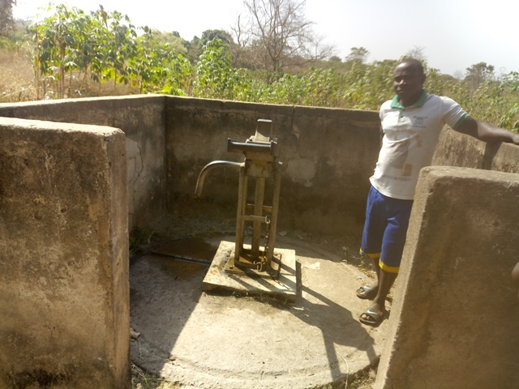
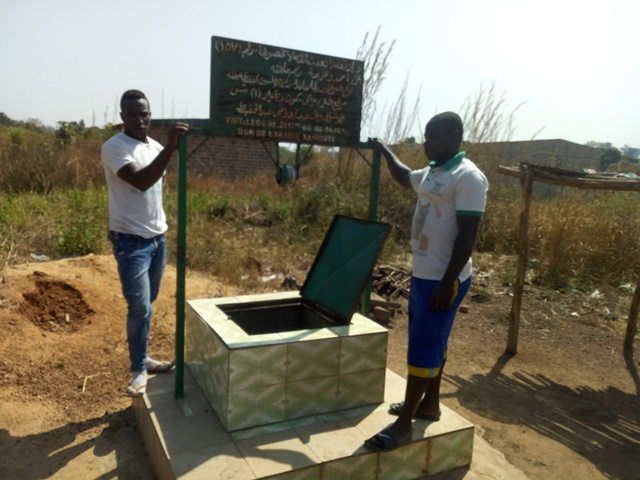
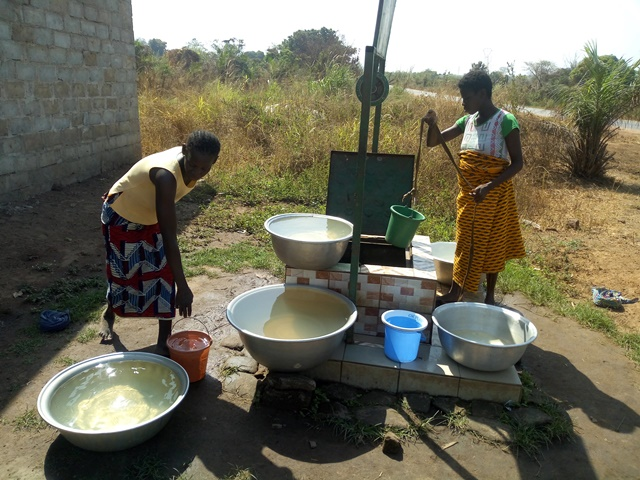
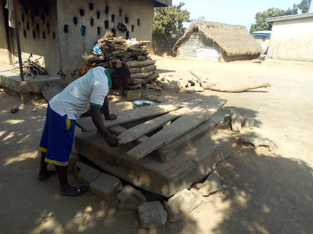
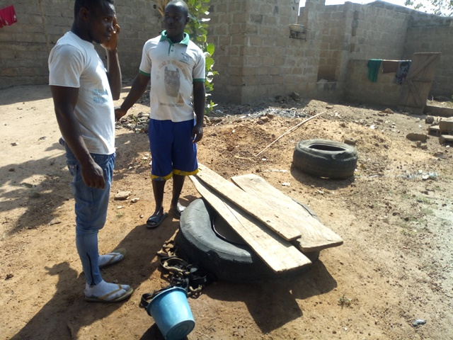

template: article
title: Kouakou-Miankro
iddbb: Kouakou-Miankro
slug: kouakou-miankro
tags: Rural
authors: BROU Yves Oscar Kouadio, SORO Doba, MAILLARD Thomas, DIAKITE A. Cheick, KOHE A. Christelle, OUATTARA Mafine, SERI A. Jonathan, N'GUESSAN Firmain Kouakou
date: 2019-01-22
latitude: 7.81176
longitude: -5.04771
zoom: 16
localisation: Nord de Bouaké

|Informations générales||
|:--|--:|
| Nom de la localité : | N’guessankro | 
| Population : | 400 habitants | 
| Dessertes en eau potable | Pas raccordé au réseau SODECI | 
| Gestion des excrétas | Assainissement autonome | 
Localité : Kouakou-Miankro
Date : 22/01/2019
Localisation : 7.81176  -5.04771 

## Présentation de la localité
Kouakou-Miankro est un village situé à 8 km de la ville de Bouaké sur l’axe Bouaké-Katiola, d’environ 400 habitants. On y accède facilement par la route nationale 3 et une large route en terre battue. 
Le village ne dispose pas d’école ni de centre de santé. L’habitat est essentiellement composé d’habitations en format de case faite en terre battue ou brique couverts de tôles ou de pailles. 

Il n'y a pas de système de gestion des ordures ménagères, aussi celles-ci sont déposées en marge du village à la lisère de la forêt. Les habitations sont rarement équipées de latrines, aussi les habitants pratiquent la défécation à l'air libre à l'écart des habitations.

L'activité principale du village est l'agriculture vivrière (igname, manioc, riz et autres productions maraîchères tomates, piments et aubergines) et la culture de rente de l'anacarde. Chaque ménage élève quelques moutons ou quelques chèvres. Durant la saison des pluies, les animaux sont gardés dans des enclos pour qu'ils ne divaguent pas dans les espaces cultivés. On observe également des excréments d’animaux partout dans le village et également à proximité des points d’eau.

## Socio-Anthropologie

Le village est peuplé des Baoulés fahafouè ou pharis. L'organisation sociale du village est similaire à l'organisation classique des communautés villageoises Baoulé. Les affaires du village sont gérées par les notables formant une chefferie hiérarchisée qui intègre aussi des représentants des organisations de femmes et de jeunes. La chefferie intervient dans le règlement des conflits (intracommunautaires et extracommunautaires) et joue un rôle d'interface entre la communauté villageoise et les administrations publiques et collectivités territoriales.  L’association des femmes fonctionne et elles entreprennent des activités génératrices de revenus. 

 Les habitants sont majoritairement issus des lignages fondateurs du village et les ménages sont constitués de famille nucléaire associant parfois des membres collatéraux (parents, cousins ou fratrie célibataire). Les tâches ménagères et en particulier l'approvisionnement en eau du ménage demeure l'apanage des femmes.

## État des lieux des ouvrages d’alimentation en eau potable
### Existant 
Le village n’est pas encore raccordé au réseau de la SODECI. Le village possède une pompe hydraulique en panne depuis plusieurs années et plusieurs puits.
Le forage équipé d’une pompe date des années 1976. C’est une pompe de la marque ABI. La pompe a été abandonnée suite à des pannes répétées auxquelles les habitants ne pouvaient plus faire face. La pompe est actuellement abandonnée dans la broussaille.

Nous avons analysé deux puits. Le premier est un puits traditionnel à l’intérieur d’une habitation, construit dans les années 1980 et le deuxième est un puits maçonné dans un espace public construit récemment en 2017 par une ONG. Ces puits sont assez profonds allant jusqu’à 10 m de profondeur. À notre arrivée nous avons pu constater que l'eau des puits avait presque tari. 

Notre étude a révélé que ces puits sont assez vulnérables aux risques de contamination. Le puits traditionnel se montre plus vulnérable aux risques de contamination avec un score de 8.  Cette vulnérabilité s’explique, car l'absence de clôture autorise l’accès des animaux au point d’eau. La dalle et la margelle du point d’eau présentent des fissures et craquelures. L’environnement immédiat du point d’eau est sale ainsi que le système d’exhaure notamment la puisette. Le puits maçonné quant à lui est moyennement vulnérable avec un score de 4 à cause de l'absence de clôture et de son environnement  sale.

Les analyses de la qualité de l’eau n’ont révélé aucune pollution majeure dans ces points d’eau. Les proportions de chlore sont très négligeables ce qui signifie que les puits ne sont pas traités convenablement. Nous avons observé des contaminations par *E. coli* dans les deux puits.

### Pratiques et modes d’approvisionnement en eau

En l'absence d'équipement hydraulique villageois amélioré (PPMH) et de raccordement au réseau de distribution de la SODECI, les habitants s'approvisionnent dans les puits communautaires et les marigots. Les marigots sont éloignés du village, mais perçus par les femmes comme une eau de très bonne qualité.

### Gestion des points d’eau

L'entretien et la gestion des puits relèvent de leur propriétaire (les puits communautaires sont situés dans l'espace public, mais appartiennent à des particuliers qui en assurent l'entretien). La pompe en panne depuis 10 ans était gérée par un comité, mais celui-ci s'est avéré incapable d'assurer l'entretien et les réparations. Il est aujourd'hui dissous.

## Personnes ressources 

* Le représentant du chef
* le président des jeunes
* La présidente des femmes

## Gestion des excréta
Les types de latrines que l’on trouve dans le village sont les latrines directes sans fosses septiques. Néanmoins comme dans plusieurs villages, les populations continuent d’aller déféquer en brousse.

## Desiderata des habitants

| Type d'entretien | Date | 
| :-- | :--: | 
| Entretien individuel Chef de village Kouakou-Miankro |22 janvier 2019| 
| Entretien individuel Présidente des Femmes Kouakou-Miankro |22 janvier 2019|
| Entretien individuel Président du comité de gestion Kouakou-Miankro |22 janvier 2019| | Focus group hommes Kouakou-Miankro |22 janvier 2019| |
| Focus group femmes Kouakou-Miankro |22 janvier 2019|

La population souhaite:

1. être raccordé au réseau de distribution de la SODECI (Château d'eau situé à Sakassou)
2. Réparer la pompe en panne et former les membres d'un nouveau comité de gestion
3. Apprendre à entretenir les puits et marigots du village
4. Obtenir des latrines et un point de collecte des ordures.

## Tensions ressenties lors des entretiens

### Tensions générales

Aucune tension signalée

### Tensions autour de l'eau

Aucun conflit signalé autour des points d'eau malgré leur rareté.
### Tensions avec les localités voisines
Aucune tension signalée

