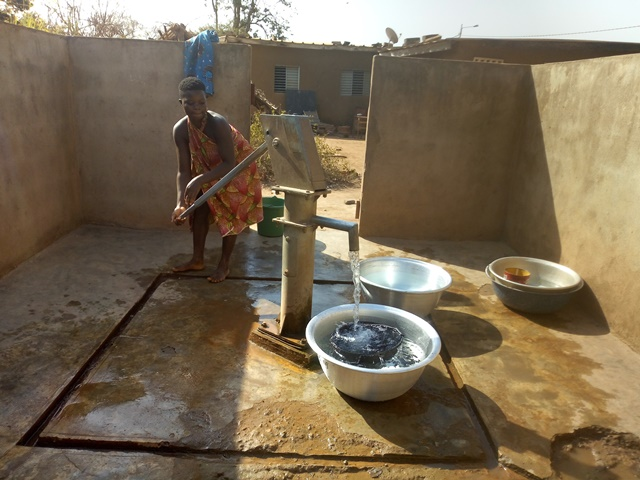
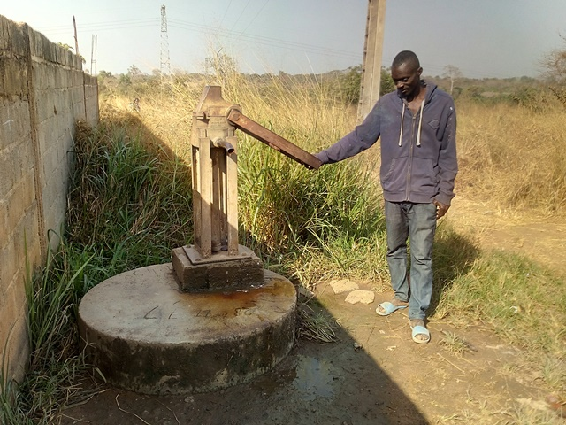
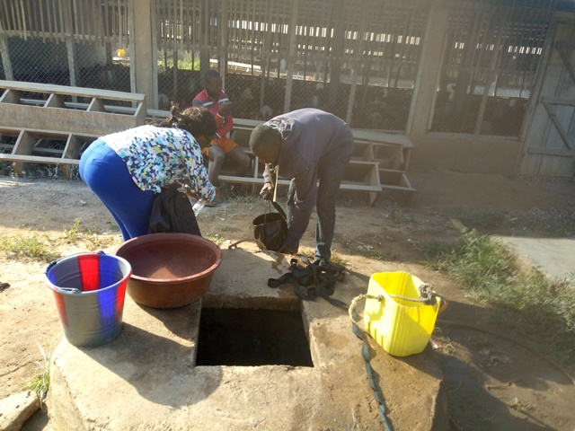

template: article
title: N’guessankro
iddbb: Nguessankro
slug: nguessankro
tags: Rural
authors: BROU Yves Oscar Kouadio, SORO Doba, MAILLARD Thomas, DIAKITE A. Cheick, KOHE A. Christelle, OUATTARA Mafine, SERI A. Jonathan, N'GUESSAN Firmain Kouakou
date: 2019-01-22
latitude: 7.80520
longitude: -5.04480
zoom: 16
localisation: Nord de Bouaké

|Informations générales||
|:--|--:|
| Nom de la localité : | N’guessankro | 
| Population : | 2000 habitants | 
| Dessertes en eau potable | Pas raccordé au réseau SODECI | 
| Gestion des excrétas | Assainissement autonome | 

## Présentation de la localité

N’guessankro est un grand village d’environs 2000 habitants,  situé à 7 kilomètres de la ville de Bouaké sur l’axe Bouaké-Katiola. Le village de N’Guessankro appartient au canton de Konankankro. Il donc est facilement accessible par la route bitumée. Les habitations du village sont à l'est de la route, tandis que les terres cultivées et une ferme avicole sont à l'ouest.

N’guessankro dispose d’une école primaire composée de 6 classes, qui accueille aussi les enfants des villages voisins. 

L’habitat est composé essentiellement d’habitations faites en briques. Les principales activités agricoles sont la production d'igname et de manioc et l'élevage du poulet.

## Socio-Anthropologie

N’Guessankro est un village Baoulé situé au nord à quelque Kilomètre de la ville de Bouaké. Le village est peuplé des Baoulés fahafouè ou pharis.

 L'organisation sociale du village est similaire à l'organisation classique des communautés villageoises Baoulé. Les affaires du village sont gérées par les notables formant une chefferie hiérarchisée qui intègre aussi des représentants des organisations de femmes et de jeunes. La chefferie intervient dans le règlement des conflits (intracommunautaires et extracommunautaires) et joue un rôle d'interface entre la communauté villageoise et les administrations publiques et collectivités territoriales.

 

## État des lieux des ouvrages d’alimentation en eau potable

### Existants 
Le village de N’guessankro n’est pas encore raccordé au réseau de la SODECI bien que la tuyauterie soit déjà installée dans le village.

Le village dispose de deux pompes et de plusieurs puits. Parmi les deux forages équipés de pompe, un seul est fonctionnel et l’autre est défaillant, car la pression de l’eau est faible. Notre étude a porté sur le forage fonctionnel et deux puits.

Le forage fonctionnel est situé  non loin de l’école primaire du village et celui défaillant est situé presque en bordure du goudron.
Le forage de l’école a été construit en 2016 contrairement à celui qui est défaillant qui lui date des années 1975. Le forage de l’école n’est pas encore tombé en panne depuis son installation, mais la superstructure est en mauvais état. on observe des fissures au niveau de la dalle et la clôture. L’enquête sanitaire que nous avons réalisée au niveau de ce point d’eau a montré que le taux de vulnérabilité du point d’eau est élevé. En effet, on observe de l’eau stagnante tout autour du point d’eau, des fentes et des craquelures au niveau de la superstructure, l’environnement du point d’eau qui sale et le système d’exhaure est impropre.

Au niveau des puits, ceux-ci sont pour la majorité très vieux, mais toujours fonctionnels. Les puits qui se trouvent dans les bas-fonds offrent de l’eau toute l’année contrairement à ceux se trouvant en hauteur sur la côte qui tarissent dès l’apparition de la saison sèche.
Pour les deux puits auxquels nous nous sommes intéressés, ce sont des puits moins âgés traditionnel ou maçonné. Ce sont des puits assez profonds soit 13 mètres en moyenne de profondeur. La hauteur de l’eau dans ces points d’eau était de 1 mètre lors de notre passage.

Nos enquêtes ont révélé que ces puits sont très vulnérables aux risques de contamination. Cela se justifie par la proximité de ces points d’eau à des sources de pollution telles qu’un enclos pour élevage de poulet ou des toilettes, une absence de clôture, des fissures et craquelures observées au niveau de la margelle. Les analyses de la qualité de l’eau n’ont révélé aucune pollution majeure au niveau de l’eau de ces puits, mais un gout salée au niveau de l’eau du deuxième puits. 

Les points d’eau ne sont pas traités au chlore et même quand ils sont traités le traitement n’est pas convenable.

### Pratiques et modes d’approvisionnement en eau

La pompe du forage est la source d'eau potable la plus utilisée. Les habitants considèrent que c'est la meilleure eau, ils l'utilisent donc pour la boisson et la cuisine. L'eau des puits est utilisée pour les tâches ménagères, car les villageois la perçoivent comme de qualité moindre. Cependant, si la pompe du forage est en panne ou s'ils n'ont pas les moyens de débourser le prix de l'eau, les habitants sont contraints d'utilisera l'eau des puits pour la boisson. 
### Gestion des points d’eau
La gestion de la pompe hydraulique est le fait d'un comité de gestion composé de 7 femmes supervisées par un homme. L’eau du forage est vendue la bassine à 10 FCFA. Concernant les puits la gestion est individuelle. Chaque propriétaire de puits gère à sa façon son puits, mais les puits sont ouverts à tous et chacun peut y puiser gratuitement.
## Personnes ressources 
* Chef de village 
* Présidente des Femmes
* Président des jeunes

## Gestion des excrétas 
Pour la gestion des excrétas l’on retrouve dans le village plusieurs types de latrines notamment les latrines à fosses simples et les latrines à fosses septiques. Néanmoins la défécation en brousse se fait toujours.
## Desiderata des populations
| Type d'entretien | Date | 
| :-- | :--: | 
| Entretien individuel Chef de village N’Guessankro|22 janvier 2019| 
| Entretien individuel Présidente des Femmes N’Guessankro|22 janvier 2019|
| Entretien individuel Président du comité de gestion N’Guessankro|22 janvier 2019| 
| Focus group femmes N’Guessankro|22 janvier 2019|

Les villageois considèrent qu'ils n'ont pas assez de points d'eau, ils souhaiteraient disposer d'un forage équipé d'une pompe à motricité humaine en plus. Les hommes ont évoqué aussi leur souhait de raccorder leur village au réseau de distribution d'eau potable géré par la SODECI. 

## Tensions ressenties lors des entretiens

### Tensions générales

Aucune tension signalée

### Tensions autour de l'eau

Aucun conflit signalé autour des points d'eau malgré leur rareté.
### Tensions avec les localités voisines
Aucune tension signalée

