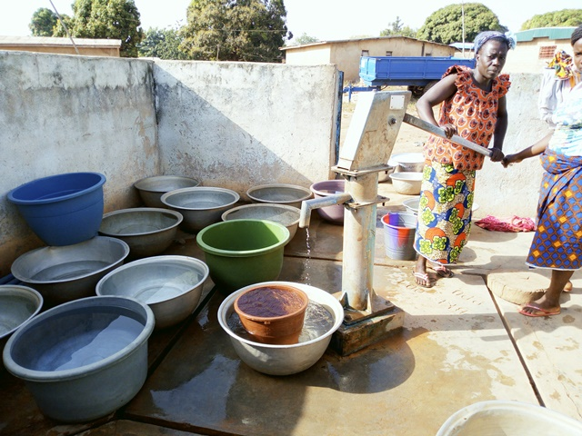
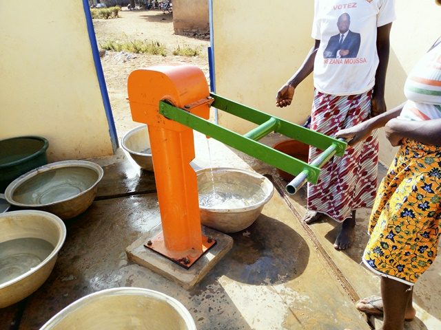
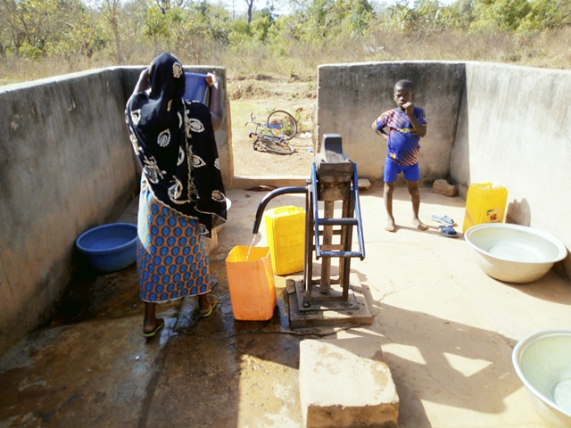

template: article
title: Yobouékro
iddbb: Yobouekro
slug: Yobouekro
tags: Rural
authors: BROU Yves Oscar Kouadio, SORO Doba, MAILLARD Thomas, DIAKITE A. Cheick, KOHE A. Christelle, OUATTARA Mafine, SERI A. Jonathan, N'GUESSAN Firmain Kouakou
date: 2019-02-11
latitude: 7.84452
longitude: -5.05206
zoom: 16
localisation: Nord de Bouaké

|Informations générales||
|:--|--:|
| Nom de la localité : | Yobouékro | 
| Population : | 800 habitants | 
| Dessertes en eau potable | Pas raccordé au réseau SODECI | 
| Gestion des excrétas | Assainissement autonome | 

## Présentation de la localité
Village situé en bordure de route sur l’axe Bouaké – Katiola, Yobouékro est situé à 11 kilomètres de Bouaké. Il est donc accessible par une large route bitumée (2x2 voies). Le village compte environ 800 résidents.

Le village ne dispose pas d’école primaire et centre de santé communautaire. La population se rend dans le village  de Bamoro pour les problèmes sanitaires et dans le village voisin d’Akpôkro pour la scolarisation des enfants.
On retrouve tous les types d’habits dans le village, mais les habitations sont faites soit en briques en terre ou en ciment et recouvertes de tôles ondulées.

Il n'y a pas de système de gestion des ordures ménagères, aussi celles-ci sont déposées en marge du village à la lisère de la forêt. Les habitations sont rarement équipées de latrines, aussi les habitants pratiquent la défécation à l'air libre à l'écart des habitations.

L'activité principale du village est l'agriculture vivrière (igname, manioc, riz et autres productions maraîchères tomates, piments et aubergines) et la culture de rente de l'anacarde. Les femmes du village transforment le manioc en attiéké dans de petites unités de production familiales et commercialisent leurs productions au marché de Bamoro. Chaque ménage élève quelques moutons ou quelques chèvres. Durant la saison des pluies, les animaux sont gardés dans des enclos pour qu'ils ne divaguent pas dans les espaces cultivés.

## Socio anthropologie de la localité 

L'organisation sociale du village est similaire à l'organisation classique des communautés villageoises Baoulé. Les affaires du village sont gérées par les notables formant une chefferie hiérarchisée qui intègre aussi des représentants des organisations de femmes et de jeunes. La chefferie intervient dans le règlement des conflits (intracommunautaires et extracommunautaires) et joue un rôle d'interface entre la communauté villageoise et les administrations publiques et collectivités territoriales.  L’association des femmes fonctionne et elles entreprennent des activités génératrices de revenus. Les jeunes s’impliquent dans la propreté du village en organisant régulièrement des opérations de nettoyage des rues et espaces publics. 

 Les habitants sont majoritairement issus des lignages fondateurs du village et les ménages sont constitués de famille nucléaire associant parfois des membres collatéraux (parents, cousins ou fratrie célibataire). Les tâches ménagères et en particulier l'approvisionnement en eau du ménage demeure l'apanage des femmes.
 

## État des lieux des ouvrages d’alimentation en eau potable

### Ouvrages existants
En termes d’ouvrages d’hydraulique villageoise, le village de Yobouékro compte 3 pompes à motricité humaine (PMH) qui étaient toutes fonctionnelles lors des enquêtes dans le village. Une pompe construite par le Conseil Régional en 2018 de type SATH, la deuxième de type India Mark 2 a été réhabilitée par une ONG locale en 2015 et une pompe de type ABI 1:la première pompe du village construite en 1986. Le Comité de gestion des points d’eau est très dynamique dans le village, la fréquence des pannes est faible (1 à 2 pannes par an), le temps d’arrêt des pompes n’excède pas 48 heures.
Le niveau de vulnérabilité des points d’eau est très faible, les PMH sont entretenues quotidiennement.

 L’association des femmes du village a planifié le balayage et le désherbage autour des points d’eau.
 
 
L’analyse de la qualité de l’eau indique une pollution aux composées azotées telles que le nitrate dans 66% des points d’eau enquêté et à l’ammoniac au niveau d’une PMH sur trois. Les concentrations de fluor dans les eaux prélevées sont très élevées supérieures à 1 mg/l mais seul 01 point d’eau a un taux supérieur à la norme recommandée pour l’eau de boisson. Quant à la contamination par *E. coli*, elle touche 1 point d’eau sur 3.

### Pratiques et modes d’approvisionnement en eau
Les habitants du village utilisent exclusivement l’eau de forage pour la boisson et les tâches domestiques.

### Gestion des points d’eau
Le comité de gestion prélève la somme de 10 F CFA par cuvette, s’occupe de l’entretien des PMH et veille à la propreté  de l’environnement. Il arrive à collecter des fonds suffisants pour maintenir la pompe en fonctionnement. En cas de panne nécessitant des réparations lourdes, le comité organise une levée de fond exceptionnelle auprès des villageois. **Ce village apparait comme exemplaire au regard de l'efficacité du comité de gestion**.

## Personnes ressources

* Président des jeunes du village
* Présentent des femmes
* Président du comité de gestion des pompes

## Assainissement et gestion des excrétas
L’assainissement général et la gestion des excréta se fait de manière autonome. Chaque concession élimine ses déchets.  La gestion des ordures ménagères se fait de manière individuelle dans les habitations. Généralement dans les villages, un site est identifié et utilisé comme dépotoir des ordures ménagères.

Les latrines sèches à fosse simple sont les plus répandues dans le village.

## Desideratas des populations
| Type d'entretien | Date | 
| :-- | :--: | 
| Entretien individuel Chef de village Yobouekro|11 février 2019| 
| Entretien individuel Présidente des Femmes Yobouekro|11 février 2019|
| Entretien individuel Président du comité de gestion Yobouekro|11 février 2019|
| Focus group hommes Yobouekro|11 février 2019|
| Focus group femmes Yobouekro|11 février 2019|

Les habitants sont satisfaits de leur équipement d'adduction en eau potable. Ils n'ont exprimé aucune demande lors de notre visite.

## Tensions ressenties lors des entretiens

### Tensions générales
Aucune tension.

### Tensions autour de l'eau
Comme ailleurs, des disputes éclatent dans la file d’attente des pompes, toutefois celles-ci demeurent ponctuelles et de faible ampleur.

### Tensions avec les localités voisines
Aucune tension signalée. 
