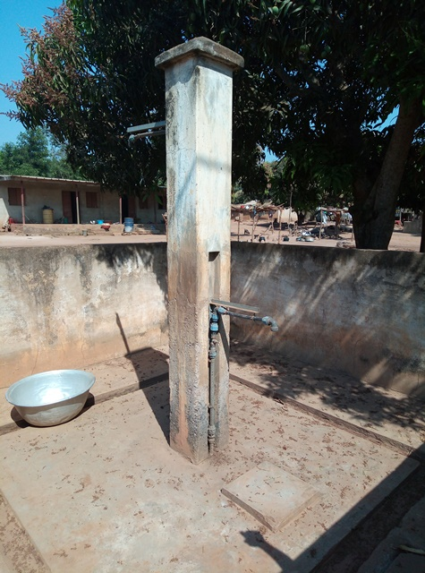
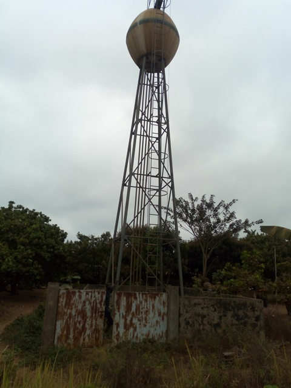
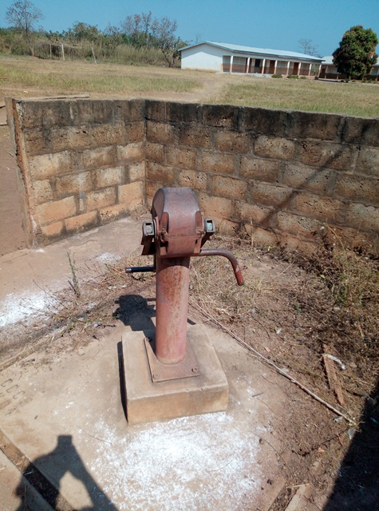
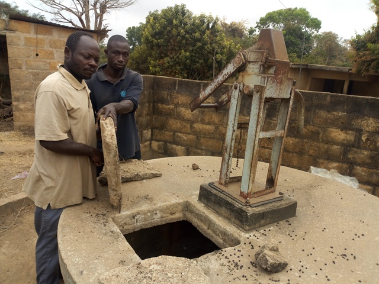
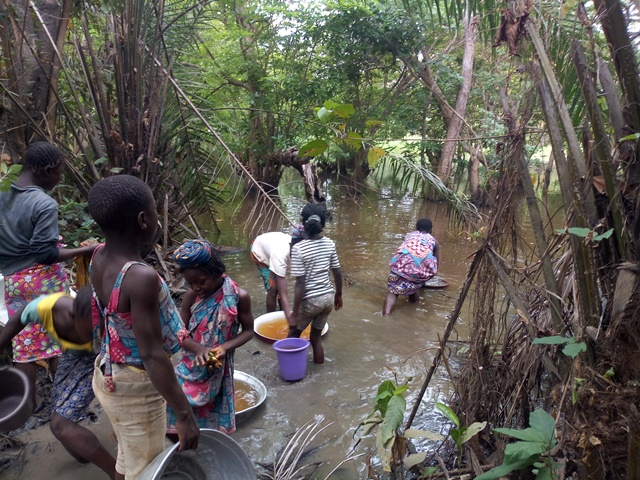

template: article
title: Affouékro
slug: affouekro
iddbb: Affouekro
tags: Rural
authors: BROU Yves Oscar Kouadio, SORO Doba, MAILLARD Thomas, DIAKITE A. Cheick, KOHE A. Christelle, OUATTARA Mafine, SERI A. Jonathan, N'GUESSAN Firmain Kouakou
date: 2019-01-30
latitude:  7.76254
longitude: -4.92230
zoom: 16
localisation: Nord-Est de Bouaké, sur la route de Bassawa

|Informations générales||
|:--|--:|
| Nom de la localité : | Affouékro | 
| Population : | 1200 habitants | 
| Dessertes en eau potable | Non raccordé au réseau SODECI | 
| Gestion des excrétas | Assainissement autonome |

## Présentation de la localité
Le village d’Affouékro est situé à environ 5 kilomètres de Bouaké au bord de la route nationale 10 qui mène à Bassawa. Il compte environ 1200 habitants et  dispose d’une école primaire, mais pas de centre de santé. Les habitants du village se rendent dans la commune de Bouaké notamment à Belleville pour les problèmes de sanitaires.

On y retrouve essentiellement des habitations de tous types : parpaings, terre, ciment avec des tôles ondulées. On note aussi la présence de cases en banco, mais en de faibles proportions. L'agriculture est l'activité principale : l’igname, le manioc, l’anacarde et les produits maraichers (tomate, piment, aubergine).

En ce qui concerne les infrastructures, le village ne dispose pas de point de collecte d’ordures ménagères. Cette situation oblige la communauté à  déverser les ordures ménagères dans la forêt juste derrière le village. De plus, il faut noter que la majorité des villageois ne disposent pas de toilettes dans leurs maisons et vont faire leur besoin dans la forêt. On observe également des excréments d’animaux partout dans le village et en particulier à proximité des points d’eau.

## Socio anthropologie de la localité 

Situé à l’Est de la ville de Bouaké, Affouékro est un village habité par les Baoulés nanafouè, sous-groupe du peuple Akan, et appartient  au canton faafouè-Gossan. Le village est régi par une autorité traditionnelle composée d’un chef de village, de plusieurs notables, de deux présidents de jeunesse (homme et femme). Le chef  du village est l’autorité exécutive en charge de la prise de décision dans le village. Celui-ci est accompagné par les notables qui font office de conseillers. Quant aux présidents de jeunesses, ceux-ci sont responsables de l’intégration communautaire des membres à travers des activités festives et ludiques. Ils interviennent aussi dans la médiation des conflits communautaires.

## Etat des lieux des ouvrages d’alimentation en eau potable

### Ouvrages existants
Le village n’est raccordé pas au réseau de la SODECI.

En ce qui concerne l’hydraulique villageoise, le village dispose d’un mini réseau d’AEP avec 4 bornes-fontaines installées dans le village depuis 1995. Ce mini réseau est alimenté par une pompe électrique (raccordée au réseau, donc non-autonome) dans un forage  et un chateau d'eau. Toutefois, La boite de commande automatique de pompage a été dérobée. Par conséquent, le pompage doit etre démarré manuellement. En outre, 2 bornes-fontaines sur 4 ne sont plus fonctionnelles. En cas de coupure de courant de plusieurs jours, ce réseau est inutilisable.
 
 
 
  
 

 Nous avons aussi recensé deux pompes à motricité humaine en panne: 1 forage avec PMH (type ABI 2) situé à l’école et 1 puits à grand diamètre busés avec PMH ABI 1 construit dans les années 1978. Ces deux PMH sont abandonnées depuis plus de 5 ans.
 
 
 
   
 

Le marigot est utilisé en cas de coupure de courant.

L’analyse des paramètres physicochimiques n’a révélé aucune pollution des paramètres analysés, mais les prélèvements effectués au niveau des bornes-fontaines étaient contaminés par *E. coli*.

### Pratiques et modes d’approvisionnement en eau

Le réseau de borne-fontaine est la principale source d'approvisionnement du village. En cas de longue coupure de courant et d'arrêt de l'alimentation des bornes, les femmes du village se provisionnent au marigot.

### Gestion des points d’eau

Il n'y a pas de comité de gestion des points d'eau. Une personne du village est chargée d'ouvrir et de fermer les bornes-fontaines et d'appeler un artisan réparateur en cas de panne. C'est insuffisant, car il n'y a pas de caisse dédiée à l'entretien et la réparation, ce qui explique que les ouvrages ne soient pas réparés ou remplacés.

## Personnes ressources
* Représentant du chef de village 
* Présidente des Femmes 
* Responsable de la gestion des pompes

## Gestion des excrétas

À Affouékro, les eaux et ordures ménagères sont généralement déversées dans les cours des maisons et aux alentours du village. Vu qu’il n’y a pas de point de collecte d’ordure, chaque ménage gère les déchets (liquides et solides) de façon autonome. 

Par ailleurs, moins de la moitié de la population dispose de toilettes à proximité des maisons. De ce fait, les personnes n’ayant pas de toilettes défèquent à l’air libre aux alentours du village et dans la forêt. Il faut également noter la présence d’animaux dans tout le village. N’ayant pas d’enclos, ceux-ci défèquent et urines n’ importe où dans le village.

## Desideratas des populations
| Type d'entretien | Date | 
| :-- | :--: | 
| Entretien individuel représentant du Chef de village |30 janvier 2019| 
| Entretien individuel Président des Femmes |30 janvier 2019| 
| Entretien individuel responsable des pompes |30 janvier 2019| 
| Focus group hommes |30 janvier 2019| 

À Affouékro, les habitants souhaiteraient que la pompe qui alimente le château d'eau soit équipée d’un nouveau moteur de réhabilité le réseau d'AEP. De plus, les habitants demandent à ce que les deux PMH en panne et abandonnées soit réhabilitées.

## Tensions ressenties lors des entretiens

### Tensions générales
Aucune tension signalée

### Tensions autour de l'eau
Aucune tension signalée

### Tensions avec les localités voisines
Aucune tension signalée.
