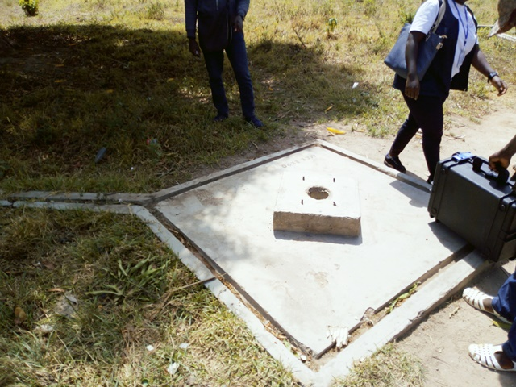
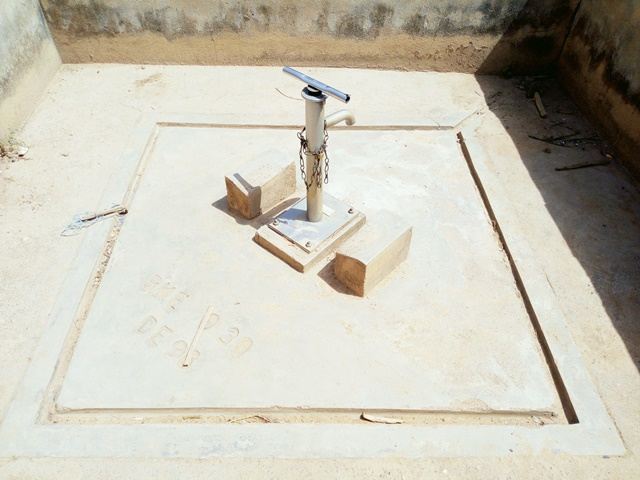

template: article
title: Affouvanssou
slug: affouvanssou
iddbb: Affouvanssou
tags: Rural
authors: BROU Yves Oscar Kouadio, SORO Doba, MAILLARD Thomas, DIAKITE A. Cheick, KOHE A. Christelle, OUATTARA Mafine, SERI A. Jonathan, N'GUESSAN Firmain Kouakou
date: 2019-02-12
latitude:  7.86085 
longitude: -5.96062 
zoom: 16
localisation: Nord-Nord-Est de Bouaké

|Informations générales||
|:--|--:|
| Nom de la localité : | Affouvanssou | 
| Population : | 2000 habitants | 
| Dessertes en eau potable | Pas raccordé au réseau SODECI | 
| Gestion des excrétas | Assainissement autonome | 

## Présentation de la localité
Affouvanssou est un grand village de la Sous-préfecture de Bouaké situé au nord-nord-est à 10 kilomètres du village de Bamoro, et donc à une vingtaine de kilomètres de Bouaké. On y accède par une route en terre battue à partir de Bamoro. Peuplé de plus de 2000 habitants, ce village dispose d’une école primaire de 6 classes, mais il n’a pas de centre de santé malgré sa taille. Le village est relié au réseau électrique, mais pas d'accès au réseau d'eau potable géré par la SODECI.
On y retrouve des habitations de tous types : des habitations en parpaings en terre ou en ciment avec des tôles ondulées.

Les habitants tirent leurs revenus de l'agriculture: Anacarde et variétés vivrières.

## Socio anthropologie de la localité  

Situé au nord de la ville de Bouaké, Affounvansou est un village habité par les Baoulés nanafouè, sous-groupe du peuple Akan. Il appartient au canton faafouè-Gossan. Le village est régi par une autorité traditionnelle composée d’un chef de village, de plusieurs notables, de deux présidents de jeunesse (homme et femme). Le chef  du village est l’autorité exécutive en charge de la prise de décision dans le village. Celui-ci est accompagné par les notables qui font office de conseillers. Quant aux présidents de jeunesses, ceux-ci sont responsables de l’intégration communautaire des membres à travers des activités festives et ludiques. Ils interviennent aussi dans la médiation des conflits communautaires.

## État des lieux des ouvrages d’alimentation en eau potable

### Ouvrages existants
Le village compte 4 points d’eau: des forages équipés de pompes à motricité humaine (PMH). Sur ces 4 points d’eau: 2 sont fonctionnels.

Les deux pompes fonctionnelles tombent souvent en panne (3 à 4 fois dans l’année). Mais celles-ci n’excèdent pas deux jours avant d’être réparées.  

La première pompe en panne a été enlevée et stockée à l'abri. La seconde PMH en panne souffre d’une défaillance des segments depuis 2 ans.

L’évaluation sanitaire des deux points d’eau fonctionnels indique que l’un des points d’eau  a une vulnérabilité forte, car il n’a pas de clôture et l’environnement alentour est insalubre. Il s’agit de la pompe de type ABI 2 . L’analyse de la qualité de l’eau indique que les taux de nitrate sont supérieurs à la norme pour l’eau de boisson. Aucun *E. coli* n’a été détecté dans les prélèvements effectués.

### Pratiques et modes d’approvisionnement en eau

Les habitants du village s’approvisionnent exclusivement aux différentes pompes pour la boisson et les tâches domestiques.

### Gestion des points d’eau

La gestion des 4 points d’eau est quasiment la même. Il n’y a pas de comité de gestion pour la régulation du processus d’approvisionnement.La clé des pompes est gardée chez le chef du village qui désigne une personne chaque jour pour les ouvertures et les fermetures.
L’eau est vendue dans le village à 10 FCFA le bidon de 20 litres. En cas de panne, chaque famille cotise une certaine somme pour les réparations. Ce système fonctionne relativement bien, les pompes sont réparées dans un délai de 48 heures après les pannes dans la plupart du temps. 

## Personnes ressources

* Chef de village 
* Présidente des Femmes

## Assainissement et gestion des excrétas

Le village d’Affouvanssou ne dispose pas de réseau de drainage des eaux usées pluviales et domestiques.
La gestion des ordures ménagères se fait de manière individuelle dans les habitations. Généralement dans les villages, un site est identifié et utilisé comme dépotoir des ordures ménagères.
Quant à la gestion des excrétas dans le village, on retrouve tous les types de latrines dans le village : des latrines sèches aux latrines à eau en fonction du type d’habitations. Certaines habitations ne disposent toujours pas de latrines, les habitants défèquent dans les broussailles autour du village.

## Desideratas des populations
| Type d'entretien | Date | 
| :-- | :--: | 
| Entretien individuel Chef de village |12 Février 2019| 
| Entretien individuel Président des Femmes|12 Février 2019| 
| Focus group hommes |12 Février 2019| 

Les habitants souhaiteraient que leurs pompes en panne soient réparées et ils aimeraient qu'une nouvelle pompe soit construite.

## Tensions ressenties lors des entretiens

### Tensions générales
Aucune tension signalée

### Tensions autour de l'eau
Du fait de la rareté des points d’eau communautaires, des disputes éclatent dans la file d’attente, toutefois celles-ci demeurent ponctuelles et de faible ampleur.

### Tensions avec les localités voisines
Aucune tension signalée.

