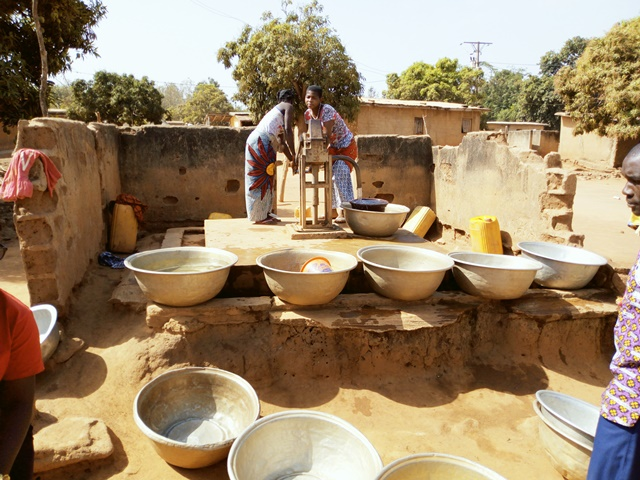
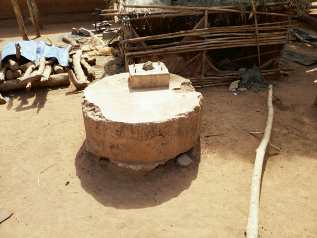
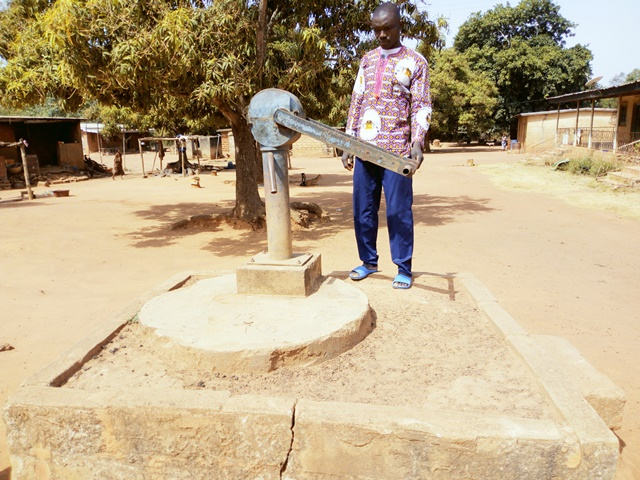
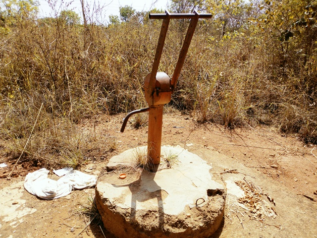

template: article
title: Akpokro
iddbb: Akpokro
slug: akpokro
tags: Rural
authors: BROU Yves Oscar Kouadio, SORO Doba, MAILLARD Thomas, DIAKITE A. Cheick, KOHE A. Christelle, OUATTARA Mafine, SERI A. Jonathan, N'GUESSAN Firmain Kouakou
date: 2019-05-20
latitude: 7.85091
longitude: -5.05906
zoom: 16
localisation: Nord de Bouaké

|Informations générales||
|:--|--:|
| Nom de la localité : | N’guessankro | 
| Population : | 300 habitants | 
| Dessertes en eau potable | Pas raccordé au réseau SODECI | 
| Gestion des excrétas | Assainissement autonome | 

## Présentation de la localité

Akpokro est un village de la Sous-préfecture de Bouaké situé au nord à environ une quinzaine de kilomètres de la ville. Le village est facilement accessible par une large route en terre battue à partir de la route nationale 3.  Peuplé d'environ 300 habitants, ce village abrite une école primaire et une pompe endommagée, mais pas de centre de santé. 

  
  
Le village n'est pas raccordé au réseau de distribution de l'eau potable géré par la SODECI, mais est relié au réseau électrique.

On retrouve tous les types d’habits dans le village, mais les habitations sont faites soit en briques en terre ou en ciment et recouvertes de tôles ondulées.

Il n'y a pas de système de gestion des ordures ménagères, aussi celles-ci sont déposées en marge du village à la lisère de la forêt. Les habitations sont rarement équipées de latrines, aussi les habitants pratiquent la défécation à l'air libre à l'écart des habitations.

L'activité principale du village est l'agriculture vivrière (igname, manioc, riz et autres productions maraîchères tomates, piments et aubergines) et la culture de rente de l'anacarde. Chaque ménage élève quelques moutons ou quelques chèvres. Durant la saison des pluies, les animaux sont gardés dans des enclos pour qu'ils ne divaguent pas dans les espaces cultivés.

## Socio-anthropologie
L'organisation sociale du village est similaire à l'organisation classique des communautés villageoises Baoulé. Les affaires du village sont gérées par les notables formant une chefferie hiérarchisée qui intègre aussi des représentants des organisations de femmes et de jeunes. La chefferie intervient dans le règlement des conflits (intracommunautaires et extracommunautaires) et joue un rôle d'interface entre la communauté villageoise et les administrations publiques et collectivités territoriales.  L’association des femmes fonctionne et elles entreprennent des activités génératrices de revenus. 

 Les habitants sont majoritairement issus des lignages fondateurs du village et les ménages sont constitués de famille nucléaire associant parfois des membres collatéraux (parents, cousins ou fratrie célibataire). Les tâches ménagères et en particulier l'approvisionnement en eau du ménage demeure l'apanage des femmes.

## Etat des lieux des ouvrages d’alimentation en eau potable

### Existants 
  
Les principales sources d’approvisionnement en eau potable du village d’Akpokro sont des forages. Le village compte 4 points d’eau existants, des forages équipés de PMH. Sur ces 4 forages, seulement 1 encore opérationnel. Les autres forages souffrent de pannes au niveau du moteur et des tuyaux d’alimentation et sont délaissés depuis 3 à 4 ans. L’une des pompes a été démontée afin de fournir des pièces de rechange pour une autre. Toutefois, cela n'a pas suffi à la remettre en marche. La seule pompe fonctionnelle du village tombe en panne régulièrement. La superstructure de cette pompe est en train de se dégrader (clôture, dalle, etc.). Les paramètres organoleptiques révèlent que l’eau de la pompe a un gout salé et une odeur de rouille liée certainement au mauvais état du tuyau métallique. On note par ailleurs une concentration en nitrate et en fluor dans l’eau (66 mg/l) et (1.2 mg/l).

### Pratiques et modes d’approvisionnement en eau
Les principales sources d’approvisionnement en eau potable du village d’Akpokro sont des forages. L’eau est utilisée pour tous les usages domestiques. Toutefois, il faut noter que l’on a souvent fait recours à des marigots pour les activités agricoles.

### Gestion des points d’eau 
La pompe est gérée par un comité local. L’eau est payante à hauteur de 10 FCFA par cuvette. La surveillance et le recouvrement du coût de l'eau sont réalisés par un représentant de chaque famille à tour de rôle. Chaque jour, un jeune issu d’une famille du village est chargé de surveiller la pompe. Après la fermeture, ce dernier va faire le versement de la recette au président du comité de gestion.

## Gestion des excréta
À Akpokro, les règles d’hygiène et d’assainissement sont difficilement respectées.  La majeure partie des concessions ne dispose pas de latrines conventionnelles. La défécation se fait soit à l’air libre dans le village ou autour, soit dans des latrines traditionnelles peu respectueuses des règles d’hygiène. Pour ce qui concerne la gestion des ordures ménagères, il n’existe pas un système propre au village. Les déchets ménagers sont collectés et déversés en brousse
## Personnes ressources
* Chef de village 
* Présidente des femmes 
* Président des jeunes 

## Desideratas des populations
| Type d'entretien | Date | 
| :-- | :--: | 
| Entretien individuel Chef de village Akpokro|11 février 2019| 
| Entretien individuel Présidente des Femmes Akpokro|11 février 2019|
| Entretien individuel Président du comité de gestion Akpokro|11 février 2019|
| Focus group hommes Akpokro|11 février 2019|
| Focus group femmes Akpokro|11 février 2019|

Le comité de gestion n’a pas pu réunir suffisamment de fonds pour remparer les PMH en panne. Le village souhaiterait donc qu’on leur apporte de l’aide en réparant ces 2 PMH.  

## Tensions ressenties lors des entretiens

### Tensions générales
Aucune tension signalée

### Tensions autour de l'eau
Étant donné qu’il n'existe qu'une seule pompe fonctionnelle dans le village, de fréquentes tensions sont observées autour de la pompe, malgré le système de gestion du comité local de gestion. Ces tensions s’observent généralement aux heures de pointe : très tôt le matin avant d’aller au champ et dans l’après-midi au retour des champs. Des disputes éclatent dans la file d’attente des pompes, toutefois celles-ci demeurent ponctuelles et de faible ampleur.

### Tensions avec les localités voisines
Aucune tension signalée

                                                                                                                                                                           

