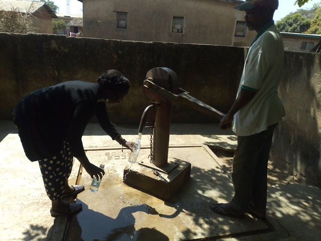
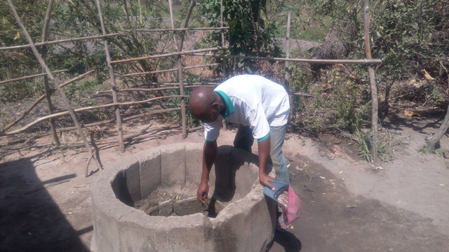

template: article
title: Andon Sakassou
slug: andonsakassou
iddbb: Andonsakassou
tags: Rural
authors: BROU Yves Oscar Kouadio, SORO Doba, MAILLARD Thomas, DIAKITE A. Cheick, KOHE A. Christelle, OUATTARA Mafine, SERI A. Jonathan, N'GUESSAN Firmain Kouakou
date: 2019-01-28
latitude: 7.75637
longitude: -5.01458
zoom: 16
localisation: Nord de Bouaké

|Informations générales||
|:--|--:|
| Nom de la localité : | Andon Sakassou | 
| Population : | 800 habitants | 
| Dessertes en eau potable | Pas raccordé au réseau SODECI | 
| Gestion des excrétas | Assainissement autonome | 

## Présentation de la localité
Situé à la sortie nord à 5 kilomètres de la commune de Bouaké, le village d’Andon Sakasou se trouve à environ 2 kilomètres du village de Golikro dans le canton de Konakankro.  l'accès se fait par une large route en terre battue. Le village compte près de 800 habitants.

Andon Sakassou ne dispose pas d’école et centre de santé communautaire. La population se rend dans le village voisin de Golikro pour les problèmes sanitaires et l’éducation des enfants.

On y retrouve essentiellement des habitations de tous types : des habitations en parpaings, en terre ou en ciment avec des tôles ondulées.  Le village ne dispose pas d’école et de centre de santé. Les élèves du village vont à l’école de Golikro.

Il n'y a pas de système de gestion des ordures ménagères, aussi celles-ci sont déposées en marge du village à la lisère de la forêt. Les habitations sont rarement équipées de latrines, aussi les habitants pratiquent la défécation à l'air libre à l'écart des habitations.

L'activité principale du village est l'agriculture vivrière (igname, manioc, riz et autres productions maraîchères tomates, piments et aubergines) et la culture de rente de l'anacarde. Les femmes du village transforment le manioc en attiéké dans de petites unités de production familiales. Chaque ménage élève quelques moutons ou quelques chèvres. Durant la saison des pluies, les animaux sont gardés dans des enclos pour qu'ils ne divaguent pas dans les espaces cultivés.

## Socio anthropologie de la localité 
Andon-Sakassou est habité par les Baoulés phali. Il est structuré en trois quartiers: Bokanou, Akouekro et Andonkro. 

L'organisation sociale du village est similaire à l'organisation classique des communautés villageoises Baoulé. Les affaires du village sont gérées par les notables formant une chefferie hiérarchisée qui intègre aussi des représentants des organisations de femmes et de jeunes. La chefferie intervient dans le règlement des conflits (intracommunautaires et extracommunautaires) et joue un rôle d'interface entre la communauté villageoise et les administrations publiques et collectivités territoriales. Les femmes sont organisées en association et pratiquent quelques activités (cultures maraichères, tontine). Les jeunes ont un président, mais leur structure est moins organisée que celle des femmes.

 Les habitants sont majoritairement issus des lignages fondateurs du village et les ménages sont constitués de famille nucléaire associant parfois des membres collatéraux (parents, cousins ou fratrie célibataire). Les tâches ménagères et en particulier l'approvisionnement en eau du ménage demeure l'apanage des femmes.

## État des lieux des ouvrages d’alimentation en eau potable

### Ouvrages existants
Le village d’Andon Sakassou compte un seul point d’eau sûre. Il s’agit d’un forage équipé d'une pompe à motricité humaine (PMH) de type ABI 1 construit dans les années 1980 lors des premiers programmes d’hydraulique villageoise. La pompe est toujours fonctionnelle, mais tombe souvent en panne à cause de la vétusté des pièces. Le village compte aussi un puits traditionnel construit par un particulier dans sa ferme avicole située à la sortie du village. Ce puits construit dans un bas-fond a une profondeur de 3 mètres, maçonné et n’a pas de dalle de couverture.

L’évaluation de la vulnérabilité autour des 2 points d’eau du village a relevé que le puits a une vulnérabilité très importante à cause de l’absence de couverture et de la proximité de la ferme. L’analyse de la qualité de l’eau a relevé une contamination à *E. coli* de l’eau du puits. Une concentration de fluor supérieure à la norme (1,5 mg/l) a été détectée dans l’eau du forage.

### Pratiques et modes d’approvisionnement en eau
Les habitants s’approvisionnent essentiellement à la PMH. Les femmes, qui sont chargées de la collecte de l’eau, se réveillent de bonne heure (5h du matin) pour y faire la queue. Le comité de gestion est chargé  d’ouvrir la pompe tôt le matin.
Cependant, en cas de pannes de la pompe, les populations se tournent vers l’eau du puits ou la pompe du village voisin de Golikro.

### Gestion des points d’eau
Le point d’eau est géré par un comité composé de trois personnes, dont deux femmes. Ce comité est chargé d’ouvrir la pompe les matins et de réguler tout le processus d’approvisionnement. Le comité encaisse également un montant forfaitaire (10 francs par cuvette) et le reverse dans la caisse prévue à cet effet. Cet argent est généralement utilisé pour les éventuelles réparations de la pompe.

##Personnes ressources

* Président des jeunes d’Andon Sakassou
* Chef de village Andon-Sakassou
* Présidente du comité de gestion Andon-Sakassou

##Assainissement et gestion des excrétas
L’assainissement général et la gestion des excréta se fait de manière autonome. Chaque concession élimine ses déchets.  La gestion des ordures ménagères se fait de manière individuelle dans les habitations. Généralement dans les villages, un site est identifié et utilisé comme dépotoir des ordures ménagères.
Les latrines sèches à fosse simple sont les plus répandues à Andon Sakassou. Mais la défécation à l’air libre se poursuit toujours, car certaines habitations ne disposent toujours pas de latrines.

##Desideratas des populations
| Type d'entretien | Date | 
| :-- | :--: | 
| Entretien individuel Chef de village Andon-Sakassou|28 janvier 2019/ 06 Mai 2019| 
| Entretien individuel Président des jeunes Andon-Sakassou |28 janvier 2019/06 Mai 2019 | 
| Entretien individuel Présidente du comité de gestion Andon-Sakassou |28 janvier 2019/ 06 Mai 2019| 
| Focus group hommes Andon-Sakassou |28 janvier 2019/ 06 Mai 2019| 
| Focus group femmes Andon-Sakassou |28 janvier 2019/ 06 Mai 2019| 

La population d’Andon-Sakassou souhaiterait obtenir une PMH supplémentaire au sein du village. Cette infrastructure pourrait aider la communauté à être autosuffisante en eau. La communauté affirme être réceptive à toute sorte d’innovation pour aider le village à régler les problèmes d’eau d’hygiène et d’assainissement.

## Tensions ressenties lors des entretiens

### Tensions générales
Aucune tension générale n’a été identifiée dans le village.
### Tensions autour de l'eau
Du fait de la rareté des points d’eau communautaires (1 pompe fonctionnelle pour près de 800 habitants), des disputes éclatent dans la file d’attente, toutefois celles-ci demeurent ponctuelles et de faible ampleur.

### Tensions avec les localités voisines
En cas de coupure de l'eau du robinet, les villageois s'approvisionnent à la pompe située à côté de l'école primaire dans le village voisin de Golikro. Or, si l'école accueille des enfants des villages environnants, la pompe a été payée et construite par la mutuelle de Golikro, aussi les habitants de Golikro considèrent qu'ils sont prioritaires. Il leur arrive de verrouiller la pompe afin qu'elle ne soit plus accessible aux habitants des autres villages. Cela crée un climat de tension entre les villages.

