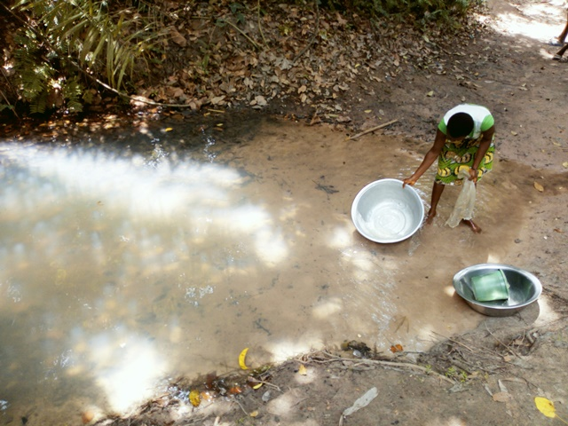

template: article
title: Angoua Yaokro
slug: angoua-yaokro
iddbb: Angoua Yaokro
tags: Rural
authors: BROU Yves Oscar Kouadio, SORO Doba, MAILLARD Thomas, DIAKITE A. Cheick, KOHE A. Christelle, OUATTARA Mafine, SERI A. Jonathan, N'GUESSAN Firmain Kouakou
date: 2019-02-19
latitude:  7.69897 
longitude: -5.21261
zoom: 16
localisation: Ouest de Bouaké, sur la route de Béoumi, au sud de la retenu de la Loka

|Informations générales||
|:--|--:|
| Nom de la localité : | Angoua Yaokro | 
| Population : | 2000 habitants | 
| Dessertes en eau potable | Raccordé au réseau SODECI | 
| Gestion des excrétas | Assainissement autonome |

## Présentation de la localité
Angoua-Yaokro est un village de la Sous-préfecture de Bouaké situé à 13 km dans la direction ouest de la ville, sur l’axe Bouaké-Béoumi. Il compte plus de 1000 habitants. Angoua-Yaokro abrite une école primaire, mais pas de centre de santé. Le village est relié au réseau de la SODECI. Cependant il n’y a pas d’électricité dans le village.

En ce qui concerne la typologie d’habitat que l’on retrouve dans ce village, elle est plutôt sous un style traditionnel avec des maisons construites en banco. On trouve aussi des maisons modernes. La majorité des habitations sont dépourvues de latrines et les habitants pratiquent la défécation à l'air libre en lisière du village.

Les activités génératrices de revenus sont généralement axées sur l’agriculture avec une production d’anacarde comme culture de rente et le riz, l’igname, etc. comme cultures vivrières

## État des lieux des ouvrages d’alimentation en eau potable

### Ouvrages existants
Le village est raccordé au réseau de la SODECI. Il se trouve en outre juste à côté du point de captage et de l'usine de traitement de l'eau du barrage de la Loka.
 
 
 

Un marigot relativement éloigné du village est utilisé quotidiennement pour les habitants n’ayant pas accès au réseau de la SODECI. Pour ceux qui disposent d’un robinet, le marigot n’est qu’une alternative en cas de pénurie d’eau.
L’enquête sanitaire réalisée au niveau du marigot révèle une couleur blanchâtre de l’eau. Elle indique également que ce point d’eau ne présente pas de risque pour la santé des populations. Les analyses de la qualité de l’eau révèlent l’absence d’une pollution azotée dans les échantillons d’eau. Les paramètres microbiologiques ont révélé la présence de *E. coli* (9 UCF/100ml).

  

### Gestion des points d’eau

Il n’y a pas de véritable gestion des points d’eau. Les personnes chez qui il y a l’eau de SODECI permettent généralement à ceux qui n’en ont pas de s’approvisionner. Néanmoins lorsqu’il y a des coupures d’eau de la SODECI, tout le monde se retourne vers les marigots où il n’y a aucun mécanisme de gestion de la source.

## Personnes ressources

* Chef de village 
* Présidente des Femmes                                
* Président des jeunes

## Gestion des excrétas
L’évacuation des selles dans le village se fait à partir de différents types de latrines. Nous avons des latrines à fosses septiques avec ou sans chasse d’eau et des latrines à fosse directe. Néanmoins, comme dans plusieurs villages, la défécation en brousse se fait toujours.
## Desideratas des populations
| Type d'entretien | Date | 
| :-- | :--: | 
| Entretien individuel Chef de village |19 Fevrier 2019| 
| Entretien individuel Président des Femmes|19 Fevrier 2019 | 
| Focus group femmes |19 Fevrier 2019| 

Les habitants souhaiteraient que la distribution de l'eau par la SODECI soit de meilleure qualité. Comme ils se trouvent en tête de réseau l'eau a parfois un fort goût de chlore. Ils amenaient aussi que les coupures soit moins fréquentent.

## Tensions ressenties lors des entretiens

### Tensions générales
Aucune tension signalée

### Tensions autour de l'eau
Aucune tension signalée

### Tensions avec les localités voisines
Aucune tension signalée.
