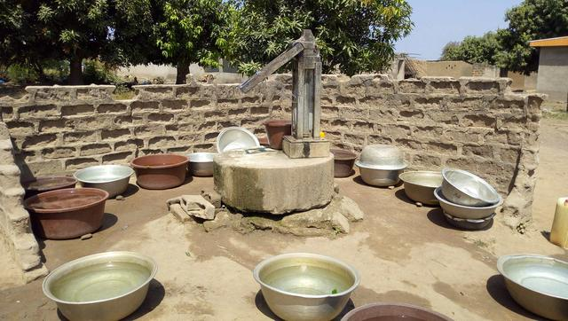
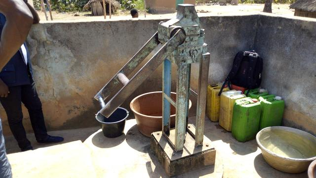

template: article
title: Assoumankro
iddbb: Assoumankro
slug: assoumankro
tags: Rural
authors: BROU Yves Oscar Kouadio, SORO Doba, MAILLARD Thomas, DIAKITE A. Cheick, KOHE A. Christelle, OUATTARA Mafine, SERI A. Jonathan, N'GUESSAN Firmain Kouakou
date: 2019-05-07
latitude: 7.84473
longitude: -5.02773
zoom: 16
localisation: Nord de Bouaké

|Informations générales||
|:--|--:|
| Nom de la localité : | Assoumankro | 
| Population : | 400 habitants | 
| Dessertes en eau potable | Non raccordé au réseau SODECI | 
| Gestion des excrétas | Assainissement autonome | 

## Présentation de la localité
Le village d’Assoumankro est situé au nord de la ville de Bouaké à environ 11 kilomètres. Il dispose d’une école de 6 classes, mais n’est pas raccordé au réseau d'eau potable de la SODECI. Le village compte environ 400 habitants. Ce village est relié au village de Kouamé Assêkro. Les deux forment désormais un village unique qu’on appelle sêssêkro.

La typologie d’habitat que l’on retrouve dans ce village s’apparente à un style traditionnel. Les maisons construites en géobéton (brique de terre-ciment) ou en banco. Le village est traversé par une route non bitumée menant au village d’Affouvansou. Les activités génératrices de revenus sont généralement axées sur l’agriculture avec une production d’anacarde comme culture de rente et le riz et l’igname comme cultures vivrières. On observe aussi certains investissements dans le commerce et la restauration.

## Socio-Anthropologie

 Les autochtones du village sont des Baoulés appartenant au sous-groupe fahaphouè du canton pharis ayant pour chef de canton le village de Konankankro. En ce qui concerne les infrastructures, le village ne dispose  d’aucun dispensaire et d’aucun point de collecte d’ordures ménagères. Cette situation oblige la communauté à déverser les ordures ménagères dans un lieu public. De plus, il faut noter que la majorité des villageois ne disposent pas de toilettes dans leurs maisons. En effet, les anciennes constructions (cases) ne prévoyaient pas de toilettes, du coup, les villageois vont faire leur besoin dans la forêt. On observe également des excréments d’animaux partout dans le village et également à proximité des points d’eau.

## État des lieux des ouvrages d’alimentation en eau potable
### Existants
Nous avons identifié 1 source principale d’approvisionnement en eau de consommation : les forages. Le forage est la principale source d’approvisionnement en eau de boisson pour cause de la qualité. Elle sert pour tous les usages.
Le village compte 3 forages (1 défaillants et 2 fonctionnel). Les enquêtes ont porté sur les 2 points d’eau fonctionnels. L’un des forages fonctionnels souffre régulièrement de pannes au niveau du moteur et des tuyaux depuis 5 mois. Le déficit de moyen financier rend son entretien presque impossible. Il tombe en panne en moyenne 3 fois par an. La qualité de l’eau est jugée acceptable par les populations et l’analyse de l’eau n’a pas révélé des anomalies particulières. Quant à la pompe en panne depuis 3 mois, elle souffre d’une défaillance au niveau du tuyau. Le coût total de la réparation s’élève à 100 000 FCFA. Le comité de gestion éprouve des difficultés à rassembler cette somme. 
Les analyses des paramètres physiques de l’eau de la pompe ont démontré que l’eau avait une forte concentration en fluor (1,4 mg/l). Ces points d’eau ont un niveau de vulnérabilité élevé au niveau de ces points d’eau.

### Pratiques et modes d’approvisionnement en eau
La population de Assoumankro s'approvisionne majoritairement à la pompe et aux marigots. Les pannes récurrentes du forage les incitent à privilégier l’eau du marigot.  Il faut souligner qu’il existe 3 PMH dans le village dont deux fonctionnelles. Mais il ressort que le processus d’approvisionnement est lent et certains points d’eau sont éloignés des ménages en particulier les marigots.

### Gestion des points d’eau. 
Le village s’approvisionne avec 2 PMH fonctionnelles et aux marigots. L’eau des PMH, est essentiellement utilisée pour les activités quotidiennes qui sont la boisson, la cuisine et toutes les activités ménagères. En effet, la gestion revient au comité de gestion. L’eau de la pompe est vendue à 10 FCFA par cuvette. 

Les marigots sont le plus utilisés par les femmes à cause des pannes récurrentes de la pompe. Les règles d'usage sont très respectées (interdiction d'y puiser les mercredi et vendredi).

## Personnes ressources 

* Le représentant du chef
* Le président des jeunes
* La présidente du comité de gestion
* Les membres du comité d’organisation

## Gestion des excréta
Assoumankro est assez vulnérable au niveau de l’hygiène et de l’assainissement. La majeure partie des concessions ne dispose pas de latrine. Par conséquent, la défécation à l’air libre continue de se faire par les habitants du village. Pour ce qui concerne la gestion des ordures ménagères, il n’existe pas un système propre au village. Les déchets ménagers sont collectés et déversés en brousse. 

## Desideratas des populations

| Type d'entretien | Date | 
| :-- | :--: | 
| Entretien individuel Chef de village Assoumankro|24 janvier 2019| 
| Entretien individuel Présidente des Femmes Assoumankro|24 janvier 2019| 
| Entretien individuel Président du comité de gestion Assoumankro|24 janvier 2019|
| Focus group hommes Assoumankro|24 janvier 2019|
| Focus group femmes Assoumankro|24 janvier 2019|

Face aux problèmes rencontrés dans l’approvisionnement en eau chez les communautés locales, les populations demandent l’installation d’autres pompes, car elles estiment que celles qui existent déjà sont insuffisantes. 
La population d’Assoumankro souhaiterait qu’on répare leur pompe en panne en premier lieu et dans un second temps: construire une nouvelle pompe. Enfin, entretenir les marigots, former et renforcer la capacité des membres des comités de gestion. De plus ils aimeraient obtenir des latrines et un point de collecte d’ordures.

## Tensions ressenties lors des entretiens

### Tensions générales
Aucune tension signalée

### Tensions autour de l'eau
Du fait de la rareté des points d’eau communautaires, des disputes éclatent dans la file d’attente, toutefois celles-ci demeurent ponctuelles et de faible ampleur.

### Tensions avec les localités voisines
Aucune tension signalée.

