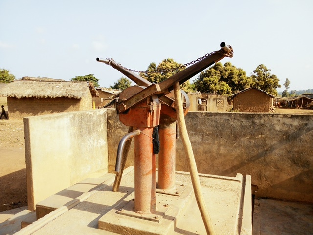
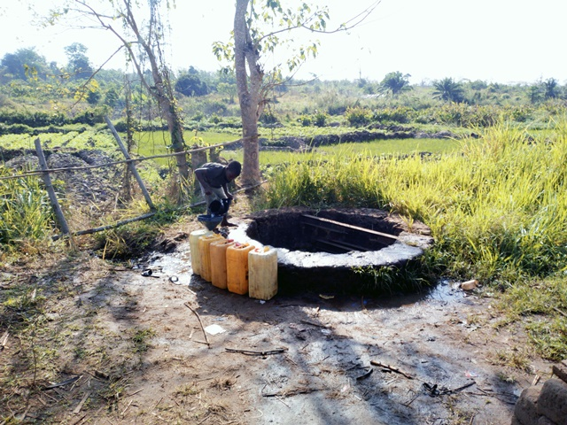
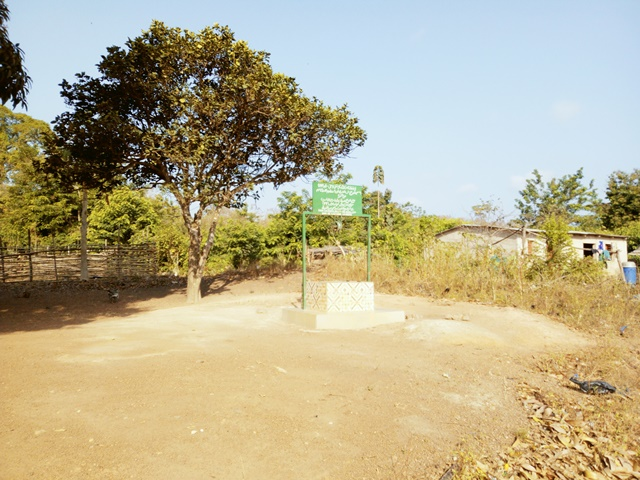

template: article
title: Bamaro Gare
slug: bamorogare
iddbb: Bamoro gare
tags: Rural
authors: BROU Yves Oscar Kouadio, SORO Doba, MAILLARD Thomas, DIAKITE A. Cheick, KOHE A. Christelle, OUATTARA Mafine, SERI A. Jonathan, N'GUESSAN Firmain Kouakou
date: 2019-02-18
latitude: 7.82287
longitude: -5.07437
zoom: 16
localisation : Nord de Bouaké

|Informations générales||
|:--|--:|
| Nom de la localité : | Bamaro Gare | 
| Population : | 900 habitants | 
| Dessertes en eau potable | Pas raccordé au réseau SODECI | 
| Gestion des excrétas | Assainissement autonome | 

## Présentation de la localité
Le village de Bamoro Gare est situé à plus de 10 kilomètres de la commune de Bouaké. On y accède par la route bitumée qui dessert la gare. Le village compte de plus 900 habitants. Bamoro Gare ne dispose pas d’école et de centre de santé communautaire. La population se rend dans le village  de Bamoro pour les problèmes sanitaires et dans le village voisin de N’Gatta Sakassou pour l’éducation des enfants.

On y retrouve essentiellement des habitations de tous types : des habitations en parpaings, en terre ou en ciment avec des tôles ondulées.  Le village ne dispose pas d’école et de centre de santé. Les élèves du village vont à l’école de Golikro.

Il n'y a pas de système de gestion des ordures ménagères, aussi celles-ci sont déposées en marge du village à la lisère de la forêt. Les habitations sont rarement équipées de latrines, aussi les habitants pratiquent la défécation à l'air libre à l'écart des habitations.

L'activité principale du village est l'agriculture vivrière (igname, manioc, riz et autres productions maraîchères tomates, piments et aubergines) et la culture de rente de l'anacarde. Les femmes du village transforment le manioc en attiéké dans de petites unités de production familiales. Chaque ménage élève quelques moutons ou quelques chèvres. Durant la saison des pluies, les animaux sont gardés dans des enclos pour qu'ils ne divaguent pas dans les espaces cultivés.

## Socio anthropologie de la localité

Le village de Bamoro Gare est à l'origine un camp temporaire accueillant les ouvriers du chemin de fer. À la différence des villages alentour, il accueille une importante population non-Baoulé: ressortissant du nord de la Côte d'Ivoire, du Mali, de Guinée ou du Burkina Faso. La communauté Baoulé est structurée par un système de chefferie hiérarchisé. Cependant, les non-Baoulés sont peu impliqués dans la gestion collective du village et ne reconnaissent pas l'autorité des chefs Baoulé. De ce fait, la communauté villageoise apparait fragmentée et peu mobilisée pour des projets d'intérêt commun. Comme en témoignent l'absence d'équipement communautaire et le mauvais état des points d'eau collectifs. 

## État des lieux des ouvrages d’alimentation en eau potable

### Ouvrages existants
Bamoro gare compte 3 pompes à motricité humaine (PMH), elles étaient toutes en panne lors de notre visite. Les seuls points d’eau utilisés par les habitants du village sont le puits colonial construit dans les années 30 lors de la construction du chemin de fer et les puits offerts par les ONG musulmanes  pendant la crise de l’eau à Bouaké. Les deux premières pompes sont en pannes depuis une dizaine d’années. La troisième pompe, tombée en panne en 2019, n’avait pas encore été réparée. Il s’agit d’un forage équipé d’une double pompe ABI.
L’enquête sanitaire a porté exclusivement sur le puits colonial. L’inspection sanitaire a ainsi démontré une forte vulnérabilité de ce point d’eau par rapport aux sources de pollution. En effet, il est situé à proximité du puits des jardins maraichers, l’environnement autour du puits est très sale et le puits n’avait pas de couverture.
L’analyse d’un échantillon d’eau du puits a révélé de fortes concentrations de nitrate et de fluor. Les concentrations de ces deux paramètres sont supérieures à la norme recommandée par l’OMS pour les eaux de boisson. En plus, une contamination à *E. coli* a été détectée dans l’eau du puits.

### Pratiques et modes d’approvisionnement en eau
Il ressort de nos entretiens avec les leaders communautaires que lorsque la pompe fonctionne, celle-ci constitue la principale source d’alimentation en eau potable des populations. Elle est utilisée pour toutes les tâches domestiques. Cependant, lorsqu’elle tombe en panne comme lors de notre passage dans le village, la population se tourne vers le puits colonial pour la collecte de l’eau.

### Gestion des points d’eau
Le comité de gestion existe. Mais il n’y a pas de moyens financiers pour réparer les PMH qui sont en panne. L’eau de puits et celle des marigots ne nécessitent pas une gestion particulière. 

## Personnes ressources
 
 
* Chef du village de Bamoro gare
* Président des jeunes de Bamoro gare

## Assainissement et gestion des excrétas
L’assainissement général et gestion des excréta se fait de manière autonome. Chaque concession élimine ses déchets.  La gestion des ordures ménagères se fait de manière individuelle dans les habitations. Généralement dans les villages, un site est identifié et utilisé comme dépotoir des ordures ménagères.
Les latrines sèches à fosse simple sont les plus répandues dans le village.

## Desiderata des populations
| Type d'entretien | Date | 
| :-- | :--: | 
| Entretien individuel Chef de village Bamoro Gare|18 février 2019| 
| Entretien individuel Présidente des Femmes Bamoro Gare|18 février 2019|
| Entretien individuel Présidente du comité de gestion Bamoro Gare|18 février 2019| 
| Focus group hommes Bamoro Gare|18 février 2019|
| Focus group femmes Bamoro Gare|18 février 2019|

Au sortir de nos entretiens avec les personnes ressources de la communauté, la réparation des trois PMH et la formation des membres du comité de Gestion, ainsi que des aides pour leur financement ont été sollicitées. 

## Tensions ressenties lors des entretiens

### Tensions générales
Aucune tension importante n'a été relevée, si les différentes communautés composant le village cohabitent sans heurts, elles peinent à collaborer pour mener à bien des projets d'intérêt commun. 

### Tensions autour de l'eau
Les pannes des pompes ont augmenté les files d'attente au marigot et au puits colonial. Des disputes éclatent dans la file d’attente, toutefois celles-ci demeurent ponctuelles et de faible ampleur. 

### Tensions avec les localités voisines
Aucune tension avec les villages des environs.

