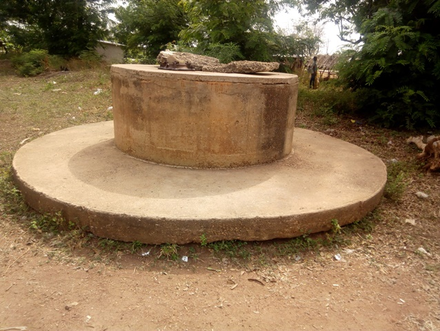
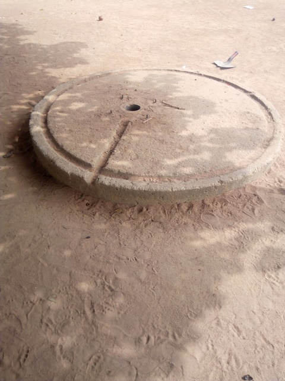
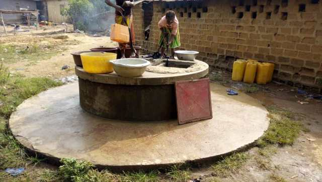

template: article
title: Bendêkouassikro
slug: bendekouassikro
iddbb: Bendêkouassikro
tags: Rural
authors: BROU Yves Oscar Kouadio, SORO Doba, MAILLARD Thomas, DIAKITE A. Cheick, KOHE A. Christelle, OUATTARA Mafine, SERI A. Jonathan, N'GUESSAN Firmain Kouakou
date: 2019-02-14
latitude:  7.65540
longitude: -5.13027
zoom: 16
localisation: Ouest de Bouaké, sur la route de Sakassou

|Informations générales||
|:--|--:|
| Nom de la localité : | Bendêkouassikro | 
| Population : | 2000 habitants | 
| Dessertes en eau potable | Partiellement raccordé au réseau SODECI | 
| Gestion des excrétas | Assainissement autonome |

## Présentation de la localité
Bendêkouassikro est un village situé à 8 km à l’ouest de la ville de Bouaké. C’est un village  moderne d’environ 2000 habitants divisé en 03 quartiers. Le village dispose d’une grande école primaire ainsi que d’un centre de santé.

L’habitat du village est moderne avec principalement des maisons faites en briques de ciment et couvertes de tôles. Néanmoins on y retrouve encore des habitations anciennes faites en briques de terre battue et recouverte de paille ou de tôles. 

À Bendêkouassikro, les activités agricoles sont toujours d’actualité avec essentiellement la culture de l’anacarde et à côté les cultures vivrières telles que l’igname, le manioc, l’anacarde et les maraichers (tomate, piment, aubergine). Nous retrouvons aussi les activités commerciales avec l’hôtellerie et la restauration.

## État des lieux des ouvrages d’alimentation en eau potable

### Ouvrages existants

Le village de Bendêkouassikro est raccordé au réseau de la SODECI, mais les coupures sur le réseau sont fréquentes.

 
 
 
 
 
 

En matière d’hydraulique villageoise, le village possède aussi 3 points d’eau équipés de pompes hydrauliques toutes en panne, dont deux complètement inutilisables et démontées. 

Seul un point reste encore utilisable, il s’agit d’un puits à grand diamètre équipé d’une PMH non fonctionnelle munie d’une trappe. Ce point d’eau fait office de puits domestique pour tout le village. 

Les trois pompes hydrauliques datent des années 1976. Seul le puits a fait l’objet de notre enquête. Il était équipé auparavant d’une pompe, mais aujourd’hui les usagers ouvrent la trappe du puits pour ainsi puiser de l’eau à l’aide de puisette. Le puits est assez profond avec 15 m de profondeur et  il y a de l’eau dans le puits toute l’année. L’inspection sanitaire réalisée autour du point d’eau a montré que le point d’eau est moyennement vulnérable aux risques de contamination avec un score de 4. Cela s’explique par l’eau stagnante autour du point d’eau, le système d’exhaure notamment les puisettes et le couvercle qui sont en mauvais état.
Au niveau de l’analyse de la qualité de l’eau, nous avons relevé un taux élevé de nitrate (supérieur à 50 mg/L) dans l’eau du puits ainsi qu’une absence de chlore qui montre que le puits n’est pas traité. 

Le village possède aussi 03 marigots situés à différents endroits du village. Nous avons pu constater que les points d’eau sont envahis par les broussailles. L’eau des points d’eau est de couleur blanchâtre avec un gout d’argile. L’analyse de la qualité de l’eau a montré un taux élevé de nitrate dans l’eau de ces points d’eau et une contamination à *E. coli*.

  
 

### Pratiques et modes d’approvisionnement en eau
Le village étant raccordé au réseau de la SODECI, la principale source d’approvisionnement en eau est l’eau du robinet. Cependant, avec les nombreuses coupures d’eau les habitants se tournent vers le puits et les marigots. L’eau de la SODECI est utilisée principalement pour la boisson. L’eau de puits et de marigot vient en complément de l’eau de la SODECI ou en remplacement lorsque cette dernière est indisponible. Toutes les concessions ne possèdent pas de compteur. Celles qui n’en possèdent pas vont s’approvisionner dans les habitations voisines qui en possèdent.

### Gestion des points d’eau

Les marigots sont ouverts à tous. Tout le monde peut y puiser de l’eau sans restriction. Le puits quant à lui est géré par un homme du village.

## Personnes ressources

* Chef de village
* Présidente des femmes
* Président des jeunes du village

## Gestion des excrétas
L’évacuation des selles dans le village se fait à partir de différents types de latrines. Nous avons des latrines à fosses septiques avec ou sans chasse d’eau et des latrines à fosse directe. Néanmoins, comme dans plusieurs villages, la défécation en brousse se fait toujours.

## Desideratas des populations
| Type d'entretien | Date | 
| :-- | :--: | 
| Entretien individuel Chef de village Bindêkouassikro|14 février 2019| 
| Entretien individuel Présidente des Femmes|14 février 2019|
| Entretien individuel Présidente du comité de gestion|14 février 2019| 
| Focus group hommes |14 février 2019|
| Focus group femmes |14 février 2019|

Face aux coupures intempestives de l’eau de la SODECI, les communautés souhaiteraient que les deux autres pompes soient réinstallées. Les hommes vont plus loin en demandant un forage de plus ; car une forte pression s’exerce sur celui qui est utilisé.   

## Tensions ressenties lors des entretiens

### Tensions générales
Aucune tension signalée

### Tensions autour de l'eau
Du fait de la rareté des points d’eau communautaires, des disputes éclatent dans la file d’attente, toutefois celles-ci demeurent ponctuelles et de faible ampleur.

### Tensions avec les localités voisines
Aucune tension signalée.
