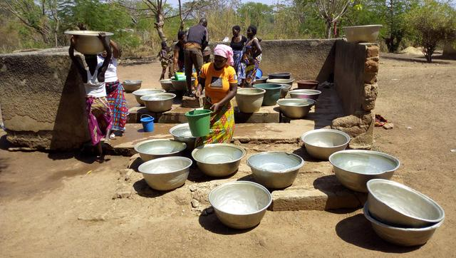
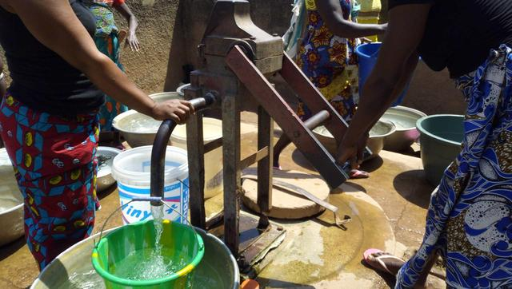
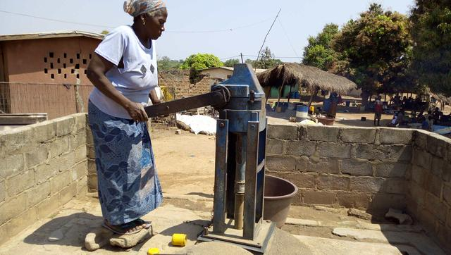

template: article
title: Djêkro
iddbb: Djêkro
slug: djekro
tags: Rural
authors: BROU Yves Oscar Kouadio, SORO Doba, MAILLARD Thomas, DIAKITE A. Cheick, KOHE A. Christelle, OUATTARA Mafine, SERI A. Jonathan, N'GUESSAN Firmain Kouakou
date: 2019-05-07
latitude: 7.83624
longitude: -5.04178
zoom: 16
localisation: Nord de Bouaké

|Informations générales||
|:--|--:|
| Nom de la localité : | Djêkro | 
| Population : | 2800 habitants | 
| Dessertes en eau potable | Non raccordé au réseau SODECI | 
| Gestion des excrétas | Assainissement autonome | 

## Présentation de la localité
Djêkro est un village situé au nord de la ville de Bouaké à environ 9 kilomètres. Il est peuplé majoritairement par les Baoulés du sous-groupe Pharis. On y retrouve par ailleurs des allogènes Burkinabés et Maliens. Au total, ce sont environ 800 habitants qui peuplent ce village. Djêkro est situé juste à la périphérie du village de Bamoro.  Malgré sa dense population, Djêkro ne dispose pas d’école et de centre de santé rural et n’est pas connecté au réseau de la SODECI. La population se rend à l'école et au poste de santé de Bamoro.
La typologie d’habitat que l’on retrouve dans ce village s’apparente à un style plutôt traditionnel avec des maisons construites en banco pour certains et d’autres avec des briques en terre battue. Cependant on ne manque pas d’observer des constructions en béton. Ces concessions appartiennent pour la plupart à des cadres du village et autres retraités.  Les activités génératrices de revenus sont généralement axées sur l’agriculture avec une production d’anacarde comme culture de rente et le riz et l’igname comme cultures vivrières

## Socio anthropologie de la localité 
Le village est peuplé des Baoulés fahafouè ou pharis. L'organisation sociale du village est similaire à l'organisation classique des communautés villageoises Baoulé. Les affaires du village sont gérées par les notables formant une chefferie hiérarchisée qui intègre aussi des représentants des organisations de femmes et de jeunes. La chefferie intervient dans le règlement des conflits (intracommunautaires et extracommunautaires) et joue un rôle d'interface entre la communauté villageoise et les administrations publiques et collectivités territoriales.  L’association des femmes fonctionne et elles entreprennent des activités génératrices de revenus. 

 Les habitants sont majoritairement issus des lignages fondateurs du village et les ménages sont constitués de famille nucléaire associant parfois des membres collatéraux (parents, cousins ou fratrie célibataire). Les tâches ménagères et en particulier l'approvisionnement en eau du ménage demeure l'apanage des femmes.

## État des lieux des ouvrages d’alimentation en eau potable
### Existants
Djêkro dispose de 2 points d’eau majeurs à savoir : 1 forage et 1 marigot.  Le forage est la seule source d’approvisionnement en eau dans le village, aussi il tombe régulièrement en panne. En effet, datant de 1989, ce dernier tombe en panne en moyenne 1 fois par mois. Son entretien n’est pas régulier ce qui le rend encore plus vulnérable face à la densité de la population et à la pression qu'il subit quotidiennement. Les types de pannes les plus fréquentes se situent au niveau des tuyaux. Les frais d’entretien sont soumis à la charge du comité de gestion de l’eau.

L’enquête sanitaire réalisée au niveau du forage indique que ce point d’eau ne présente pas de risques pour la santé des populations. Les analyses de la qualité de l’eau révèlent l’absence d’une pollution azotée dans les échantillons d’eau. Quant aux usagers, ils estiment que l’eau du forage est agréable à la consommation. Selon eux, il n’y a aucune anomalie au niveau organoleptique. À cet effet, l’eau est utilisée pour la boisson, la cuisine, la vaisselle et le bain. L’analyse bactériologique ne révèle pas de contamination par *E. coli*. 

Le marigot est situé dans un bas-fond et ne bénéficie pas d’entretien particulier. L’eau du marigot est utilisée à des fins d’hygiène. Elle sert à faire la lessive et non à la consommation comme eau de boisson. Cela est motivé par sa couleur trouble et rougeâtre. 

### Pratiques et modes d’approvisionnement en eau
La population s’approvisionne essentiellement dans la PMH et dans les marigots. Ce sont les principales sources d’eau existantes dans le village. Les femmes, qui sont chargées de la collecte de l’eau, se réveillent de bonne heure (5h du matin) pour s’approvisionner auprès de la seule PMH. Le comité de gestion est chargé  d’ouvrir la pompe tôt le matin afin de permettre à ces femmes de collecter de l’eau. L’eau de marigot ne bénéficie pas d’un traitement particulier..

### Gestion des points d’eau
Le comité de gestion est chargé de la PMH. Le comité de gestion est composé d’une personne. La responsable est chargée d’ouvrir et de fermer la PMH à des heures précises. Un prix forfaitaire (10 FCFA/cuvette) est demandé à chaque personne qui s'y approvisionne. Cet argent est reversé dans une caisse et est utilisé pour l’entretien général de la PMH. Il faut préciser que malgré ce dispositif de collecte de fonds, le village manque parfois de ressources pour les réparations de la PMH.

## Personnes ressources

* Chef de village 
* Président des Femmes
* Le gestionnaire des pompes 

## Gestion des excréta
Le niveau d’assainissement est faible, car on observe des excréments d’humains et d’animaux aux abords du village. On y observe également des déchets ménagers à savoir des sachets plastiques, des bouts de papier et des noyaux de fruits (mangues et anacarde) partout dans le village. De plus,  Djèkro ne dispose pas d’un réseau de drainage des eaux de pluie et usées. Ces eaux sont généralement déversées dans les cours des maisons ou dans les broussailles environnantes. Tout cela témoigne du niveau d’assainissement médiocre du village. Nos entretiens ont également révélé que la majorité des habitants n’ont pas de latrines raison pour laquelle on retrouve des excréments aux abords du village. Ainsi, le manque d’infrastructures d’assainissement contribue au fait que les habitants défèquent à l’air libre. Enfin, les animaux n’ayant pas d’enclos, se promènent et défèquent partout dans le village.

## Desiderata des populations
| Type d'entretien | Date | 
| :-- | :--: | 
| Entretien individuel Chef de village |06 février 2019| 
| Entretien individuel Président des Femmes|06 février 2019| 
| Entretien individuel Présidente du comité de gestion|06 février 2019| 
| Focus group hommes |06 février 2019| 
| Focus group femmes |07 février 2019| 

La préoccupation majeure des habitants de Djèkro est d’avoir de l’eau potable. Toutefois, ils n'ont pas émis de souhait précis lors de notre visite.

## Tensions ressenties lors des entretiens

### Tensions générales
Aucune tension signalée

### Tensions autour de l'eau
Du fait de la rareté des points d’eau communautaires, des disputes éclatent dans la file d’attente, toutefois celles-ci demeurent ponctuelles et de faible ampleur.

### Tensions avec les localités voisines

La fusion des trois villages limitrophes (Bamoro, Djèkro et Béssérikro) a entrainé des conflits de légitimité entre les différents chefs de village, qui peuvent entraver des projets d'intérêt commun.

