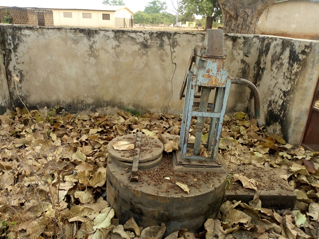
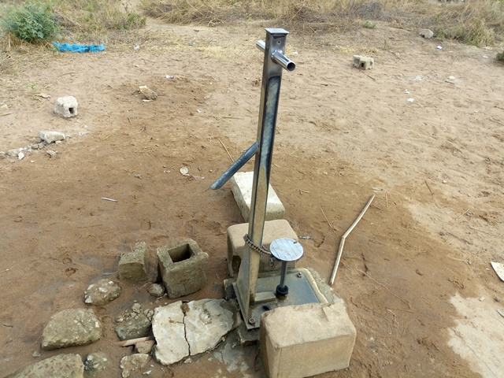
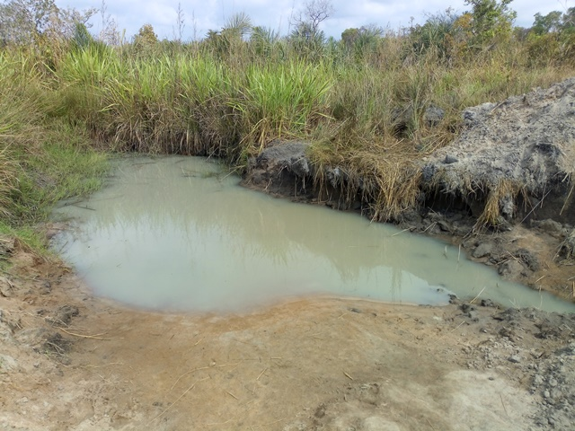
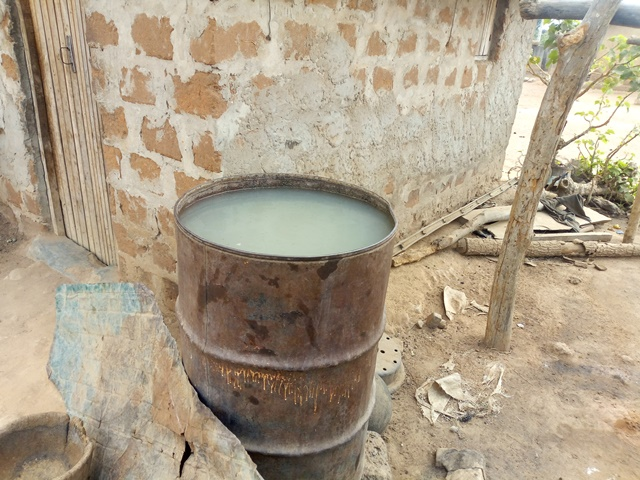
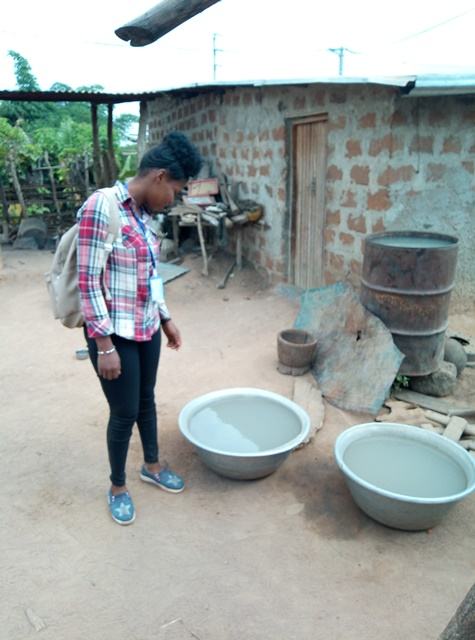

template: article
title: Djétouankro
slug: djetouankro
iddbb: Djetouankro
tags: Rural
authors: BROU Yves Oscar Kouadio, SORO Doba, MAILLARD Thomas, DIAKITE A. Cheick, KOHE A. Christelle, OUATTARA Mafine, SERI A. Jonathan, N'GUESSAN Firmain Kouakou
date: 2019-01-30
latitude:  7.75157 
longitude: -4.91047 
zoom: 16
localisation: Nord-Est de Bouaké, sur la route de Bassawa

|Informations générales||
|:--|--:|
| Nom de la localité : | Djétouankro | 
| Population : | 400 habitants | 
| Dessertes en eau potable | Partiellement raccordé au réseau SODECI | 
| Gestion des excrétas | Assainissement autonome | 

## Présentation de la localité
Le village de Djétouankro est situé à environ 7 kilomètres de Bouaké en sortant du quartier Belleville 2. On y accède par une large route en terre battue.  Il compte environ 400 habitants et dispose d’une école primaire de 06 classes. Les habitants du village se rendent dans la commune de Bouaké pour accéder à des services sanitaires.

On y retrouve essentiellement des habitations de tous types : parpaings, terre, ciment avec des tôles ondulées. On note aussi la présence de cases en banco, mais en de faibles proportions. L'agriculture est l'activité principale : l’igname, le manioc, l’anacarde et les produits maraichers (tomate, piment, aubergine).

En ce qui concerne les infrastructures, le village ne dispose pas de point de collecte d’ordures ménagères. Cette situation oblige la communauté à  déverser les ordures ménagères dans la forêt juste derrière le village. De plus, il faut noter que la majorité des villageois ne disposent pas de toilettes dans leurs maisons et vont faire leur besoin dans la forêt. On observe également des excréments d’animaux partout dans le village et en particulier à proximité des points d’eau.

## Socio anthropologie de la localité 

LE village est peuplé par les Baoulés fahafoués, il appartient au canton Fahafouè-Gossan . Le village est structuré en chefferie: un chef de village  assisté par des notables, un président des jeunes et une présidente des femmes. La chefferie s’occupe de l’organisation générale et du bien-être des habitants du village. En d’autres termes, la chefferie intervient dans le règlement des conflits (intracommunautaire et extra-communautaire). Elle intervient également auprès des collectivités territoriales en faisant des plaidoyers pour l’acquisition de nouvelles infrastructures éducatives, environnementales, hydraulique, etc.

## État des lieux des ouvrages d’alimentation en eau potable

### Ouvrages existants
Le village est en cours de raccordement au réseau de la SODECI mais la distribution de l’eau aux concessions abonnées n’était pas encore effective lors des enquêtes dans le village. Seule 1 habitation du village sur les 35 abonnées recevait de l’eau, mais par intermittence.
En ce qui concerne l’hydraulique villageoise, le village compte 2 pompes à motricité humaine (PMH), dont une seule fonctionnelle. 

La pompe à main de modèle ABI de l’école est en panne depuis 2 ans. Les tuyaux en fer sont perforés et elle est abandonnée.

 La seule pompe fonctionnelle (de type Vergnet HPV 60) connait beaucoup de pannes (Baudruche et tuyaux perforés). Par ailleurs, la construction du point d’eau n’a pas été achevée. Il n’y a pas de clôture et la dalle anti-bourbier est mal réalisée. La margelle est très dégradée si bien que les eaux de ruissellement pénètrent dans le forage. L’inspection sanitaire du forage fonctionnel relève une forte vulnérabilité du point d’eau avec un score de 8. Cependant, l’analyse de la qualité de l’eau du forage indique seulement une pollution  au fluor supérieure à 1,5 mg/l recommandé pour l’eau de boisson.
 
 
 
 
 
 Il importe de souligner que les 2 pompes sont relativement loins des habitations.
 
 
Le marigot est une ancienne sablière (trou pour extraire du sable) qui tarit chaque année en saison sèche.

### Pratiques et modes d’approvisionnement en eau

Les femmes du village préfèrent se rendre chez le seul ménage recevant l'eau courante pour s'approvisionner, car il est plus proche de leurs habitations que la pompe fonctionnelle.

En cas de coupure sur le réseau, elles se rendent à la pompe.

L'eau du marigot est plutôt utilisée pour la lessive, mais peut parfois servir à la boisson en cas de longue coupure du réseau et de panne de la pompe.
 
 
  Les habitants stockent de grandes quantités d'eau chez eux en prévision des pénuries et pannes de leurs différentes sources d'approvisionnement.
 
 
 

### Gestion des points d’eau

La pompe est gérée par un comité de gestion qui assure l'ouverture et la fermeture de la pompe à heure fixe, régule la file d'attente et recueille les fonds nécessaires aux réparations.

## Personnes ressources

* Chef de village 
* Présidente des Femmes                                
* Président des jeunes

## Gestion des excrétas
La gestion des excréta dans le village se fait de manière individuelle. La majeure partie des habitations ne disposent pas de latrines améliorées. Les quelques latrines que l’on rencontre dans le village sont principalement des latrines sèches à fosse simple. Les habitants qui ne disposent pas de latrines pratiquent la défécation à l’air libre. 

Pour ce qui concerne la gestion des ordures ménagères, il n’existe pas un système propre au village. Les déchets ménagers sont collectés et déversés en brousse. 

## Desideratas des populations
| Type d'entretien | Date | 
| :-- | :--: | 
| Entretien individuel Chef de village |30 janvier 2019| 
| Entretien individuel Président des Femmes|30 janvier 2019| 
| Entretien individuel Présidente du comité de gestion|30 janvier 2019| 
| Focus group hommes |30 janvier 2019| 
| Focus group femmes |30 janvier 2019| 

Au vu des difficultés liées à l’accès à l’eau dans le village, les habitants souhaiteraient que les pompes en panne soient réhabilitées et que de nouvelles pompes soient construites.

## Tensions ressenties lors des entretiens

### Tensions générales
Aucune tension signalée

### Tensions autour de l'eau
Du fait de la rareté des points d’eau communautaires, des disputes éclatent dans la file d’attente, toutefois celles-ci demeurent ponctuelles et de faible ampleur.

### Tensions avec les localités voisines
Aucune tension signalée.
