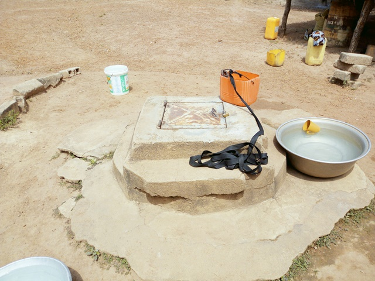
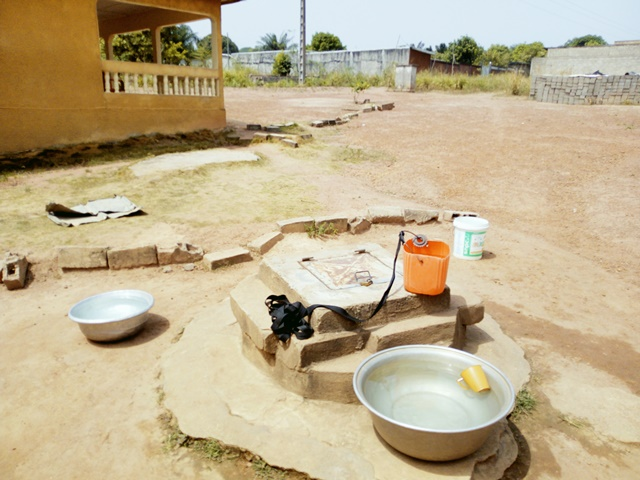

template: article
title: Ikilatêkro
slug: ikilattekro
iddbb: Iki Lattekro
tags: Rural
authors: BROU Yves Oscar Kouadio, SORO Doba, MAILLARD Thomas, DIAKITE A. Cheick, KOHE A. Christelle, OUATTARA Mafine, SERI A. Jonathan, N'GUESSAN Firmain Kouakou
date: 2019-02-14
latitude:  7.63450 
longitude: -5.14226 
zoom: 16
localisation: Ouest de Bouaké, sur la route de Sakassou

|Informations générales||
|:--|--:|
| Nom de la localité : | Ikilatêkro | 
| Population : | 600 habitants | 
| Dessertes en eau potable | Raccordé au réseau SODECI | 
| Gestion des excrétas | Assainissement autonome |

## Présentation de la localité
Ikilatêkro est un grand village de la Sous-préfecture de Bouaké situé à l’ouest à 10 kilomètres de Bouaké. Ce village fait partie du canton Dôhoun dont le chef-lieu de canton est le village de Bendêkouassikro. Il est peuplé de plus de 600 habitants composés de Baoulés provenant de Walêbo et de personnes venues d'autres régions de la Côte d'Ivoire et des pays limitrophes. 

Ce village dispose d’une école primaire, mais pas de centre de santé. Le village est relié au réseau électrique et à celui de la SODECI. 

En ce qui concerne la typologie d’habitat que l’on retrouve à Ikilatêkro, elle est plutôt sous un style moderne avec des maisons construites en briques en terre battue. Toutefois, les habitants déplacent progressivement le village vers la route.
    
 
Les activités génératrices de revenus sont généralement axées sur l’agriculture avec une production d’anacarde comme culture de rente et le riz, l’igname, etc. comme cultures vivrières

## État des lieux des ouvrages d’alimentation en eau potable

### Ouvrages existants

Le village est raccordé au réseau de la SODECI.

On a recensé 2 puits privés dans le village. En cas de coupure d’eau, les populations partent s’approvisionner dans ces puits ou les marigots autour du village.

Le puits enquêté est un puits traditionnel disposant d’une margelle, d’un trottoir et d’une dalle. Cependant le couvercle n’est pas adapté. C’est une vieille feuille de tôle qui est utilisée comme couverture du puits. La puisette utilisée pour recueillir de l’eau est mal entretenue. Après usage, elle est mise par terre et réutilisée après.

Quant au marigot proche du village, on observe un manque d’entretien.Le marigot est envahi de broussailles. Cette eau est utilisée, en plus des usages domestiques, pour l’arrosage des cultures maraîchères.

 
L’enquête sanitaire que ces points d’eau présentent un risque pour la santé des populations. Les analyses de la qualité de l’eau révèlent la présence d’une pollution azotée dans les échantillons d’eau. Les différents tests physico-chimiques indiquent la présence de nitrate en des concentrations relativement élevées (66 mg/l) au-delà du seuil admissible pour l’eau de boisson. L’analyse bactériologique des eaux a aussi révélé la présence de *E. coli* dans l’eau du puits (83) et du marigot (7). 

### Gestion des points d’eau

Ces points d’eau ne sont pas gérés de façon communautaire. Les différents propriétaires régulent l’approvisionnement dans leurs puits.

## Personnes ressources
    • Chef de village
    • Présidente des femmes
    • Président des jeunes du village

## Gestion des excrétas
Nous avons pu observer lors de notre passage dans le village, plusieurs types de latrines notamment les latrines avec des fosses septiques, les latrines à fosses simples. Néanmoins la défécation en brousse se fait toujours dans le village.

## Desideratas des populations
| Type d'entretien | Date | 
| :-- | :--: | 
| Entretien individuel Chef de village |18 février 2019| 
| Entretien individuel Présidente des Femmes|18 février 2019|
| Focus group hommes |18 février 2019|
| Focus group femmes |18 février 2019|

Les habitants demandent une PMH, car ils estiment que l’irrégularité de l’approvisionnement par la SODECI cause des désagréments. Une PMH apparait ici comme une source de secours qui pourrait être utilisée en cas de coupure d’eau courante.  

## Tensions ressenties lors des entretiens

### Tensions générales
Aucune tension relevée

### Tensions autour de l'eau
Aucune tension relevée

### Tensions avec les localités voisines
Aucune tension relevée

