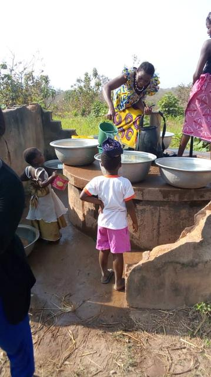
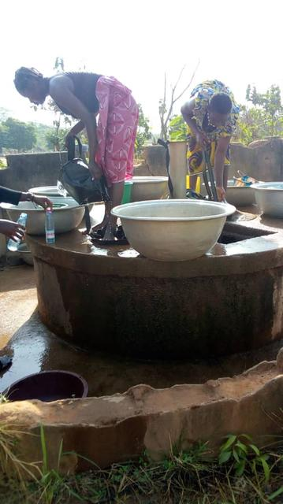

template: article
title: Kahankro
slug: kahankro
iddbb: Kahankro
tags: Rural
authors: BROU Yves Oscar Kouadio, SORO Doba, MAILLARD Thomas, DIAKITE A. Cheick, KOHE A. Christelle, OUATTARA Mafine, SERI A. Jonathan, N'GUESSAN Firmain Kouakou
date: 2019-02-01
latitude:  7.76010 
longitude: -4.9234
zoom: 16
localisation: Nord-Est de Bouaké, sur la route de Bassawa

|Informations générales||
|:--|--:|
| Nom de la localité : | Kahankro | 
| Population : | 5000 habitants | 
| Dessertes en eau potable | Totalement raccordé au réseau SODECI | 
| Gestion des excrétas | Assainissement autonome |

## Présentation de la localité
Kahankro est un grand village situé au nord-Est de la commune de Bouaké à environ 800 mètres de Bouaké en sortant par le quartier Belleville. Il est sur la route nationale qui relie Bouaké à Bassawa. La taille de la population du village est estimée à environ 5000 habitants.

 
Le village possède un groupe scolaire et un centre de santé. La population est essentiellement agricole. Les activités génératrices de revenus sont généralement axées sur l’agriculture avec une production d’anacarde comme culture de rente et le riz, l’igname, les cultures vivrières, etc. comme on y retrouve d’autres activités telles que la chasse et le commerce. Au niveau de l’habitat, les maisons sont plutôt modernes en brique et couverte de tôles.

### Ouvrages existants
Le village est raccordé au réseau de distribution de la SODECI.

 
En termes d’hydraulique villageoise, le village possède aussi 2 PMH, toutes en panne lors des enquêtes. Ces pompes équipent un forage et un puits à grand diamètre. Plusieurs puits traditionnels ont été identifiés dans le village en plus du marigot.

Le premier point d’eau du village (puits) a été construit en 1960. La pompe de ce dernier est en panne depuis plusieurs années maintenant. Elle n’a pas été réparée et depuis les usagers ouvrent la trappe pour prendre de l’eau à l’aide d’une puisette. L’inspection réalisée sur ce point d’eau a révélé que le point d’eau est très vulnérable aux risques de contamination avec un score de 9. Cela se justifie par le fait qu’il y a des broussailles tout autour du point d’eau, le point d’eau n’est pas clôturé ce qui autorise sa fréquentation par des animaux, le canal de drainage est sale, il y a de l’eau stagnante autour du point d’eau et le système d’exhaure notamment les puisettes sont en mauvais état.
 
 
 

L’analyse de la qualité de l’eau n’a révélé aucune pollution majeure à part le taux de fluor qui s’élève à 1,5 mg/l supérieur à la norme recommandée pour l’eau de boisson.

La deuxième pompe date des années 1976. Elle tombait régulièrement en panne après sa construction. Elle a été abandonnée pendant plusieurs années et réparée en 2018 pendant la^pénurie d'eau. Elle est tombée en panne une fois de plus et n’a plus été réparée.

Au niveau des puits, tous ont tari dès l’entame du mois de février. À notre passage il n’y avait plus d’eau dans les puits.

Le marigot est à environ 500 mètres du village. À notre passage il y avait encore de l’eau dans le marigot, mais selon les habitants, le marigot tari à la saison sèche.
Une inspection sanitaire a été menée sur le point d’eau qui a révélé que le marigot n’est pas vulnérable aux risques de contamination. L’environnement du point d’eau est propre. 

 

## Pratiques et modes d’approvisionnement en eau
À Kahankro la source d’eau principale est celle de la SODECI, car elle est considérée comme la plus potable. L’eau de la SODECI est destinée à tous usages. Lorsqu’il y a pénurie d’eau, les habitants se tournent vers l’eau des puits ou du marigot.

## Gestion des points d’eau
La gestion du forage communautaire est assurée par une femme du village qui assure la surveillance et l’entretien aux alentours de la pompe.  

## Personnes ressources

* Le représentant du chef
* le président des jeunes
* La présidente du comité de gestion
* les membres du comité d’organisation

## Gestion des excrétas
On trouve dans le village différent type de latrines. On a des latrines à chasse d’eau, des latrines à fosses septiques et des latrines à fosses directes. Néanmoins comme dans tous les villages la défécation en brousse se fait toujours. 

## Desideratas des populations
| Type d'entretien | Date | 
| :-- | :--: | 
| Entretien individuel Chef de village Kahankro | 01 Février 2019| 
| Entretien individuel Président des Femmes|01 Février 2019| 
| Entretien individuel Présidente du comité de gestion|01 Février 2019| 
| Focus group hommes Kahankro |01 Février 2019| 
| Focus group femmes Kahankro|01 Février 2019| 

La population de Kahankro souhaiterait que leurs pompes soient réparées, et surtout que le réseau de la SODECI n'ait plus de coupure.

## Tensions ressenties lors des entretiens

### Tensions générales
Aucune tension signalée

### Tensions autour de l'eau
Du fait de la rareté des points d’eau communautaires en période de coupure de la SODECI, des disputes éclatent dans la file d’attente, toutefois celles-ci demeurent ponctuelles et de faible ampleur.

### Tensions avec les localités voisines
Les villageois ont signalé des tensions ponctuelles avec les villages voisins de Kongokro et d'Andokro, sans fournir plus de détails.
