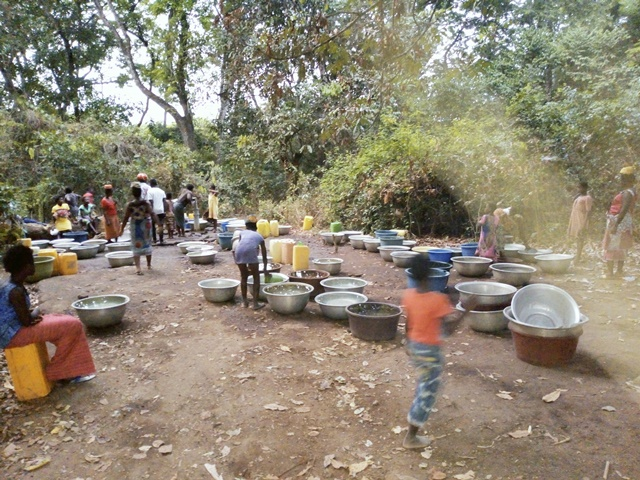
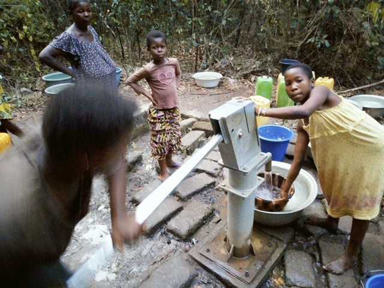
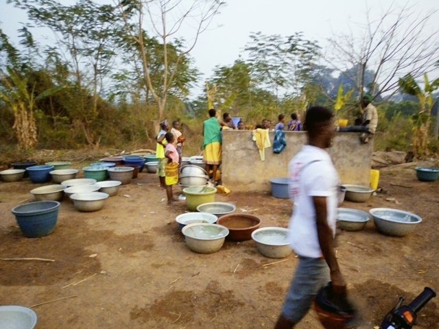

template: article
title: Klôbonoua
slug: klobonoua
iddbb: Klobonoua
tags: Rural
authors: BROU Yves Oscar Kouadio, SORO Doba, MAILLARD Thomas, DIAKITE A. Cheick, KOHE A. Christelle, OUATTARA Mafine, SERI A. Jonathan, N'GUESSAN Firmain Kouakou
date: 2019-02-15
latitude:  7.67264 
longitude: -5.16147 
zoom: 16
localisation: Ouest de Bouaké, au sud de la route de Béoumi

|Informations générales||
|:--|--:|
| Nom de la localité : | Klôbonoua | 
| Population : | 800 habitants | 
| Dessertes en eau potable | Non raccordé au réseau SODECI | 
| Gestion des excrétas | Assainissement autonome |

## Présentation de la localité
Klogbonoua est un grand village de la Sous-préfecture de Bouaké. Il est accessible par une route carrossable en terre battue à partir de Sessenouan. Ce village fait partie du canton Dôhoun. Il est peuplé de plus de 800 habitants, ce village dispose d’une école primaire. On observe un manque de centre de santé local. Le village n’est ni relié au réseau électrique ni à l'eau courante  et il ne dispose d’aucun point de collecte d’ordures ménagères.

La typologie d’habitat que l’on retrouve dans ce village s’apparente à un style plutôt mixte avec des maisons construites en dur et des maisons en banco. Les concessions modernes appartiennent pour la plupart à des cadres du village travaillants en ville et autres retraités. Seules les habitations les plus récentes disposent de latrines, et les habitants pratiquent la défécation à l'air libre en lisière du village.

Les activités génératrices de revenus sont généralement axées sur l’agriculture avec une production d’anacarde comme culture de rente et le riz, l’igname, etc. comme cultures vivrières. 

## État des lieux des ouvrages d’alimentation en eau potable

### Ouvrages existants
Le village dispose de 2 pompes à motricité humaine toutes les deux fonctionnelles. Ces dernières tombent en moyenne 1 à 2 fois dans le mois. Les pannes très souvent révélées sont situées au niveau des tuyaux et du corps de la pompe. En cas de panne, les populations s’orientent vers les marigots à proximité. Les différentes PMH sont très sollicitées. Les marigots utilisés en cas de pannes dans PMH ne sont pas pérennes et étaient presque taris lors des enquêtes.

**PMH 1**
 
 
 
**PMH 2**
 
 

L’enquête sanitaire autour des 2 pompes révèle un degré de vulnérabilité des deux points d’eau assez forts à cause du manque d’hygiène. Les analyses des paramètres chimiques de l’eau ont démontré une forte concentration en nitrate (66 mg/l) dans un des forages et en fluor (1,4 et 1,5 mg/l). Les paramètres microbiologiques ont révélé une contamination de l’eau de la deuxième pompe et du marigot, par les colonies de *E. coli*.
 

### Gestion des points d’eau

Les PMH du village sont gérés par une femme du village qui forme à elle seule le comité de gestion.

## Personnes ressources

* Chef de village 
* Présidente du CGPE                               
* Président des jeunes

## Gestion des excrétas

Kolongbonoua ne dispose pas d’un réseau de drainage des eaux de pluie et usées. Ces eaux sont généralement déversées dans les cours des maisons.
L’assainissement y est autonome, chaque habitation gère ses eaux usées domestiques. Moins de la moitié de la population dispose de toilettes à proximité des maisons. De ce fait, les personnes n’ayant pas de toilettes défèquent à l’air libre dans la forêt. Il faut également noter la présence d’animaux dans tout le village. N’ayant pas d’enclos, ceux-ci défèquent et urinent n’importe où dans le village.

## Desideratas des populations
| Type d'entretien | Date | 
| :-- | :--: | 
| Entretien individuel Chef de village |15 Février 2019| 
| Entretien individuel Présidente des Femmes|15 Février 2019| 
| Entretien individuel Présidente du comité de gestion|15 Février 2019| 
| Focus group hommes |15 Février 2019| 
| Focus group femmes |15 Février 2019| 

Les hommes du village n'ont pas évoqué de souhaits particuliers relatifs à l'eau potable, mais les femmes ont insisté sur le besoin d'un soutien financier pour l'entretien et la réparation des pompes.

## Tensions ressenties lors des entretiens

### Tensions générales
Aucune tension signalée

### Tensions autour de l'eau
Du fait de la rareté des points d’eau communautaires, des disputes éclatent dans la file d’attente, toutefois celles-ci demeurent ponctuelles et de faible ampleur.

### Tensions avec les localités voisines
Aucune tension signalée.

