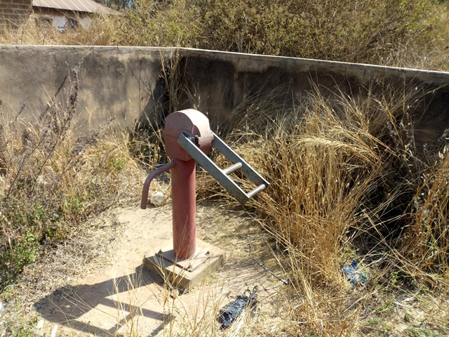
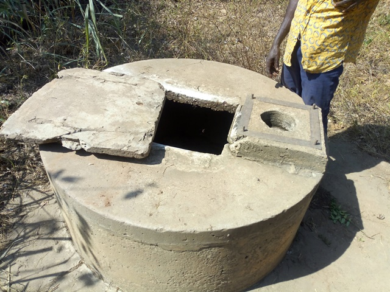
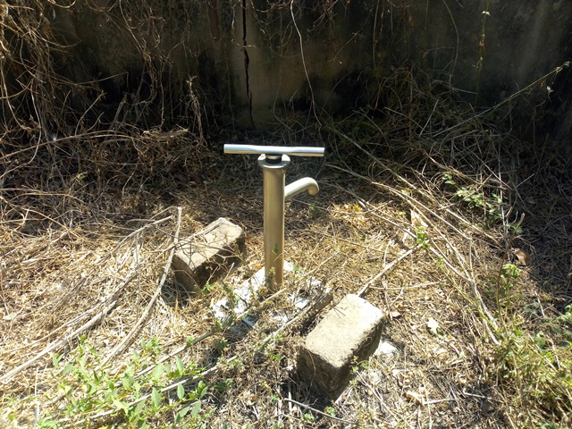

template: article
title: Kouadio Miankro
slug: kouadio-miankro
iddbb: Kouadio Miankro
tags: Rural
authors: BROU Yves Oscar Kouadio, SORO Doba, MAILLARD Thomas, DIAKITE A. Cheick, KOHE A. Christelle, OUATTARA Mafine, SERI A. Jonathan, N'GUESSAN Firmain Kouakou
date: 2019-01-18
latitude: 7.76569
longitude: -5.00433
zoom: 16
localisation: Nord de Bouaké

|Informations générales|
|:--|--:|
| Nom de la localité : | Kouadio-Miankro | 
| Population : | 900 habitants | 
| Dessertes en eau potable | Partiellement raccordé au réseau SODECI | 
| Gestion des excrétas | Assainissement autonome | 

## Présentation de la localité
Le village de Kouadio Miankro est situé à moins d’un kilomètre du village de Golikro et à 5 kilomètres de Bouaké. l'accès se fait par une large route en terre battue. Il compte environ 900 habitants.

On y retrouve essentiellement des habitations de tous types : des habitations en parpaings, en terre ou en ciment avec des tôles ondulées.  Le village ne dispose pas d’école et de centre de santé. Les élèves du village vont à l’école de Golikro.

Il n'y a pas de système de gestion des ordures ménagères, aussi celles-ci sont déposées en marge du village à la lisère de la forêt. Les habitations sont rarement équipées de latrines, aussi les habitants pratiquent la défécation à l'air libre à l'écart des habitations.

L'activité principale du village est l'agriculture vivrière (igname, manioc, riz et autres productions maraîchères tomates, piments et aubergines) et la culture de rente de l'anacarde. Les femmes du village transforment le manioc en attiéké dans de petites unités de production familiales. Chaque ménage élève quelques moutons ou quelques chèvres. Durant la saison des pluies, les animaux sont gardés dans des enclos pour qu'ils ne divaguent pas dans les espaces cultivés.

## Socio anthropologie de la localité 
Le village est peuplé des Baoulés fahafouè. Il appartient au canton de Konankankro. Il regroupe en son sein trois petits villages ou quartiers : Miankro, Yaokro et Konankro représenté par des chefs de quartiers se référant à un chef central. L'organisation sociale du village est similaire à l'organisation classique des communautés villageoises Baoulé. Les affaires du village sont gérées par les notables formant une chefferie hiérarchisée qui intègre aussi des représentants des organisations de femmes et de jeunes. La chefferie intervient dans le règlement des conflits (intracommunautaires et extracommunautaires) et joue un rôle d'interface entre la communauté villageoise et les administrations publiques et collectivités territoriales. 

 Les habitants sont majoritairement issus des lignages fondateurs du village et les ménages sont constitués de famille nucléaire associant parfois des membres collatéraux (parents, cousins ou fratrie célibataire). Les tâches ménagères et en particulier l'approvisionnement en eau du ménage demeure l'apanage des femmes.

## État des lieux des ouvrages d’alimentation en eau potable

### Ouvrages existants
Le village de Kouadio-Miankro est connecté au réseau de distribution d’eau de la SODECI mais seule une dizaine de ménages sont abonnés.
En ce qui concerne l’hydraulique villageoise, le village compte 3 points d’eau équipés de pompes à motricité humaine (PMH). Elles sont toutes en panne(cf. Photos 4_Kouadio-Miankro). La première PMH du village de type ABI se trouve à l’école et est en panne depuis plus de 10 ans. La seconde PMH de type Vergnet HPV 30 quant à elle est en panne depuis 3 ans. Le troisième point d’eau a vu la pompe enlevée  et emportée par un Artisan réparateur.

Les coupures d’eau étant fréquentes sur le réseau de la SODECI, les populations s’approvisionnent par la trappe d'accès du puits dont la PMH a été démontée et dans le marigot situé dans le bas-fond en aval du village.

L’analyse de la qualité de l’eau au niveau de ces 2 points d’eau a révélé principalement une contamination à *E. coli*.

### Pratiques et modes d’approvisionnement en eau
Le village étant connecté au réseau de la SODECI, les modes d’approvisionnement dépendent de la disponibilité des compteurs et de la perception de la qualité de l’eau de la SODECI.
Les concessions abonnées au réseau de distribution utilisent l’eau pour toutes les tâches domestiques et la boisson. Les puits et le marigot servent principalement aux tâches domestiques (la lessive principalement pour le marigot) mais peuvent parfois servir à la boisson en cas de longue pénurie et de panne de la pompe.

### Gestion des points d’eau

Il n'y a pas de comité de gestion spécifiquement dédié aux pompes du village.

Les marigots sont gérés par le biais de règles d'usage : les femmes n'ont pas le droit d'utiliser l'eau des marigots les mercredi et vendredi. Comme ce sont les femmes qui puisent l'eau pour la famille, cette règle permettait à la réserve d'eau des marigots de se reconstituer.

## Personnes ressources

* Leader communautaire et porte-canne du chef de village
* Chef de village 
* Présidente des Femmes                                
* Président des jeunes

## Assainissement et gestion des excrétas
L’assainissement est exclusivement autonome. Chaque concession possède son système d’évacuation des excrétas. Les latrines sèches à fosse simple sont les plus répandues dans le village. Cependant, quelques fosses septiques ont été recensées.
La gestion des ordures ménagères se fait de manière individuelle dans les habitations. Généralement dans les villages, un site est identifié et utilisé comme dépotoir des ordures ménagères.
Comme dans presque tous les villages, la défécation à l'air libre t est encore pratiquée surtout chez les enfants et chez certains adultes qui ne possèdent pas de latrines dans leurs habitations.

## Desideratas des populations
| Type d'entretien | Date | 
| :-- | :--: | 
| Entretien individuel Chef de village Kouadio Miankro|28 janvier 2019| 
| Entretien individuel Présidente des Femmes Kouadio Miankro|28 janvier 2019|
| Entretien individuel Président des jeunes Kouadio Miankro|28 janvier 2019|
| Focus group hommes Kouadio Miankro|28 janvier 2019|
| Focus group femmes Kouadio Miankro|28 janvier 2019|

La population de Kouadio-Miankro souhaiterait qu’on améliore le service de la SODECI pour qu’il n’y ait plus de coupures en premier lieu. Secundo, ils aimeraient réhabiliter leurs pompes en panne. Enfin, entretenir les marigots, former des habitants pour les comités de gestion. De plus ils aimeraient obtenir des latrines et un point de collecte d’ordures.

## Tensions ressenties lors des entretiens

### Tensions générales
Il ressort des entretiens qu’il n’existe pas de conflits ou de tension entre les habitants de Kouadio-Miankro

### Tensions autour de l'eau
Lors de nos entretiens, il a été souligné qu’il n’existe pas de tension autour des points d’eau.

### Tensions avec les localités voisines
En cas de coupure de l'eau du robinet, les villageois s'approvisionnent à la pompe située à côté de l'école primaire dans le village voisin de Golikro. Or, si l'école accueille des enfants des villages environnants, la pompe a été payée et construite par la mutuelle de Golikro, aussi les habitants de Golikro considèrent qu'ils sont prioritaires. Il leur arrive de verrouiller la pompe afin qu'elle ne soit plus accessible aux habitants des autres villages. Cela crée un climat de tension entre les villages.

