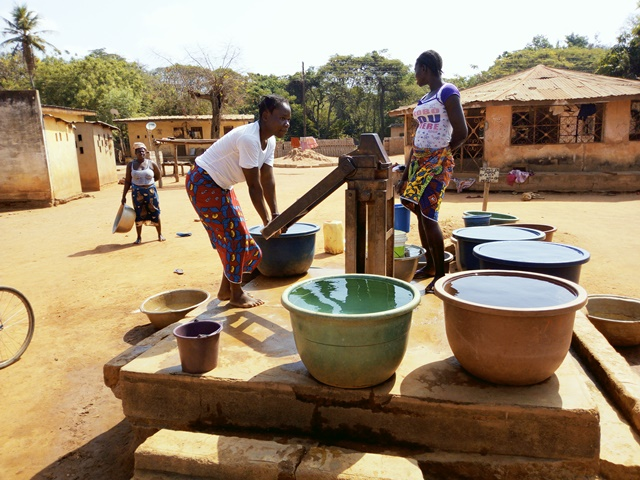
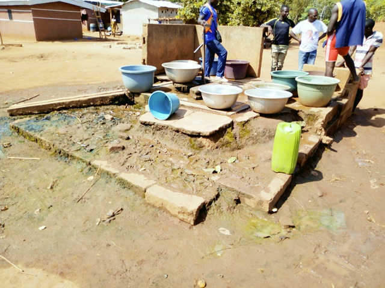

template: article
title: Kouakro
iddbb: Kouakro
slug: kouakro
tags: Rural
authors: BROU Yves Oscar Kouadio, SORO Doba, MAILLARD Thomas, DIAKITE A. Cheick, KOHE A. Christelle, OUATTARA Mafine, SERI A. Jonathan, N'GUESSAN Firmain Kouakou
date: 2019-05-20
latitude: 7.83605
longitude: -5.07764
zoom: 16
localisation: Nord de Bouaké

|Informations générales||
|:--|--:|
| Nom de la localité : | Kouakro Mizron| 
| Population : | 1700 habitants | 
| Dessertes en eau potable | Non raccordé au réseau SODECI | 
| Gestion des excrétas | Assainissement autonome | 

## Présentation de la localité
Kouakro est un village de plus de 1700 habitants, situé à 6 km de Bamoro gare. Ce village dispose uniquement d’une école primaire, mais pas de centre de santé. Il est relié au réseau électrique. Toutefois, celui de la SODECI n’est pas encore disponible pour le village. Kouakro et Adjégbrinti, un campement voisin, forment une seule localité. 
À Kouakro, on retrouve une typologie d’habitat constituée d’habitations sous un style moderne avec des maisons en briques en terres battues et des cases. 
Les Cultures pratiquées dans ce village sont essentiellement destinées à la vente. Ces activités génératrices de revenus sont entre autres l’anacarde, le riz, l’igname, et des cultures vivrières.

## Socio-Anthropologie
Kouakro Mizron est un village Baoulé situé au nord à quelque kilomètre de la ville de Bouaké. Le village est peuplé des Baoulés fahafouè ou pharis. Par ailleurs, le village de Kouakro Mizron appartient au canton de Konankankro. En ce qui concerne les infrastructures, le village dispose d’une école, mais d’aucun dispensaire et d’aucun point de collecte d’ordures ménagères. Cette situation oblige la communauté à déverser les ordures ménagères dans un lieu public. De plus, il faut noter que la majorité des villageois ne disposent pas de toilettes dans leurs maisons aussi, les villageois vont faire leur besoin dans la forêt.

## État des lieux des ouvrages d’alimentation en eau potable

### Existants
Les sources d’approvisionnement principale dans le village de Kouakro sont les forages complétés par les marigots en cas de panne.

Le village compte 3 forages équipés de pompes à motricité humaine (PMH). Ces 3 forages sont fonctionnels. Le plus ancien d’entre eux est en panne en moyenne 4 fois par an. Les autres sont en panne de manière plus sporadique: 1 fois par ans. Les pannes répertoriées dans la majeure partie de ces ouvrages se concernent les tuyaux. Cependant, en raison de difficultés de gestion, le comité de gestion ne peut pas toujours couvrir les frais d'entretien et de réparation. 
Les différents points d’eau datent de 1971 pour le plus ancien et de 2001 pour les deux plus récentes. Les pompes sont des propriétés communautaires mises à la disposition de la population moyennant le prix de 10 FCFA par bassines. Le fait marquant sur la qualité de l'eau et une concentration élevée en nitrates (66 mg/l) dans toutes les pompes.

### Pratiques et modes d’approvisionnement en eau 

Si la population préfère s'approvisionner aux pompes des forages, les pannes récurrentes les amènent à se rabattre sur l'eau des marigots

### Mode de gestion

L’eau des PMH est utilisée pour toutes  les activités quotidiennes. La surveillance, l'entretien quotidien et le recueil des paiements sont effectués par différents responsables qui se succèdent régulièrement sur désignation du comité de gestion.

Les marigots sont très régulièrement utilisés par les femmes à cause des pannes récurrentes des pompes.l'usage des marigots est régulé par des interdits: les mercredi et vendredi les femmes sont interdites d’y aller sous peine de sanction.

## Gestion des excréta
À Kouakro, on observe un faible niveau d’hygiène et d’assainissement. Plusieurs concessions ne disposent pas de latrine. La défécation se fait donc à l’air libre dans le village. Pour ce qui concerne la gestion des ordures ménagères, on observe des dépotoirs sauvages dans le village. Ce qui sous-entend que le village ne dispose pas de système pour la collecte des déchets. Les ménages collectent les déchets et les déversent dans la brousse.

Problèmes et tensions autour de l’eau
Des tensions régulières sont observées autour des points d’eau. Ce sont généralement des échanges de paroles entre populations pour indiquer leur mécontentement par rapport au respect de l’ordre d’arrivée et au nombre de récipients à remplir. Ces tensions n’aboutissent toutefois pas sur des conflits ouverts, mais se limitent qu’aux simples disputes.

## Personnes ressources 

* Le représentant du chef
* le président des jeunes
* les membres du comité d’organisation

## Desiderata des habitants

| Type d'entretien | Date | 
| :-- | :--: | 
| Entretien individuel représentant du Chef de village |07 Février 2019| 
| Entretien individuel Président des Femmes |07 Février 2019| 
| Entretien individuel responsable des pompes |07 Février 2019| 
| Focus group hommes |07 Février 2019|

La population souhaite:

1. être raccordé au réseau de distribution de la SODECI 
2. Construire une pompe au niveau de l'école et former les membres du comité de gestion des pompes
3. Apprendre à entretenir les marigots du village
4. Obtenir des latrines et un point de collecte des ordures.

## Tensions ressenties lors des entretiens

### Tensions générales
Aucune tension signalée.

### Tensions autour de l'eau
Aucune tension signalée autour des points d'eau lors de la collecte.

### Tensions avec les localités voisines
Aucune tension signalée.

