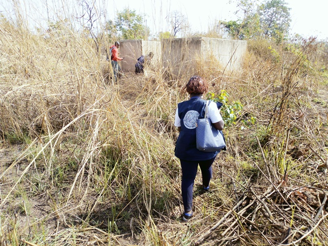
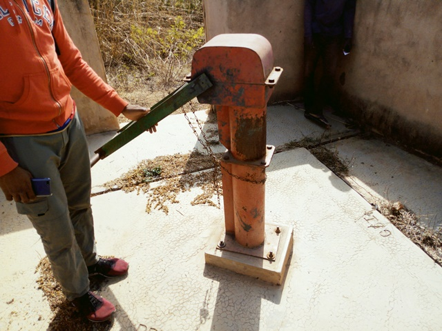

template: article
title: Kouamé Assêkro
slug:kouame-assekro
iddbb: Kouamé Assèkro
tags: Rural
authors: BROU Yves Oscar Kouadio, SORO Doba, MAILLARD Thomas, DIAKITE A. Cheick, KOHE A. Christelle, OUATTARA Mafine, SERI A. Jonathan, N'GUESSAN Firmain Kouakou
date: 2019-01-13
latitude:  7.84551
longitude: -5.02388
zoom: 14
localisation: Nord de Bouaké

|Informations générales||
|:--|--:|
| Nom de la localité : | Kouamé Assèkro | 
| Population : | 800 habitants | 
| Dessertes en eau potable | Non raccordé au réseau SODECI | 
| Gestion des excrétas | Assainissement autonome | 

## Présentation de la localité
Kouamé-Assêkro est un village de la Sous-préfecture de Bouaké situé au nord. Ce village abrite une école primaire. Il est sur un nouveau site, car le village a été déplacé. Il forme désormais un seul village (Sêssêkro) avec le village d’Assoumankro à proximité et est considéré comme un sous-quartier. On observe un manque de centre de santé local. Le village est relié au réseau électrique. Celui de la SODECI n’est pas encore disponible dans le village. On dénombre au total, près de 800 habitants composés d’autochtones Baoulé et d’allogènes.
Sur l’ancien site du village, certaines familles résident encore aujourd’hui. Elles sont au nombre de 3. L’ancien site est situé à plus de 4 km du site actuel du village. Il abrite un forage utilisé uniquement par les 3 familles résidentes.
Le type d’habitat que l’on retrouve à Kouamé-Assêkro est plutôt sous un style traditionnel avec des maisons construites en banco. 
Les activités génératrices de revenus sont généralement axées sur l’agriculture avec une production d’anacarde comme culture de rente et le riz, l’igname comme cultures vivrières.

## Socio anthropologie de la localité 

Le village est peuplé des Baoulés fahafouè ou pharis et appartient au canton de Konankankro. L’absence d’infrastructure de base au sein du village oblige la communauté à déverser les ordures ménagères dans un lieu public. De plus, il faut noter que la majorité des villageois ne disposent pas de toilettes dans leurs maisons et vont faire leur besoin dans la forêt.

## État des lieux des ouvrages d’alimentation en eau potable

### Existants
Le village compte 2 points d’eau, des forages équipés de pompes à motricité humaine (PMH). L’une des pompes est restée sur l’ancien site à plus de 4 km du site actuel. Elle est utilisée par 3 familles résidant toujours sur l’ancien site. L’autre pompe du nouveau site est un don de l’État à travers le PPU (Programme Présidentiel d'Urgence: vaste plan d'investissements pilotés par le président Alassane Ouattara après son élection en 2010). Mais celle-ci est en panne depuis 2 ans. Selon le diagnostic des pannes réalisées par un artisan réparateur, toutes les pièces de la pompe doivent être renouvelées pour un coût de 800000 francs.  Ne disposant pas d’une telle somme, les habitants ont dû abandonner la pompe pour s’orienter vers les pompes du village voisin d’Assoumankro.
La pompe était fermée lors nos enquêtes dans le village.   

### Pratiques et modes d’approvisionnement en eau

La population s'approvisionne majoritairement au niveau de 2 PMH et parfois dans des marigots. Ces eaux sont généralement utilisées pour la boisson et les activités ménagères. 

### Gestion des points d’eau
Il n’y a pas de comité de gestion de ces pompes, aussi, il y a régulièrement des tensions entre les personnes s'y approvisionnent et l'entretien et les réparations ne sont pas fait.

## Personnes ressources

* Chef de village 
* Présidente des Femmes                                
* Président des jeunes

## Gestion des excréta
La gestion des excréta se fait de manière autonome. Les latrines construites dans le village sont principalement des latrines sèches à fosse simple. Dans les concessions ne disposant pas de latrines, les habitants pratiquent la défécation à l'air libre. 

## Desideratas des populations

Les populations demandent l’installation d’autres pompes et la réparation de la pompe endommagée. 

## Tensions ressenties lors des entretiens

### Tensions générales
Aucune tension signalée

### Tensions autour de l'eau
Du fait de la rareté des points d’eau communautaires, des disputes éclatent dans la file d’attente, toutefois celles-ci demeurent ponctuelles et de faible ampleur.

### Tensions avec les localités voisines

Lorsque les villageoises se rendent au village voisin pour s'approvisionner aux pompes, des disputent éclatent, cela entretient un climat de tension entre Kouamé Assêkro et Assoumankro. Toutefois, ces deux villageois ont décidé de se regrouper, cela dénote donc une volonté de mise en commun de leurs moyens et équipements.

