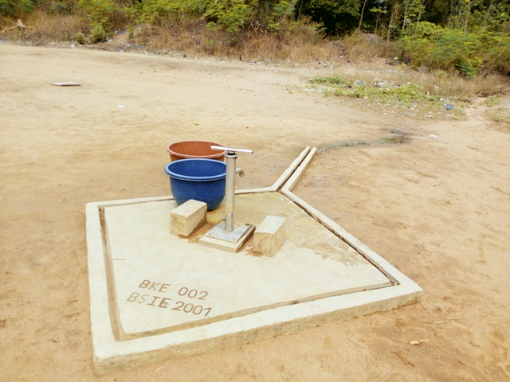
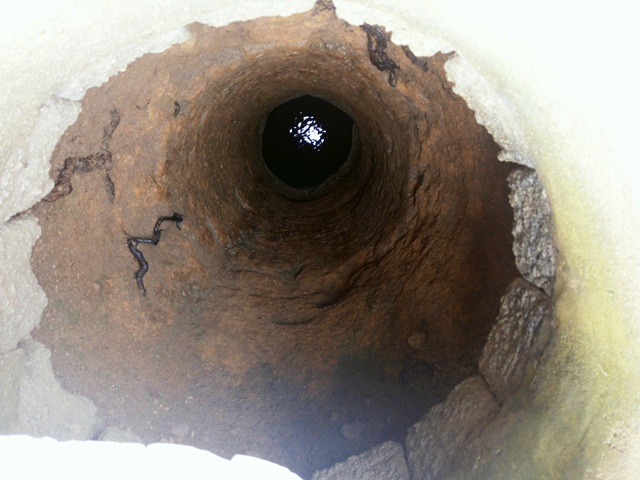
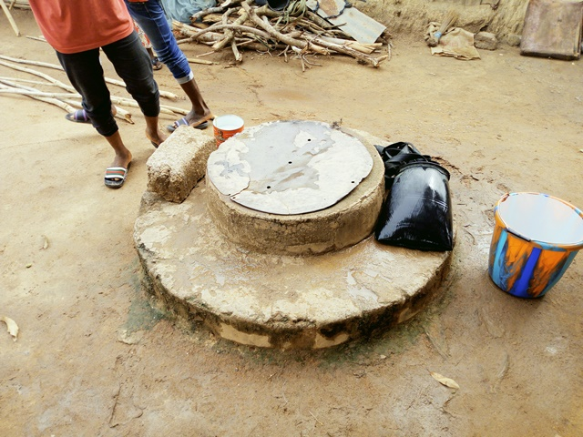

template: article
title: Kpoti Takikro
slug: kpotitakikro
iddbb: Kpoti Takikro
tags: Rural
authors: BROU Yves Oscar Kouadio, SORO Doba, MAILLARD Thomas, DIAKITE A. Cheick, KOHE A. Christelle, OUATTARA Mafine, SERI A. Jonathan, N'GUESSAN Firmain Kouakou
date: 2019-02-20
latitude:  7.77940 
longitude: -5.07731
zoom: 16
localisation: Nord de Bouaké, au nord de l'aéroport, le long de la voie ferrée

|Informations générales||
|:--|--:|
| Nom de la localité : | Kpoti Takikro | 
| Population : | 600 habitants | 
| Dessertes en eau potable | Non raccordé au réseau SODECI | 
| Gestion des excrétas | Assainissement autonome |

## Présentation de la localité
Kpoti Takikro est un village de la Sous-préfecture de Bouaké dans la direction nord-ouest de la ville, sur l’axe Bouaké-Botro, une route bitumée. Il compte plus de 600 habitants. 

Kpoti Takikro n’abrite pas d’école primaire.
Le village n’est pas relié au réseau électrique et au réseau de la SODECI et ne dispose d'aucun point de collecte des ordures.

L'habitat est plutôt traditionnel avec des maisons construites en banco. On trouve aussi des maisons modernes. Peu sont équipés de latrines aussi les habitants pratiques la défécation à l'air libre en lisière du village.

Les activités génératrices de revenus sont généralement axées sur l’agriculture avec une production d’anacarde comme culture de rente et le riz, l’igname, etc. comme cultures vivrières.

## État des lieux des ouvrages d’alimentation en eau potable

### Ouvrages existants
Le village n’est pas raccordé au réseau de la SODECI, mais le projet de raccordement serait en cours selon le Chef du village.

Deux types d’ouvrages hydrauliques ont été identifiés dans le village : 1 forage et d'au moins 3 puits traditionnels. Le village compte un forage équipé d’une PMH de type HPV 30 fonctionnelle. Le forage date de l’année 2001. Longtemps abandonné à cause d’une panne, il a récemment été réhabilité par un habitant du village. Depuis lors, on ne note pas de panne sur la pompe. L’enquête sanitaire au niveau de la pompe révèle une forte vulnérabilité à la pollution. La pompe est située en aval du village et à proximité d’elle plusieurs sources de contamination potentielles ont été identifiées : Douche, latrines et fosses à fumier. L’analyse de la qualité de l’eau révèle une contamination à *E. coli* dans l’eau du forage. 

 
1 puits traditionnel a été analysé et présente une pollution azotée due principalement au nitrate (concentration supérieure à 50 mg/L). Notons qu’aucune contamination à *E. coli* n’a été détectée dans le prélèvement de l’eau de puits.

### Pratiques et modes d’approvisionnement en eau
L'eau du forage présente un goût salé et les habitants préfèrent utiliser l'eau des puits pour la boisson.

### Gestion des points d’eau

Le forage est géré par un comité de gestion constitué d'une femme. L'eau est vendue 10 francs la cuvette. Les difficultés de gestion n'ont pas permis à ce comité de réparer la pompe et il a fallu attendre les investissements exceptionnels d'un habitant du village pour que ce soit fait.

L'eau des puits est accessible gratuitement aux habitants du voisinage.

## Personnes-ressources

* Chef de village 
* Présidente des Femmes                                
* Président des jeunes

## Gestion des excrétas
L’évacuation des selles dans le village se fait à partir de différents types de latrines. Nous avons des latrines à fosses septiques avec ou sans chasse d’eau et des latrines à fosse directe. Néanmoins, comme dans plusieurs villages, la défécation en brousse se fait toujours.
## Desideratas des populations
| Type d'entretien | Date | 
| :-- | :--: | 
| Entretien individuel Chef de village |20 Février 2019| 
| Entretien individuel Président des Femmes20 Février 2019|| 
| Entretien individuel Présidente du comité de gestion|20 Février 2019| 
| Focus group hommes |20 Février 2019| 
| Focus group femmes |20 Février 2019| 

Les hommes du village aimeraient qu'un petit réseau autonome d'adduction en eau potable alimenté par un château d'eau soit implanté.

Les femmes veulent plutôt qu'une nouvelle pompe soit installée.

## Tensions ressenties lors des entretiens

### Tensions générales
Aucune tension signalée

### Tensions autour de l'eau
Du fait de la rareté des points d’eau communautaires, des disputes éclatent dans la file d’attente, toutefois celles-ci demeurent ponctuelles et de faible ampleur.

### Tensions avec les localités voisines
Aucune tension signalée.

