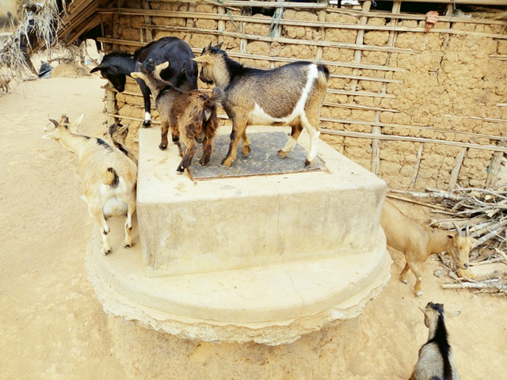
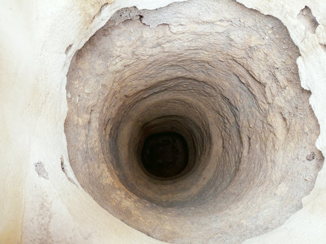
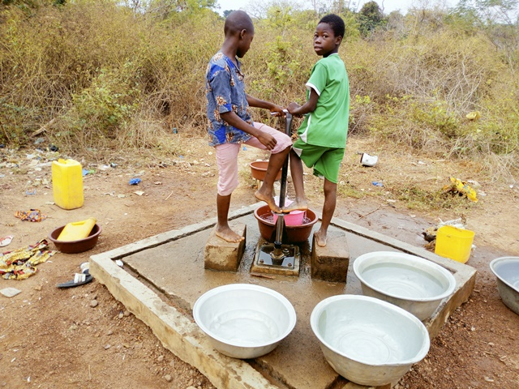
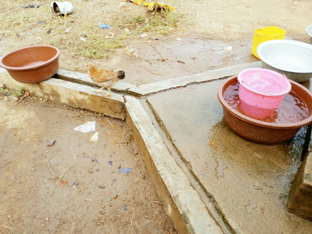

template: article
title: Lokanou
slug: lokanou
iddbb: Lokanou
tags: Rural
authors: BROU Yves Oscar Kouadio, SORO Doba, MAILLARD Thomas, DIAKITE A. Cheick, KOHE A. Christelle, OUATTARA Mafine, SERI A. Jonathan, N'GUESSAN Firmain Kouakou
date: 2019-02-21
latitude:  7.71954 
longitude: -5.12387
zoom: 16
localisation: Ouest de Bouaké

|Informations générales||
|:--|--:|
| Nom de la localité : | Lokanou | 
| Population : | 600 habitants | 
| Dessertes en eau potable | Non raccordé au réseau SODECI | 
| Gestion des excrétas | Assainissement autonome |

## Présentation de la localité
Lokanou est un village de la Sous-préfecture de Bouaké à l'ouest de la ville. Il est accessible par une route carrossable en terre battue. Il compte plus de 600 habitants. Lokanou abrite une école primaire de 3 classes. Il n’y a pas de centre de santé ni de point de collecte d’ordures. Le village n’est ni raccordé au réseau électrique ni au réseau d'eau potable de la SODECI. 

Les maisons sont construites en géo béton ou en banco. Peu d'habitation dispose de latrines et les habitants pratiquent la défécation à l'air libre en lisière du village.

Les activités génératrices de revenus sont généralement axées sur l’agriculture avec une production d’anacarde comme culture de rente et le riz, l’igname, etc. comme cultures vivrières. 

## État des lieux des ouvrages d’alimentation en eau potable

### Ouvrages existants

 
 

3 puits qui tarissent en saison sèche, dont 1 équipée d'une pompe.

1 forage équipé de PMH qui sert à la boisson et aux travaux ménagers. La pompe tombe souvent en panne en moyenne 3 fois dans l’année. Les pannes répertoriées se retrouvent au niveau des tuyaux qui selon les responsables de la pompe sont percés.
La vulnérabilité du point d’eau est moyenne. Le seul constat est l’absence de clôture. Les analyses des paramètres physiques de l’eau de la pompe ont démontré que l’eau avait une forte concentration en fluor (1,4 mg/l). On note également la présence de *E. coli* (63 UCF/100ml).

En cas de pannes de ces équipements, les habitants s'approvisionnent dans 1 marigot.

### Pratiques et modes d’approvisionnement en eau

La population de Lokanou s'approvisionne majoritairement au niveau de la pompe, des puits et du marigot. Les pannes récurrentes du forage les incitent à privilégier l’eau du marigot.  Il faut souligner qu’il existe 2 PMH dans le village dont une fonctionnelle.

### Gestion des points d’eau

Il n'y a pas de comité de gestion des points d'eau. Une femme est chargée de la surveillance de la pompe. Elle est également chargée d’encaisser les cotisations dans chaque famille pour la réparation de l’infrastructure.

## Personnes ressources

* Chef de village 
* Présidente des Femmes                                
* Président des jeunes

## Gestion des excrétas

Lokanou ne dispose pas d’un réseau de drainage des eaux de pluie et usées. Ces eaux sont généralement déversées dans les cours des maisons ou dans les broussailles environnantes. Le niveau d’assainissement est faible car on observe des excréments d’humains et d’animaux aux abords du village. On y observe également des déchets ménagers à savoir des sachets plastiques, des bouts de papier et des noyaux de fuies (mangues) partout dans le village. Nos entretiens ont révélé que la majorité des habitants n’ont pas de toilettes raison pour laquelle on retrouve des excréments aux abords du village. Ainsi, le manque d’infrastructures d’assainissement contribue au fait que les habitants défèquent à l’air libre. Enfin, les animaux n’ayant pas d’enclos se promènent et défèquent partout dans le village.

## Desideratas des populations
| Type d'entretien | Date | 
| :-- | :--: | 
| Entretien individuel Chef de village |21 Février 2019| 
| Entretien individuel Président des Femmes|21 Février 2019| 
| Focus group hommes |21 Février 2019| 
| Focus group femmes |21 Février 2019| 

Les habitants souhaiteraient avoir une pompe en plus, afin de réduire l'usure de leur pompe et de disposer une pompe de secours en cas de panne.

## Tensions ressenties lors des entretiens

### Tensions générales
Aucune tension signalée

### Tensions autour de l'eau
Du fait de la rareté des points d’eau communautaires, des disputes éclatent dans la file d’attente, toutefois celles-ci demeurent ponctuelles et de faible ampleur.

### Tensions avec les localités voisines
Aucune tension signalée.
