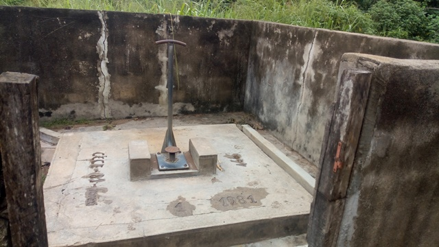
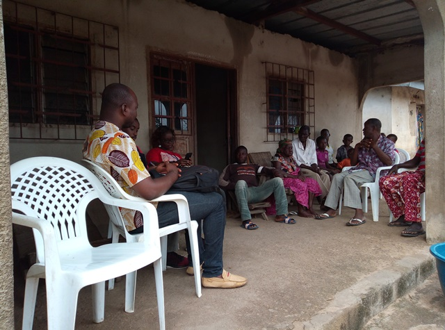

template: article
title: N'Drikro
slug: n-drikro
iddbb:N'Drikro
tags: Rural
authors: BROU Yves Oscar Kouadio, SORO Doba, MAILLARD Thomas, DIAKITE A. Cheick, KOHE A. Christelle, OUATTARA Mafine, SERI A. Jonathan, N'GUESSAN Firmain Kouakou
date: 2019-02-05
latitude:  7.71346
longitude: -4.90322
zoom: 16
localisation: Est de Bouaké

|Informations générales||
|:--|--:|
| Nom de la localité : | N'Drikro | 
| Population : | 400 habitants | 
| Dessertes en eau potable | Non raccordé au réseau SODECI | 
| Gestion des excrétas | Assainissement autonome |

## Présentation de la localité
Le village de N’drikro est situé à environ 8 kilomètres de Bouaké en passant par le village de Yapokouakoukro. La route d'accès est une large voie en terre battue.  Il compte plus 400 habitants. 

L’école primaire est en construction et il ne dispose pas de centre de santé et d’aucun point de collecte d’ordures ménagères. Les habitants du village se rendent dans la commune de Bouaké notamment à Belleville pour les problèmes de sanitaires. Le village n’est ni connecté au réseau de la SODECI, ni au réseau électrique.

On y retrouve essentiellement des habitations de type  parpaings en terre  et enduit de ciment avec des tôles ondulées. On note aussi la présence de cases en banco. Les habitations ne sont pas équipées de latrines aussi les habitants pratiquent la défécation à l'air libre en lisière du village.

La population vit de l'agriculture et les principales spéculations recensées sont l’igname, le manioc et l’anacarde.

Le village est peuplé des Baoulés fahafouè ou pharis et appartient au canton de Konankankro. 

## État des lieux des ouvrages d’alimentation en eau potable

### Ouvrages existants
Le village n’est raccordé pas au réseau de la SODECI.

En ce qui concerne l’hydraulique villageoise, le village compte 2 pompes, mais 1 seule pompe à motricité humaine toujours fonctionnelle de type Vergnet HPV 60.  Ce point d’eau a été construit en 1986 mais la fontaine a été remplacée par un appareillage plus récent. Les pannes de la pompe sont peu fréquentes. Lorsqu’elles surviennent, elles durent une semaine au maximum avant d'être réparées. Il n’y a pas d’entretiens particuliers. Elle présente des traces de moisissures, des retenues de boue au niveau de la dalle et du canal d’évacuation.

 

L’évaluation sanitaire de la pompe révèle une faible vulnérabilité par rapport aux sources de pollution. Mais l’analyse de la qualité de l’eau indique une pollution au fluor. La concentration de fluor dans l’échantillon est supérieure à 1,5 mg/L recommandé par l’OMS. Cette pollution est sans doute d'origine géologique. Aussi, l’eau de la pompe n’a pas un bon gout et une bonne odeur selon les consommateurs. Cela pourrait être dû à la rouille dans les tuyaux, car ils n’ont jamais été changés.

La population utilise de l’eau de marigot en cas de panne de la pompe, huais celui-ci est très éloigné des habitations.

### Gestion des points d’eau

Le village n'a pas de comité de gestion dédié à la pompe, cependant, un habitant est désigné par le chef de village pour collecter 10 francs par bassine d'eau afin de financer les réparations en cas de panne.

## Personnes ressources

* Chef de village 
* Présidente des Femmes                                
* Président des jeunes

## Gestion des excrétas
La gestion des excréta dans le village se fait de manière individuelle. Les pratiques sont quasiment les mêmes dans toute la région. La majeure partie des concessions ne dispose pas de latrines améliorées. Les latrines que l’on rencontre dans le village sont principalement des latrines sèches à fosse simple dans quelques concessions. Les concessions qui ne disposent pas de latrines continuent la défécation à l’air libre. Pour ce qui concerne la gestion des ordures ménagères, il n’existe pas un système propre au village. Les déchets ménagers sont collectés et déversés en brousse. 

## Desideratas des populations
| Type d'entretien | Date | 
| :-- | :--: | 
| Entretien individuel Chef de village |05 Février 2019| 
| Entretien individuel Président des Femmes|05 Février 2019|  
| Focus group hommes |05 Février 2019| 
| Focus group femmes Minakro|05 Février 2019| 

1. La réparation des pompes en panne,
2. la construction d'une nouvelle pompe,
3. la formation des membres d'un comité de gestion des pompes,
4. la construction de latrine et la mise en place d'un point de collecte des ordures.

## Tensions ressenties lors des entretiens

### Tensions générales
Aucune tension signalée

### Tensions autour de l'eau
Du fait de la rareté des points d’eau communautaires, des disputes éclatent dans la file d’attente, toutefois celles-ci demeurent ponctuelles et de faible ampleur.

### Tensions avec les localités voisines
Aucune tension signalée.
