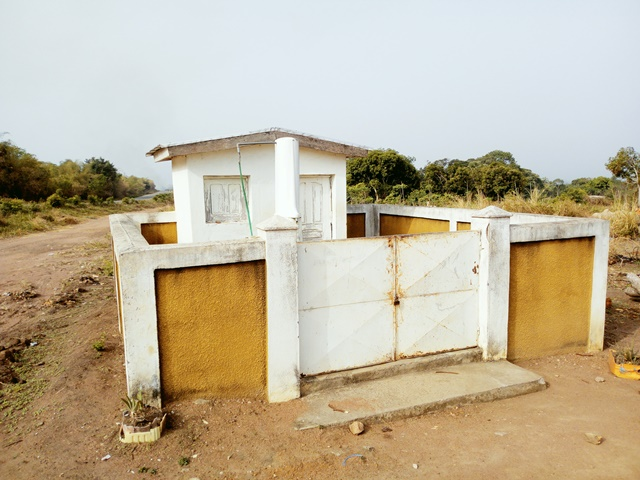
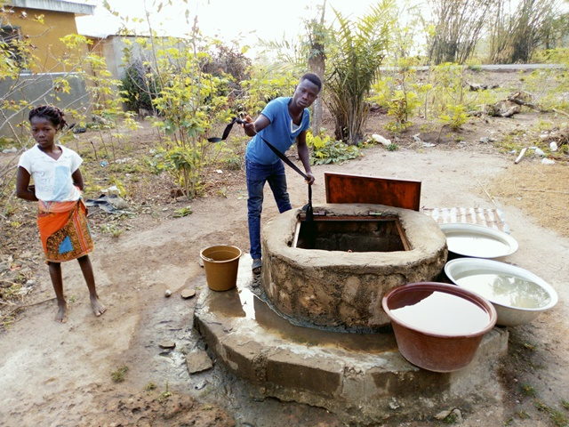
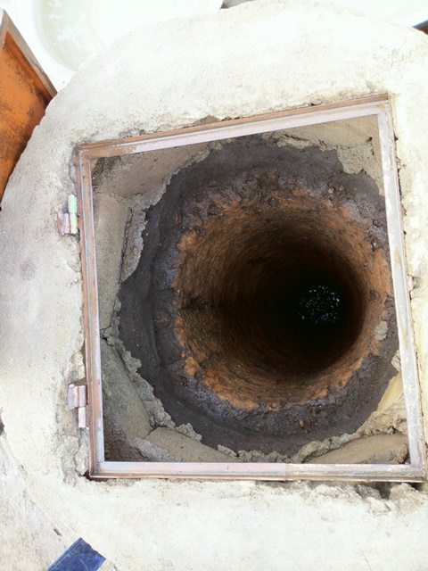
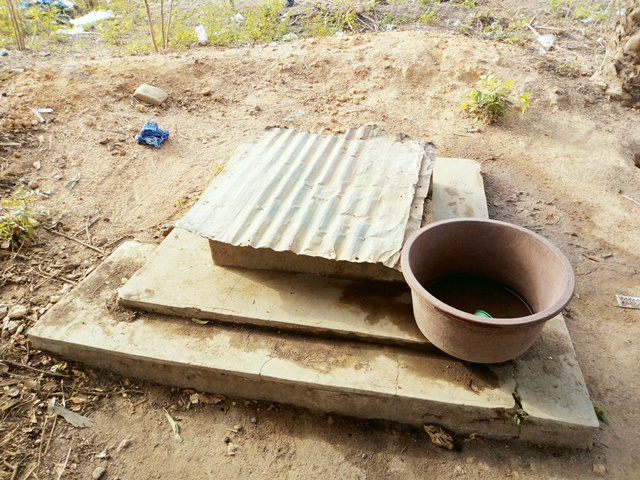
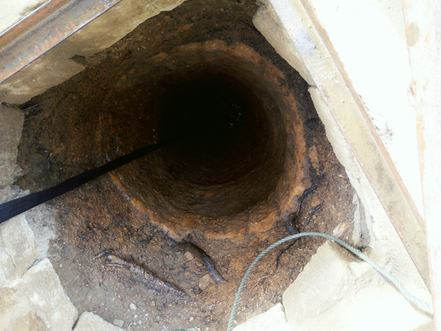
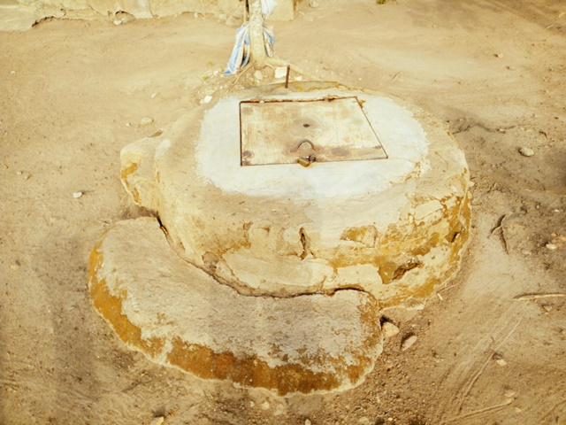
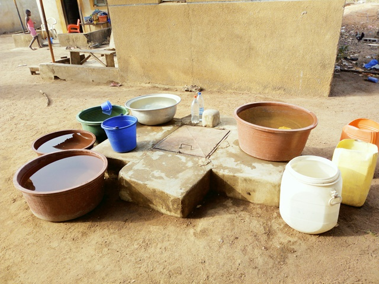
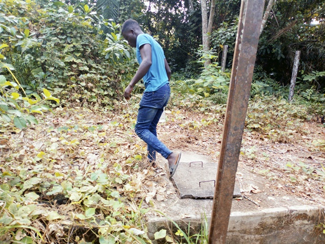

template: article
title:  N'Ganblekonankro
slug: n-ganblekonankro
iddbb:  N'Ganblekonankro
tags: Rural
authors: BROU Yves Oscar Kouadio, SORO Doba, MAILLARD Thomas, DIAKITE A. Cheick, KOHE A. Christelle, OUATTARA Mafine, SERI A. Jonathan, N'GUESSAN Firmain Kouakou
date: 2019-02-14
latitude:  7.68110
longitude: -5.10007 
zoom: 16
localisation: Ouest de Bouaké,tout juste à la sortie de Baouké sur la route de Sakassou

|Informations générales||
|:--|--:|
| Nom de la localité : | | 
| Population : | 1000 habitants | 
| Dessertes en eau potable | Raccordé au réseau SODECI | 
| Gestion des excrétas | Assainissement autonome |

## Présentation de la localité
N’Gamblekonankro est un village situé à 1km à l’ouest de  la ville de Bouaké sur l’axe Bouaké-Sakassou. C’est un village d’environ 1000 habitants. 

Le village ne possède ni d’école ni de centre de santé. 

Du fait de sa proximité avec la ville, l’habitat du village est moderne avec des maisons faites en briques de ciment et couvertes de tôles. Néanmoins on retrouve encore des maisons en briques de terre battue couvertes de tôles ou de pailles. 

Les activités génératrices de revenus sont généralement axées sur l’agriculture avec une production d’anacarde comme culture de rente et le riz, l’igname, etc. comme cultures vivrières. 

Le village est situé juste derrière l’université Alassane Ouattara (Campus 2) et accueille un bon nombre d’étudiants en raison des loyers abordables.

## État des lieux des ouvrages d’alimentation en eau potable

### Ouvrages existants
Le village de N’Gamblekonankro  est raccordé au réseau de la SODECI à travers une borne-fontaine et des branchements particuliers. Cependant il y a rarement de l’eau au niveau de la borne-fontaine et elle a été abandonnée.

En HV, le village ne possède pas non plus de pompe hydraulique, la seule PMH a été abandonnée depuis des années et la fontaine dérobée. Les habitants se tournent donc vers les puits domestiques creusés dans le village. Le village compte environ 14 puits et pour la majorité ce sont des puits traditionnels dans des habitations. 

Pour notre étude, nous nous sommes intéressés à 3 d’entre eux notamment 2 puits traditionnels et 1 puits busé.
Ce sont tous les trois des puits très vieux et creusés par des privés. Le puits busé a été creusé par une société privée, non loin d’un lac artificiel. Ce puits est actuellement inutilisé à cause de la mauvaise qualité de l’eau (salée).
Ce sont des puits assez profonds d’environ  10 m de profondeur. Il y a de l’eau dans ces puits toute l’année. A notre passage nous avons pu mesurer 2 m de hauteur de l’eau dans ces trois points d’eau. Les puits ont encore leur superstructure en bon état. L’évaluation autour des points d’eau a pu donner que les points d’eau ne sont pas vulnérables aux risques de contamination avec un score de 02. 

Au niveau de l’analyse de l’eau, nous avons pu relever au niveau du puits busé que son eau est de couleur trouble avec un gout salé. Nous avons pu relever au niveau de ce même puits un taux élevé d’ammoniac de 1 mg/l. Au niveau du taux de nitrate, celui-ci est relativement élevé (supérieur à 50 mg/L) pour tous les trois points d’eau inspectés. Les 3 puits sont contaminés par *E. coli*.

## Gestion des points d’eau
Il n’y pas de réelle gestion communautaire des puits et marigots à N’gameblèkonankro. Au sujet des puits, chaque ménage gère son puits à sa manière et en fonction de l’état du puits. Lorsqu’un puits tarit par exemple, certains propriétaires ont recours à des puisatiers pour l’approfondir davantage. D’autres préfèrent s’approvisionner chez leurs différents voisins. Concernant les marigots, ceux-ci ne subissent pas de traitement particulier. Les habitants nettoient parfois les alentours pour éviter que les broussailles y prolifèrent.

## Personnes ressources

* Chef de village              
* Président des jeunes

## Gestion des excrétas

N’gamblèkonankro ne dispose pas d’un réseau de drainage des eaux de pluie et usées. Ces eaux sont généralement déversées dans les cours des maisons et aux alentours du village. De plus chaque ménage gère les déchets de façon autonome. Il n’y a pas de point de collecte d’ordure pour le village. Par ailleurs, moins de la moitié de la population dispose de toilettes à proximité des maisons. De ce fait, les personnes n’ayant pas de toilettes défèquent à l’air libre aux alentours du village. Il faut également noter la présence d’animaux dans tout le village. N’ayant pas d’enclos, ceux-ci défèquent et urines n’ importe où dans le village. Cette situation met en exergue le caractère insalubre du village de N’gamblèkonankro.

## Desideratas des populations
| Type d'entretien | Date | 
| :-- | :--: | 
| Entretien individuel Chef de village |14 Février 2019| 
| Entretien individuel président des jeunes | 14 Février 2019| 
| Focus group hommes | 14 Février 2019| 

Dans un premier temps, les habitants du village souhaiteraient que chaque ménage soit raccordé au réseau de la SODECI. De plus, ils aimeraient obtenir une PMH au sein de leur village. En effet, les puits du village tarissent régulièrement ce qui plonge le village dans un stress hydrique important. Ainsi, une nouvelle PMH permettrait d’atténuer ce stress hydrique.

## Tensions ressenties lors des entretiens

### Tensions générales
Aucune tension signalée

### Tensions autour de l'eau
Du fait de la rareté des points d’eau communautaires, des disputes éclatent dans la file d’attente, toutefois celles-ci demeurent ponctuelles et de faible ampleur.

### Tensions avec les localités voisines
Aucune tension signalée.

