template: article
title: N’gatta Sakassou
iddbb: Ngatta Sakassou
slug: ngattasakassou
tags: Rural
authors: BROU Yves Oscar Kouadio, SORO Doba, MAILLARD Thomas, DIAKITE A. Cheick, KOHE A. Christelle, OUATTARA Mafine, SERI A. Jonathan, N'GUESSAN Firmain Kouakou
date: 2019-02-07
latitude: 7.82586
longitude: -5.06562
zoom: 16
localisation: Nord de Bouaké

|Informations générales||
|:--|--:|
| Nom de la localité : | N’gatta Sakassou | 
| Population : | 700 habitants | 
| Dessertes en eau potable | Non raccordé au réseau SODECI | 
| Gestion des excrétas | Assainissement autonome | 

## Présentation de la localité
N’gatta Sakassou est un village situé au Nord-Est de la commune de Bouaké. On y accède par la large route en terre battue qui relie la route nationale 3 à Bamoro Gare. C’est un village d’environs 7OO habitants.  
Le village possède une école de 6 classes qui accueille aussi les enfants des villages avoisinants. L’habitat à N’gattassakassou est composé de maisons en briques ou en terre battue couvertes de tôles ou de pailles. La population est essentiellement agricole avec les productions vivrières et l’anacarde.

L’eau est une ressource qui est rare dans ce village. Celui-ci dispose d’une seule PMH où l’ensemble des habitants vont s’approvisionner dans un premier temps. Ensuite, lorsque celle-ci tombe en panne, les habitants ont recours à un marigot, qui tarit régulièrement. 
## Socio anthropologie de la localité 

C’est un village habité par les Phali, sous-groupe baoulé. L'organisation sociale du village est similaire à l'organisation classique des communautés villageoises Baoulé. Les affaires du village sont gérées par les notables formant une chefferie hiérarchisée qui intègre aussi des représentants des organisations de femmes et de jeunes. La chefferie intervient dans le règlement des conflits (intracommunautaires et extracommunautaires) et joue un rôle d'interface entre la communauté villageoise et les administrations publiques et collectivités territoriales.

Les habitants sont majoritairement issus des lignages fondateurs du village et les ménages sont constitués de famille nucléaire associant parfois des membres collatéraux (parents, cousins ou fratrie célibataire). Les tâches ménagères et en particulier l'approvisionnement en eau du ménage demeure l'apanage des femmes.

Bien  que les habitants soient majoritairement autochtones, N’Gatta-Sakassou est un village cosmopolite regroupant en son sein des ressortissants de la CEDEAO (Mali, Burkina-Faso).

## État des lieux des ouvrages d’alimentation en eau

### Existants
Un château d’eau de la SODECI a été installé à proximité du village, mais le village n’est pas encore raccordé au réseau. Par contre le village possède 5 pompes dont une seule est utilisée, les autres sont en pannes ou abandonnées.

La pompe fonctionnelle a été construite en 1976 l’État. Il s’agit d’une pompe de marque ABI. La pompe tombe régulièrement en panne du fait de sa vétusté et de sa trop grande utilisation. Les pannes se rapportent généralement à la tuyauterie.
 L’inspection autour du point d’eau a révélé que le point d’eau est moyennement vulnérable aux risques de contamination avec un score de 3. Ce score est justifiable par l’eau qui stagne autour du point d’eau, les fissures et craquelures au niveau de la dalle et la clôture du point d’eau. 
Les analyses de la qualité de l’eau ont donné un taux élevé de nitrate dans l’eau de la pompe. 

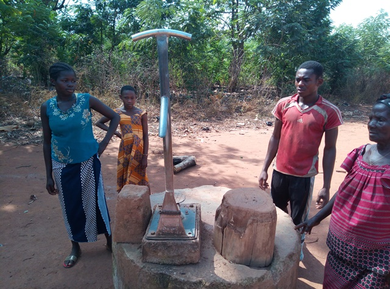

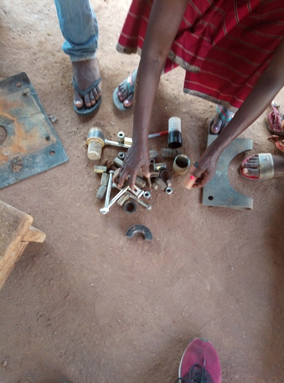
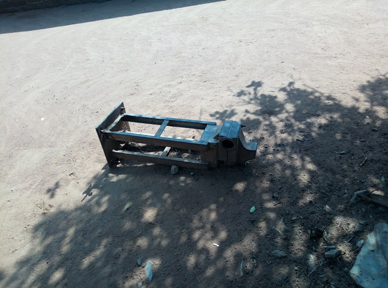

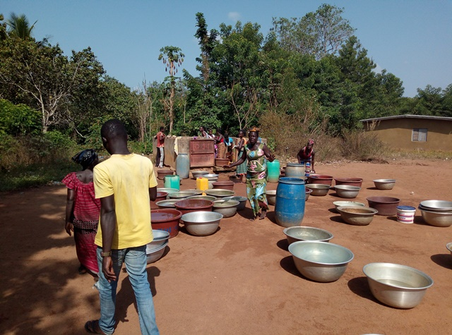

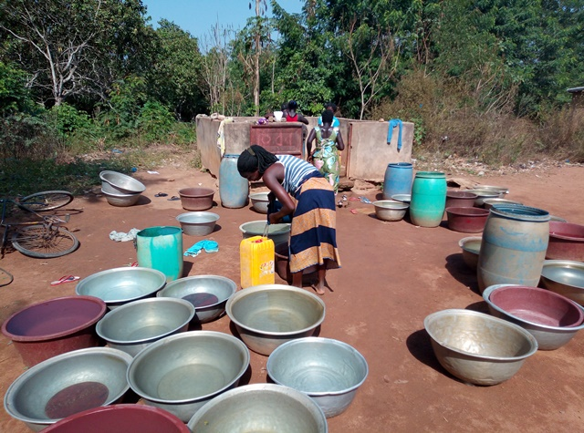
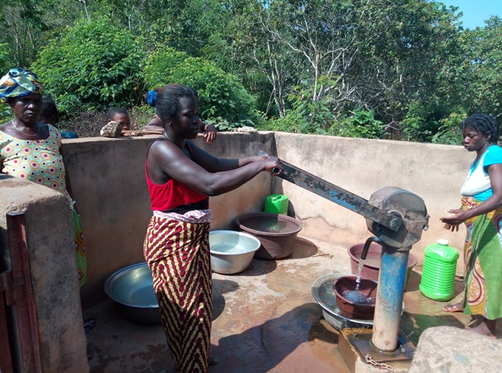
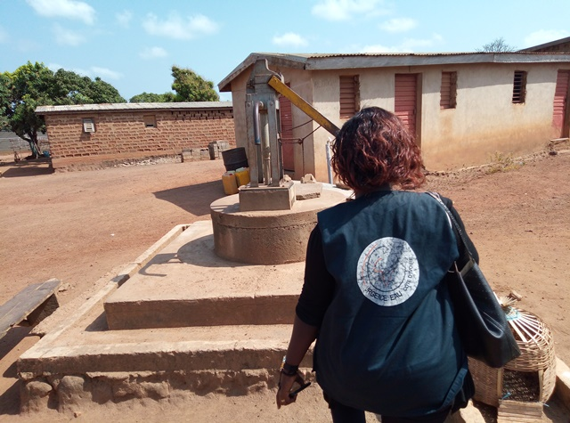

### Pratiques et modes d’approvisionnement en eau
A N’gatta Sakassou, la population s’approvisionne à la pompe. Pendant les périodes de pénurie, les villageois se dirigent dans le village voisin où se trouve un puits traditionnel, ou dans les marigots.

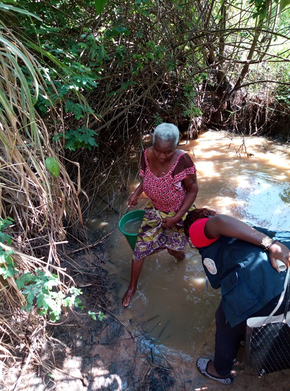

### Gestion des points d’eau
La gestion de la pompe est laissée à la charge d’un comité composé essentiellement de femmes. Ce comité est chargé de l’entretien et de la surveillance du point d’eau aussi de la trésorerie. 

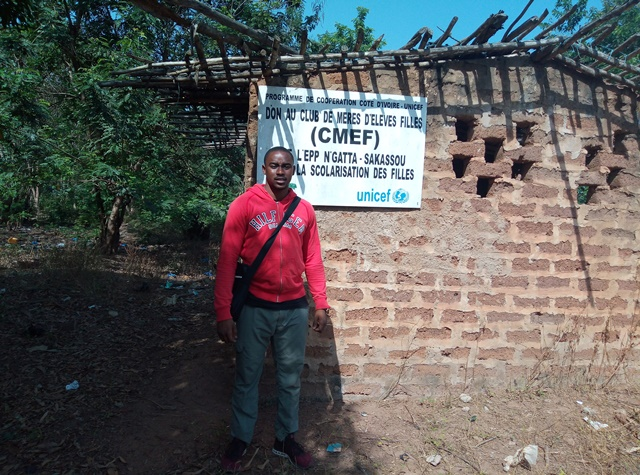
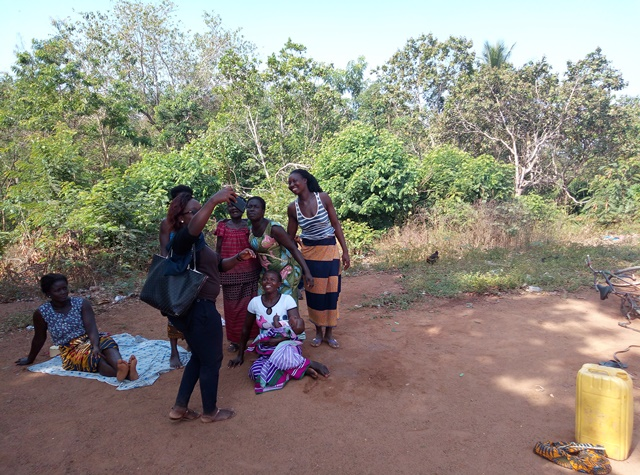
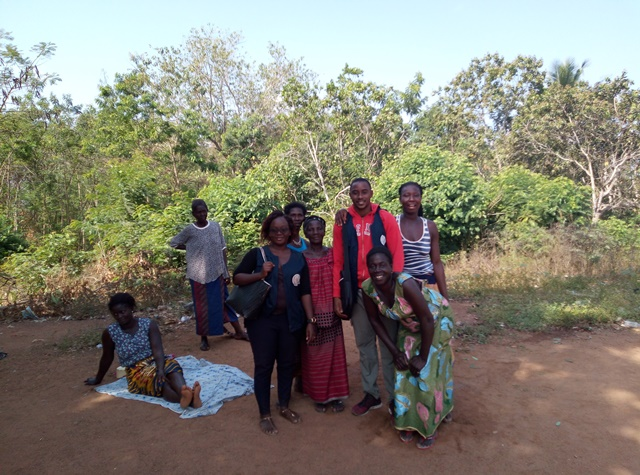

Afin de réduire la pression sur la pompe, les habitants doivent se plier à un ordre de passage très strict. Chaque famille est autorisée à s'y approvisionner seulement certains jours de la semaine (1 jour sur 2 ou sur 3). La cuvette d’eau est vendue à 10 FCFA. 
Quand il y a une panne au niveau de la pompe, la trésorière fournit l’argent pour l’achat du matériel de réparation et la main-d’œuvre du réparateur. Des difficultés interviennent dans la gestion lorsque les pannes sont plus fréquentes et que l’argent que contient la caisse n’arrive plus à subvenir aux dépenses.

## Personnes ressources

* Chef de village
* Présidente des Femmes 
* Présidente du comité de Gestion

## Gestion des excréta
Dans le village nous retrouvons plusieurs types de latrines notamment les latrines à fosses simples, les latrines à fosses septiques et les latrines à chasse d’eau. Cependant, moins de la moitié de la population dispose de toilettes à proximité des maisons. De ce fait, les personnes n’ayant pas de toilettes défèquent à l’air libre aux alentours du village et dans la forêt. Cela s'ajoute aux déjections des animaux d'élevage.

À N’gatta-Sakassou, les eaux et ordures ménagères sont généralement déversées dans les cours des maisons et aux alentours du village. Vu qu’il n’y a pas de point de collecte d’ordure, chaque ménage gère les déchets (liquides et solides) de façon autonome. 

## Desideratas des populations
| Type d'entretien | Date | 
| :-- | :--: | 
| Entretien individuel Chef de village N’Guatta-Sakassou |8 fevrier 2019| 
| Entretien individuel Président des Femmes N’Guatta-Sakassou |8 fevrier 2019|
| Entretien individuel Présidente du comité de gestion N’Guatta-Sakassou |8 fevrier 2019|
| Focus group Comité de Gestion N’Guatta-Sakassou |8 fevrier 2019|
| Focus group femmes N’Guatta-Sakassou |8 fevrier 2019|

Sur les 5 PMH que possède la communauté, 2 sont en réparation et une seule fonctionne. Les habitants souhaiteraient que leurs 4 autres soient réparées. Cela permettra de mieux desservir les populations qui habitent à proximité de ces PMH.

## Tensions ressenties lors des entretiens

### Tensions générales
Aucune tension signalée

### Tensions autour de l'eau
Du fait de la rareté des points d’eau communautaires, des disputes éclatent dans la file d’attente, toutefois celles-ci demeurent ponctuelles et de faible ampleur.

### Tensions avec les localités voisines
Aucune tension signalée. 

