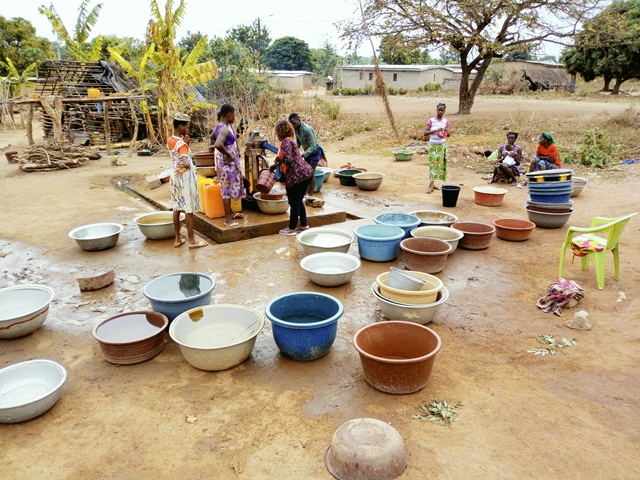
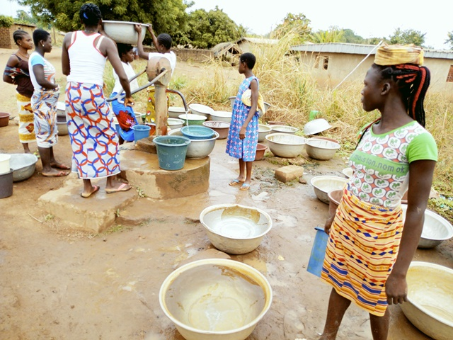

template: article
title: Pangbabo
slug: pangbabo
iddbb: Pangbabo
tags: Rural
authors: BROU Yves Oscar Kouadio, SORO Doba, MAILLARD Thomas, DIAKITE A. Cheick, KOHE A. Christelle, OUATTARA Mafine, SERI A. Jonathan, N'GUESSAN Firmain Kouakou
date: 2019-02-20
latitude:  7.77940 
longitude: -5.07731 
zoom: 16
localisation: Nord de Bouaké, au nord de l'aéroport, le long de la voie ferrée

|Informations générales||
|:--|--:|
| Nom de la localité : | Pangbabo | 
| Population : | 3000 habitants | 
| Dessertes en eau potable | Non raccordé au réseau SODECI | 
| Gestion des excrétas | Assainissement autonome |

## Présentation de la localité
Pangbabo est un village de la Sous-préfecture de Bouaké dans la direction nord-ouest de la ville, sur l’axe Bouaké-Botro. Il est accessible par une large route carrossable en terre battue qui part de l'aéroport. Il compte plus de 3000 habitants. Il regroupe en son sein 5 petits villages appelés quartier, dont Baloukro, Angankro, Djamlabo, Kouakro et Ocoinkro.

Pangbabo abrite une école primaire. Le village dispose d’un centre de santé qui n’est pas encore fonctionnel. Le village est relié au réseau électrique, mais pas au réseau de la SODECI. Il ne dispose d’aucun point de collecte d’ordure ménagère. Cette situation oblige la communauté à déverser les ordures ménagères dans un lieu public.

L'habitat est plutôt traditionnel avec des maisons construites en banco. On trouve aussi des maisons modernes. Peu sont équipés de latrines aussi les habitants pratiques la défécation à l'air libre en lisière du village.

Les activités génératrices de revenus sont généralement axées sur l’agriculture avec une production d’anacarde comme culture de rente et le riz, l’igname, etc. comme cultures vivrières.

## État des lieux des ouvrages d’alimentation en eau potable

### Ouvrages existants
Le village n'est pas raccordé au réseau de la SODECI.

Le village compte 5 points d’eau équipés de PMH, dont 2 en état de marche lors des enquêtes. Ce sont 2 forages équipés de pompes qui servent à la boisson et aux tâches ménagères. 3 autres pompes endommagées ont été démontées. Les forages tombent souvent en panne en moyenne 5 à 6 fois dans l’année. On note une pression sur les pompes fonctionnelles, ce qui peut justifier les fréquentes pannes.
L’enquête sanitaire des pompes révèle une forte vulnérabilité à la pollution au niveau des 2 pompes. L’analyse de la qualité de l’eau révèle une pollution azotée due principalement au nitrate. Les concentrations de nitrate supérieures à la norme dans les eaux des 2 forages. Notons qu’aucune contamination à *E. coli* n’a été détectée dans les prélèvements.

### Pratiques et modes d’approvisionnement en eau 

La population de Pangbabo s'approvisionne majoritairement à la pompe des forages et aux marigots. Les pannes récurrentes des forages les incitent à privilégier l’eau du marigot.

### Gestion des points d’eau

Les pompes du village sont gérées par une femme qui forme à elle seule le comité de gestion des points d'eau. L'eau est vendue 10 francs la cuvette.

## Personnes ressources

* Chef de village 
* Porte-paroles du chef                               
* Président des jeunes 
* Présidente des femmes

## Gestion des excrétas

Pangbabo ne dispose pas d’un réseau de drainage des eaux de pluie et usées. Ces eaux sont généralement déversées dans les cours des maisons.
L’assainissement y est autonome, chaque habitation gère ses eaux usées domestiques. Moins de la moitié de la population dispose de toilettes à proximité des maisons. De ce fait, les personnes n’ayant pas de toilettes défèquent à l’air libre dans la forêt. Il faut également noter la présence d’animaux dans tout le village. N’ayant pas d’enclos, ceux-ci défèquent et urinent n’importe où dans le village.

## Desideratas des populations
| Type d'entretien | Date | 
| :-- | :--: | 
| Entretien individuel Chef de village |20 Février 2019| 
| Entretien individuel Président des Femmes|20 Février 2019| 
| Entretien individuel Présidente du comité de gestion|20 Février 2019| 
| Focus group hommes Minakro|20 Février 2019| 
| Focus group femmes Minakro|20 Février 2019| 

La population de Pangbabo souhaiterait :

1. réhabiliter les pompes en panne,
2. construire une nouvelle pompe,
3. améliorer le financement du comité de gestion des pompes,
4. obtenir des latrines et un point de collecte des ordures.

## Tensions ressenties lors des entretiens

### Tensions générales
Aucune tension signalée

### Tensions autour de l'eau
Du fait de la rareté des points d’eau communautaires, des disputes éclatent dans la file d’attente, toutefois celles-ci demeurent ponctuelles et de faible ampleur.

### Tensions avec les localités voisines
Aucune tension signalée.

