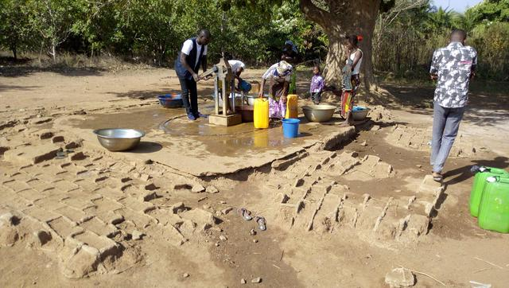

template: article
title: Pharis Assouakro
slug:pharisassouakro
iddbb: Pharis-Assouakro
tags: Rural
authors: BROU Yves Oscar Kouadio, SORO Doba, MAILLARD Thomas, DIAKITE A. Cheick, KOHE A. Christelle, OUATTARA Mafine, SERI A. Jonathan, N'GUESSAN Firmain Kouakou
date: 2019-01-21
latitude:  7.79790 
longitude: -5.05979 
zoom: 16
localisation: Nord de Bouaké

|Informations générales||
|:--|--:|
| Nom de la localité : | Pharis Assouakro | 
| Population : | 300 habitants | 
| Dessertes en eau potable | Non raccordé au réseau SODECI | 
| Gestion des excrétas | Assainissement autonome | 

## Présentation de la localité
Le village de Pharis-Assouakro est situé à environ 6 kilomètres au nord de la ville de Bouaké. Le village ne dispose pas d’école et n’est pas alimenté par le réseau de distribution de l'eau potable géré par la SODECI. La taille de la population du village est estimée à environ 300 habitants. Le village s’étend sur deux sites. Le premier est le site originel du village. Cependant les pouvoirs publics ont demandé aux habitants de se rapprocher de la route afin de bénéficier des raccordements aux différents réseaux (eau potable et électricité). Les villageois migrent progressivement vers le nouveau site.

Le type d’habitat que l’on retrouve à Pharis-Assouakro est plutôt sous un style traditionnel avec des maisons construites en banco. Les activités génératrices de revenus sont généralement axées sur l’agriculture avec une production d’anacarde comme culture de rente et le riz et l’igname comme cultures vivrières.

## Socio anthropologie de la localité 

Ce village est habité par une communauté appartenant au sous-groupe Baoulé pharis ou fahafouè. Il appartient au canton de Konankankro. En ce qui concerne les infrastructures, le village ne dispose d’aucune école primaire. De plus, il n’existe pas de point de collecte d’ordures ménagères ce qui pousse les habitants à jeter les ordures ménagères aux alentours du village ou dans la forêt. Il faut également noter que la majorité des villageois ne disposent pas de toilette dans leurs maisons et pratiquent la défécation à l'air libre.

## État des lieux des ouvrages d’alimentation en eau potable

### Existants
Le village compte 2 points d’eau, dont 1 fonctionnel. Les enquêtes ont porté sur le seul point d’eau fonctionnel. Il est situé à environ 800 mètres de l’ancien village. Le forage non fonctionnel est situé sur le nouveau site du village. Il a été construit par l’État en 2013 à travers le programme PPU (Programme Présidentiel d'Urgence: vaste plan d'investissements pilotés par le président Alassane Ouattara après son élection en 2010). 
Le forage fonctionnel est le premier point d’eau du village, il date de 1976. Les pannes y sont fréquentes : en moyenne 2 à 3 fois par an. La qualité de l’eau est jugée acceptable par les populations et l’analyse des paramètres physicochimique et bactériologique de l’eau n’a révélé aucune anomalie particulière. 

### Pratiques et modes d’approvisionnement en eau

La population de ce village s'approvisionne majoritairement à la pompe et au marigot. Les pannes récurrentes de la pompe les incitent à privilégier le marigot.

### Gestion des points d’eau

 La pompe est installée au sein du village, mais il n’y a pas de comité de gestion, un habitant surveille la pompe et réalise un entretien sommaire. En conséquence, la pompe est mal entretenue et il n'y a pas de caisse d'eau spécifique permettant de financer l'entretien et les réparations.

 L'usage des marigots est régulé par des interdits: les mercredi et vendredi les femmes sont interdites d’y aller sous peine de sanction.

## Personnes ressources

* Chef de village
* Présidente des femmes

## Gestion des excréta
On observe un faible niveau d’hygiène et d’assainissement à Pharis-Assouakro. Les concessions ne disposent pas de latrines. La défécation se fait donc à l’air libre dans le village. Pour ce qui concerne la gestion des ordures ménagères, il n’existe pas un système propre au village. Les déchets ménagers sont collectés et déversés en brousse. 

## Desideratas des populations
Les populations demandent l’installation d’autres pompes et la réparation de la pompe endommagée. 

## Tensions ressenties lors des entretiens

### Tensions générales
Aucune tension signalée

### Tensions autour de l'eau
Du fait de la rareté des points d’eau communautaires, des disputes éclatent dans la file d’attente, toutefois celles-ci demeurent ponctuelles et de faible ampleur.

### Tensions avec les localités voisines
Aucune tension signalée.
