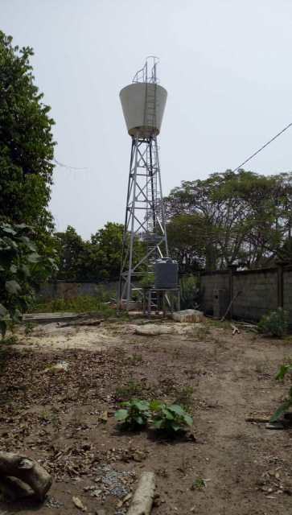
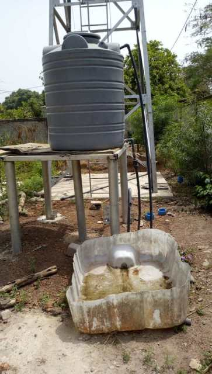

template: article
title: Pitiéssi
slug: pitiessi
iddbb: Pitiéssi
tags: Rural
authors: BROU Yves Oscar Kouadio, SORO Doba, MAILLARD Thomas, DIAKITE A. Cheick, KOHE A. Christelle, OUATTARA Mafine, SERI A. Jonathan, N'GUESSAN Firmain Kouakou
date: 2019-02-14
latitude:  7.64105 
longitude: -5.14132 
zoom: 16
localisation: Ouest de Bouaké, sur la route de Sakassou

|Informations générales||
|:--|--:|
| Nom de la localité : | Pitiéssi | 
| Population : | 500 habitants | 
| Dessertes en eau potable | Partiellement raccordé au réseau SODECI | 
| Gestion des excrétas | Assainissement autonome |

## Présentation de la localité
Pitiéssi est un village de la Sous-préfecture de Bouaké situé sur l’axe Bouaké-Béoumi à environ 6 kilomètres de la ville. Peuplé de plus de 800 habitants, ce village abrite une école primaire, mais pas de centre de santé. Pitiéssi est relié au réseau électrique et au réseau de la SODECI.

À propos de de la typologie de l’habitat, les habitations du village sont construites de façon traditionnelle en grande majorité. Cependant, certaines concessions sont de type moderne avec des villas haut-standing. 

À l’image de la plupart des villages du centre de la Côte d’Ivoire, les populations de Pitiéssi ont comme principales activités économiques l’agriculture. Elles pratiquent la culture de l’anacarde comme cultures d’exportations et le riz, l’igname, etc. comme cultures vivrières. 

## État des lieux des ouvrages d’alimentation en eau potable

### Ouvrages existants
Le village de Pitiéssi est raccordé au réseau de la SODECI, mais les coupures sur le réseau sont fréquentes et les habitants du village jugent qu’elle n’est pas de bonne qualité.
Le village dispose d’un système d’HVA construit par la présidente des femmes à la faveur de la crise d’eau qu’a connue la ville de Bouaké et les villages à sa périphérie en 2018. Ce dernier est la propriété d’un privé, mais il est aujourd’hui ouvert à tout le village gratuitement. L’ouvrage est récent et ne souffre pas de panne. On note par ailleurs une forte concentration en fluor dans l’eau (1.5 mg/l). Les paramètres microbiologiques de l’eau ont démontré la présence de *E. coli* dans l’eau (24 UFC/100ml) au niveau des points de collecte de l’eau. 

 
 

## Pratiques et modes d’approvisionnement en eau
La majeure partie de la population s’approvisionne dans ce forage. L’eau de SODECI est une source annexe. Les populations affirment ne pas avoir confiance en l’eau de la SODECI, car selon elles, il y a des ruptures fréquentes et l’eau n’a pas une bonne qualité. L’eau du forage sert donc à tous les usages domestiques du ménage. 

## Gestion des points d’eau
La gestion de la pompe est assurée par les propriétaires de celle-ci. Il faut noter que cette dernière se trouve dans l'enceinte d'une habitation. Ainsi l’entretien autour du point d’eau demeure l’affaire des propriétaires. L’eau n’eau pas payante. La pompe ouvre à 7 heures et ferme à 18 heures. 

## Personnes ressources

* Chef de village
* Présidente des femmes
* Président des jeunes du village

## Gestion des excrétas
À Pitiéssi, les règles d’hygiène et d’assainissement sont difficilement respectées.  La majeure partie des concessions traditionnelles ne dispose pas de latrines conventionnelles. La défécation se fait soit à l’air libre dans le village ou autour, soit dans des latrines traditionnelles peu respectueuses des règles d’hygiène. Seules les concessions modernes disposent de latrines à fosse septique. Pour ce qui concerne la gestion des ordures ménagères, il n’existe pas un système propre au village. Les déchets ménagers sont collectés et déversés en brousse

## Desideratas des populations
| Type d'entretien | Date | 
| :-- | :--: | 
| Entretien individuel Chef de village |14 février 2019| 
| Entretien individuel Présidente des Femmes|14 février 2019| | 
| Entretien individuel Présidente du comité de gestion|14 février 2019|
| Focus group femmes |14 février 2019|

Les populations de Pitiéssi optent pour des PMH. Elles estiment que l’eau les autres sources ne sont pas de bonne qualité. Les hommes et les femmes souhaiteraient la réparation des pompes en panne et la construction de nouveau forage. Par ailleurs, les sources fonctionnelles étant privées, le PMH sera communautaire et mieux géré par la communauté. 

## Tensions ressenties lors des entretiens

### Tensions générales
Aucune tension relevée

### Tensions autour de l'eau
Aucune tension relevée

### Tensions avec les localités voisines
Lors des coupures d'eau, des tensions apparaissent entre les habitants de Totokro et ceux du village de Pitiessi. En effet, Pitiessi est déjà peu pourvu en équipement AEP, la surconsommation occasionnée par le dépannage des habitants de Totokro peut faire éclater des conflits ponctuellement.
