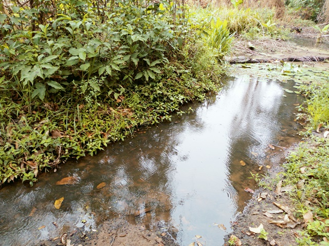
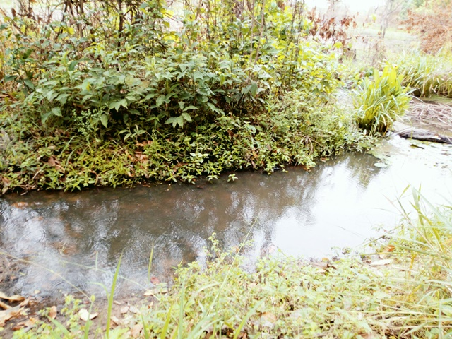
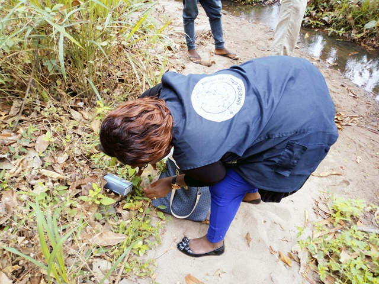
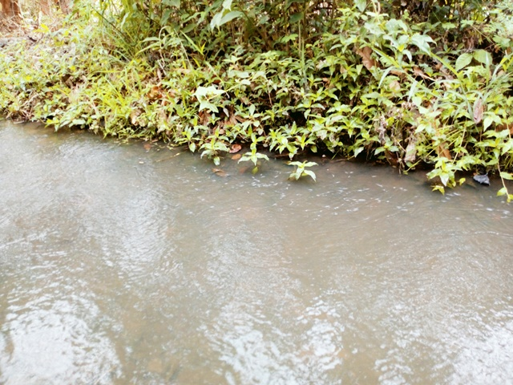

template: article
title: Sesseti
slug: sesseti
iddbb: Sesseti
tags: Rural
authors: BROU Yves Oscar Kouadio, SORO Doba, MAILLARD Thomas, DIAKITE A. Cheick, KOHE A. Christelle, OUATTARA Mafine, SERI A. Jonathan, N'GUESSAN Firmain Kouakou
date: 2019-02-21
latitude:  7.69192
longitude: -5.12515
zoom: 16
localisation: Ouest de Bouaké, sur la route de Béoumi

|Informations générales||
|:--|--:|
| Nom de la localité : | Sesseti | 
| Population : | 200 habitants | 
| Dessertes en eau potable | Non raccordé au réseau SODECI | 
| Gestion des excrétas | Assainissement autonome |

## Présentation de la localité
Sisseti est un petit village d’environ 200 habitants, à l’ouest de la commune de Bouaké sur l’axe Bouaké-Béoumi.

Le village n’a ni école, ni centre de santé, ni point de collecte des ordures. Les habitants ici sont pour la plupart des agricultures. Les principales productions sont l’anacarde et les produits vivriers.

À Sisseti, l’habitat est de type ancien. Les maisons sont construites avec des briques de terre battue et recouvertes de pailles ou de tôles. Seulement quelques maisons sont faites en briques de ciment. Peu d'habitation dispose de latrines et les habitants pratiquent la défécation à l'air libre en lisière du village.

## État des lieux des ouvrages d’alimentation en eau potable

### Ouvrages existants
Le village de Sisseti n’est pas raccordé au réseau de la SODECI. Il ne dispose pas non plus d’équipement hydraulique villageois.

Le village n’a d’autre source d’alimentation en eau que le marigot qui est situé à 200m du village. Il a été noté que le marigot du village tarit dès l’apparition de la saison sèche ce qui crée un problème préoccupant.

L’inspection sanitaire autour de ce point d’eau nous a montré que le marigot est très vulnérable aux risques de contamination. Le point d’eau n’est pas entretenu et nous avons observé des broussailles et un environnement sale autour du point d’eau. Toutefois, aucune pollution physico-chimique n’a été  décelée, mais l’eau du marigot est contaminée par *E. coli* (31 UFC/100 ml).

### Pratiques et modes d’approvisionnement en eau
Seule source d’eau du village, le marigot est utilisé pour tous les besoins. Le marigot ne subit pas d’entretien particulier sauf en saison pluvieuse. À cette saison, les jeunes du village viennent nettoyer les broussailles tout autour. L’accès au point d’eau est public et gratuit. Cependant les habitants doivent se conformer à des règles et des interdits relatifs à l'accès et l'usage de l'eau du marigot. Il est interdit de s'y rendre certains jours de la semaine. Cela permet un relatif renouvellement de la ressource.

### Gestion des points d’eau

Il n’y a aucune gestion du marigot de Sesseti. Celui-ci est toujours disponible.

## Personnes ressources

* Chef de village 
* Président des jeunes

## Gestion des excrétas
Nous avons observé dans le village un seul type de latrine notamment les latrines à fosses directes. Il faut encore noter que ce ne sont pas toutes les habitations qui possèdent une latrine. Celles qui n’en possèdent pas, utilisent celles des voisins ou défèquent en brousse.

## Desideratas des populations
| Type d'entretien | Date | 
| :-- | :--: | 
| Entretien individuel Chef de village |21 Février 2019| 
| Focus group hommes |21 Février 2019| 

La population de Sesseti souhaiterait obtenir une PMH. Cette infrastructure pourrait aider la communauté à être autosuffisante en eau. La communauté affirme être réceptive à toute sorte d’innovation pour aider le village à régler les problèmes d’eau d’hygiène et d’assainissement.

## Tensions ressenties lors des entretiens

### Tensions générales
Aucune tension signalée

### Tensions autour de l'eau
Aucune tension signalée

### Tensions avec les localités voisines
Aucune tension signalée.
