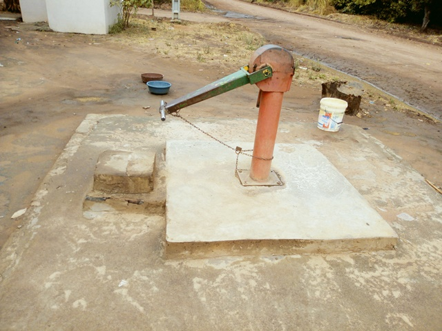
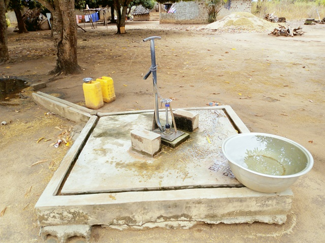

template: article
title: Sinzénou
slug: sinzenou
iddbb: Sinzenou
tags: Rural
authors: BROU Yves Oscar Kouadio, SORO Doba, MAILLARD Thomas, DIAKITE A. Cheick, KOHE A. Christelle, OUATTARA Mafine, SERI A. Jonathan, N'GUESSAN Firmain Kouakou
date: 2019-02-05
latitude:  7.72465 
longitude: -4.89137
zoom: 16
localisation: Nord-Est de Bouaké, sur la route de Bassawa

|Informations générales||
|:--|--:|
| Nom de la localité : | Sinzénou | 
| Population : | 500 habitants | 
| Dessertes en eau potable | Non raccordé au réseau SODECI | 
| Gestion des excrétas | Assainissement autonome |

## Présentation de la localité
Sinzenou est situé à 6 km à l’Est de la ville de Bouaké, il est limitrophe de YapoKouakoukro et est accessible par une large route carrossable en terre battue . Les habitants de ce village sont des Baoulés du canton Kplékpléssou plus précisément de la tribu Gossan.

 Aujourd’hui, La taille de la population du village est estimée à environ 500 habitants. 
Au niveau des infrastructures de base, Sinzenou n'a ni école,ni dispensaire, ni point de collecte des ordures.

 En ce qui concerne la typologie d’habitat que l’on retrouve à Sinzenou, elle est plutôt sous un style traditionnel avec des maisons construites en banco pour certains et d’autres avec des briques en terre battue. On y retrouve quelques maisons de type moderne. Peu d'habitations disposent de latrine, de ce fait les habitants défèquent à l'air libre en lisière du village.

 Les activités génératrices de revenus sont généralement axées sur l’agriculture avec une production d’anacarde comme culture de rente et le riz, l’igname, etc. comme cultures vivrières

## État des lieux des ouvrages d’alimentation en eau potable

### Ouvrages existants
Le village n’est raccordé pas au réseau de la SODECI.

En ce qui concerne l’hydraulique villageoise, le village de Sinzenou dispose de 3 PMH dont 2 fonctionnelles : un forage qui appartient à un particulier(pas analysé) et une pompe communautaire. 

L’entretien n’est pas régulier au niveau de la pompe communautaire ce qui la rend vulnérable face à la pression qu'elle subit quotidiennement.

Toutefois, l’enquête sanitaire réalisée au niveau du forage indique que ce point d’eau ne présente pas de risques pour la santé des populations. L’analyse de la qualité de l’eau n’a révélé aucune forme de pollution chimique et bactériologique.

## Gestion des points d’eau
La gestion du forage communautaire est assurée par un comité de gestion constitué de femmes du village. Elles assurent la surveillance et l’entretien aux alentours de la pompe. Elles sont à leur tour supervisées par le président des jeunes. L’eau est vendue dans le village à 10 francs la bassine.

La gestion et l’entretien du forage privé sont l’affaire du propriétaire. L’eau de ce dernier est vendue à hauteur de 10 francs la bassine.

## Personnes ressources

* Le représentant du chef
* Le président des jeunes
* La présidente du comité de gestion
* les membres du comité d’organisation

## Gestion des excrétas

La gestion des excréta dans le village se fait de manière individuelle. Les pratiques sont quasiment les mêmes dans toute la région. La majeure partie des concessions ne dispose pas de latrines améliorées. Les latrines que l’on rencontre dans le village sont principalement des latrines sèches à fosse simple dans quelques concessions. Les concessions qui ne disposent pas de latrines continuent la défécation à l’air libre. Pour ce qui concerne la gestion des ordures ménagères, il n’existe pas un système propre au village. Les déchets ménagers sont collectés et déversés en brousse. 

## Desideratas des populations
| Type d'entretien | Date | 
| :-- | :--: | 
| Entretien individuel Chef de village|05 Février 2019| 
| Entretien individuel Président des Femmes|05 Février 2019| 
| Entretien individuel Présidente du comité de gestion|05 Février 2019 | 
| Focus group hommes |05 Février 2019| 
| Focus group femmes |05 Février 2019| 

1. La réparation des pompes en panne,
2. la construction d'une nouvelle pompe,
3. la formation des membres d'un comité de gestion des pompes,
4. la construction de latrine et la mise en place d'un point de collecte des ordures.

## Tensions ressenties lors des entretiens

### Tensions générales
Aucune tension signalée

### Tensions autour de l'eau
Du fait de la rareté des points d’eau communautaires, des disputes éclatent dans la file d’attente, toutefois celles-ci demeurent ponctuelles et de faible ampleur.

### Tensions avec les localités voisines
Aucune tension signalée.
