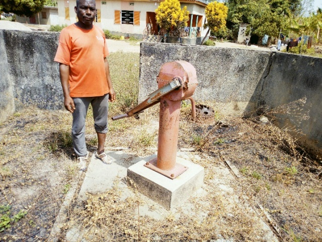
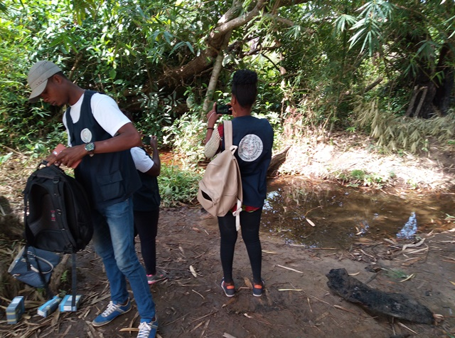

template: article
title: Tchimoukro 
slug: tchimoukro
iddbb: Tchimoukro
tags: Rural
authors: BROU Yves Oscar Kouadio, SORO Doba, MAILLARD Thomas, DIAKITE A. Cheick, KOHE A. Christelle, OUATTARA Mafine, SERI A. Jonathan, N'GUESSAN Firmain Kouakou
date: 2019-02-22
latitude:  7.69694 
longitude: -5.23210
zoom: 16
localisation: Ouest de Bouaké

|Informations générales||
|:--|--:|
| Nom de la localité : | Tchimoukro | 
| Population : | 500 habitants | 
| Dessertes en eau potable | Raccordé au réseau SODECI | 
| Gestion des excrétas | Assainissement autonome |

## Présentation de la localité
Le village de Tchimoukro est situé à 10 km de la ville de Bouaké sur la route bitumée Bouaké-Béoumi, non loin de la station de captage et de traitement de l'eau de la Loka par la SODECI. C’est un petit village d'environ 500 habitants.

Le village possède une école primaire située à 1 km dans un village voisin. Dans cette école a été installée une pompe hydraulique.

Les maisons dans le village sont faites soit en brique de ciment ou soit en brique de terre battue couvertes de tôles ou de pailles.

La population ici est essentiellement agricole avec comme principale production l’anacarde et les produits vivriers.

## État des lieux des ouvrages d’alimentation en eau potable

### Ouvrages existants

Le village est raccordé au réseau de la SODECI cependant il fait face à des coupures fréquentes.

En ce qui concerne l’Hydraulique villageoise, le village possède aussi  une pompe hydraulique,  mais celle-ci est en panne depuis plus de 10 ans. La pompe a été abandonnée suite à des fuites au niveau des tuyaux. Par la suite des pierres qui  ont été jetées par les enfants ont bouché le trou de la tuyauterie. 

En cas de pénurie d’eau, les habitants vont s’approvisionner à l’eau du marigot que nous avons pu visiter.  Le marigot est situé à 200m du village presque en bordure de route, dans un basfond. Il a été noté que le marigot tarit en saison sèche.
L’enquête réalisée a montré que le point d’eau est vulnérable aux risques de contamination avec un score de 10. Le point d’eau est envahi par des feuilles mortes et son environnement est sale.
Au niveau de l’analyse de la qualité de l’eau, les paramètres physicochimiques indiquent un taux élevé de Fluor dans l’eau du marigot et une contamination à *E. coli*. 

### Pratiques et modes d’approvisionnement en eau
La principale source d’eau et celle-là plus prisées dans le village sont l'eau du réseau de la SODECI. En raison des coupures fréquentes, les villageois stockent l'eau dans de grandes jarres de ciment ou des bidons métalliques. En cas de coupure, ils économisent leurs stocks d'eau en utilisant l'eau du marigot pour les tâches ménagères. Ils n'utilisent l'eau du marigot comme eau de boisson que lorsqu'ils n'ont pas d'autre solution.

### Gestion des points d’eau
Au niveau de l’eau de la SODECI, un ou des robinets sont installés dans les habitations qui possèdent un compteur de la SODECI, la gestion ici est donc individuelle.
Concernant le marigot il est ouvert à tous, chacun peut aller puiser de l’eau librement. Cependant comme dans nombreux villages de la commune de Bouaké, l’utilisation de l’eau de marigot est soumise à certaines coutumes qui interdisent notamment de s'y rendre certains jours de la semaine afin de laisser la ressource se renouveler

## Personnes ressources

* Chef de village 
* Présidente des Femmes                                
* Président du comité de gestion

## Gestion des excrétas

À Tchimoukro, les règles d’hygiène et d’assainissement sont difficilement respectées.  La majeure partie des concessions traditionnelles ne dispose pas de latrines conventionnelles. La défécation se fait soit à l’air libre dans le village ou autour, soit dans des latrines traditionnelles peu respectueuses des règles d’hygiène. Seules les concessions modernes disposent de latrines à fosse septique. Pour ce qui concerne la gestion des ordures ménagères, il n’existe pas un système propre au village. Les déchets ménagers sont collectés et déversés en brousse

## Desideratas des populations
| Type d'entretien | Date | 
| :-- | :--: | 
| Entretien individuel Chef de village |22 Février 2019| 
| Entretien individuel Présidente des Femmes|22 Février 2019 2019| 
| Entretien individuel Présidente du comité de gestion|22 Février 2019 2019| 
| Focus group hommes |22 Février 2019 2019| 
| Focus group femmes |22 Février 2019| 

Les habitants souhaiteraient être mieux informés par la SODECI en cas de coupures et que celles-ci soient moins fréquentes. Ils n'envisagent aucunement d'implanter d'autres équipements hydrauliques.

## Tensions ressenties lors des entretiens

### Tensions générales
Aucune tension signalée

### Tensions autour de l'eau
Aucune tension signalée

### Tensions avec les localités voisines
Aucune tension signalée.
