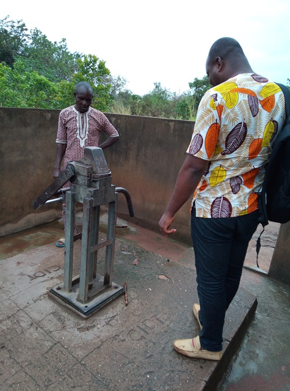
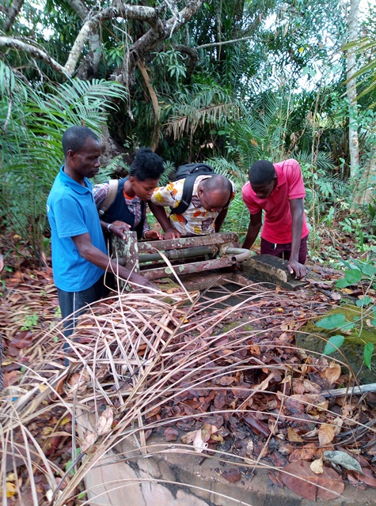
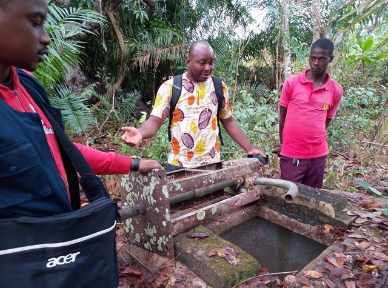

template: article
title:Yapokouakoukro
slug: yapokouakoukro
iddbb: Yapo-kouakoukro
tags: Rural
authors: BROU Yves Oscar Kouadio, SORO Doba, MAILLARD Thomas, DIAKITE A. Cheick, KOHE A. Christelle, OUATTARA Mafine, SERI A. Jonathan, N'GUESSAN Firmain Kouakou
date: 2019-02-05
latitude:  7.72979
longitude: -4.89868 
zoom: 16
localisation: Nord-Est de Bouaké, sur la route de Bassawa

|Informations générales||
|:--|--:|
| Nom de la localité : | Yapokouakoukro| 
| Population : | 500 habitants | 
| Dessertes en eau potable | Non raccordé au réseau SODECI | 
| Gestion des excrétas | Assainissement autonome |

## Présentation de la localité
Le village de Yapokouakoukro est situé à environ 6 kilomètres de Bouaké par une route carrossable en terre battue. Il compte environ 500 habitants et  dispose d’une école primaire, mais pas de centre de santé. Les habitants du village se rendent dans la commune de Bouaké notamment à Belleville pour les problèmes de sanitaires. Le village d’entend maintenant sur 2 sites : l’ancien village et le nouveau village. Il est limitrophe de celui de Sinzenou avec lequel il partage certaines infrastructures.

On y retrouve essentiellement des habitations de type  parpaings en terre  et enduit de ciment avec des tôles ondulées. On note aussi la présence de cases en banco. 

L'agriculture est l'activité principale : l’igname, le manioc, l’anacarde et les produits maraichers (tomate, piment, aubergine).

En ce qui concerne les infrastructures, le village ne dispose pas de point de collecte d’ordures ménagères. Cette situation oblige la communauté à  déverser les ordures ménagères dans la forêt juste derrière le village. De plus, il faut noter que la majorité des villageois ne disposent pas de toilettes dans leurs maisons et vont faire leur besoin dans la forêt. On observe également des excréments d’animaux partout dans le village et en particulier à proximité des points d’eau.

## Socio anthropologie de la localité 
Yapokouakoukro est un village peuplé des Baoulés fahafouè ou pharis, qui appartient au canton de Fahoufouè Gossan. Le village est régi par une autorité traditionnelle composée d’un chef de village, de plusieurs notables, de deux présidents de jeunesse (homme et femme). Le chef  du village est l’autorité exécutive en charge de la prise de décision dans le village. Celui-ci est accompagné par les notables qui font office de conseillers. Quant aux présidents de jeunesses, ceux-ci sont responsables de l’intégration communautaire des membres à travers des activités festives et ludiques. Ils interviennent aussi dans la médiation des conflits communautaires.

## État des lieux des ouvrages d’alimentation en eau potable

Le village n’est raccordé pas au réseau de la SODECI.

En ce qui concerne l’hydraulique villageoise, le village compte 3 pompes à motricité humaine dont une seule fonctionnelle de type ABI 1.  Ce point d’eau a été construit en 1978. La pompe tombe régulièrement en panne : 07 pannes en 2018. Elle est gérée par un comité de gestion et la collecte de l’eau est fixée à 10 francs la cuvette. Le comité semble dynamique, la durée des pannes n’excède pas 03 jours.

Le point d’eau est très bien entretenu et l’évaluation sanitaire de la pompe révèle une faible vulnérabilité par rapport aux sources de pollution. Mais l’analyse bactériologique indique une contamination du prélèvement à *E. coli*.

 
 
 
 
Deux pompes sont abandonnées: 

Celle de l'école (type ABI) est abandonnée parce que la quantité d’eau collectée dans le forage ne dépasse pas une bassine. La pompe est actuellement sous la garde du directeur de l’école.

La seconde pompe de type ABI 1 installée sur un puits de grand diamètre est située à l’entrée du village est relativement éloignée du centre du village. Le point d’eau est abandonné et certaines pièces de la pompe ont servi à la réparation de la pompe fonctionnelle. 

À défaut de l’eau de la pompe, la population utilise l’eau de marigot.

## Personnes ressources

* Chef de village 
* Présidente des Femmes                                
* Président des jeunes

## Gestion des excrétas

La gestion des excréta dans le village se fait de manière individuelle. Les pratiques sont quasiment les mêmes dans toute la région. La majeure partie des concessions ne dispose pas de latrines améliorées. Les latrines que l’on rencontre dans le village sont principalement des latrines sèches à fosse simple dans quelques concessions. Les concessions qui ne disposent pas de latrines continuent la défécation à l’air libre. Pour ce qui concerne la gestion des ordures ménagères, il n’existe pas un système propre au village. Les déchets ménagers sont collectés et déversés en brousse. 

## Desideratas des populations
| Type d'entretien | Date | 
| :-- | :--: | 
| Entretien individuel Chef de village |05 Février 2019| 
| Entretien individuel Président des Femmes|05 Février 2019| 
| Focus group hommes|05 Février 2019| 
| Focus group femmes|05 Février 2019| 

La population de Yapokouakoukro souhaiterait :

1. La réparation des pompes en panne,
2. la construction d'une nouvelle pompe,
3. la formation des membres du comité de gestion des pompes,
4. la construction de latrine et la mise en place d'un point de collecte des ordures.

## Tensions ressenties lors des entretiens

### Tensions générales
Aucune tension signalée

### Tensions autour de l'eau
Du fait de la rareté des points d’eau communautaires, des disputes éclatent dans la file d’attente, toutefois celles-ci demeurent ponctuelles et de faible ampleur.

### Tensions avec les localités voisines
Aucune tension signalée.

