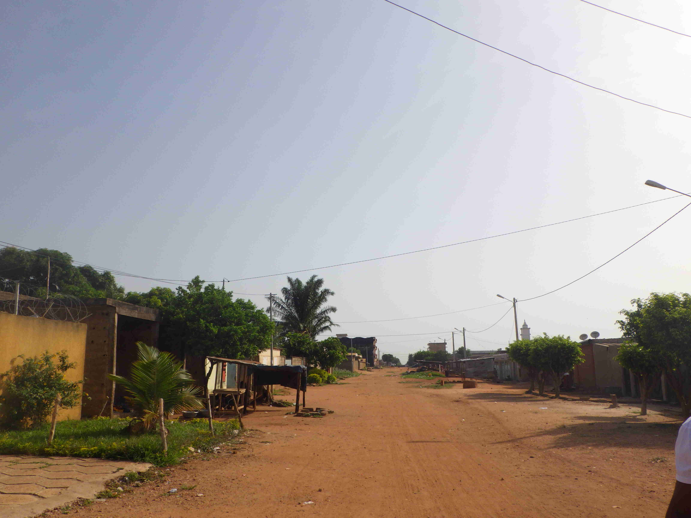
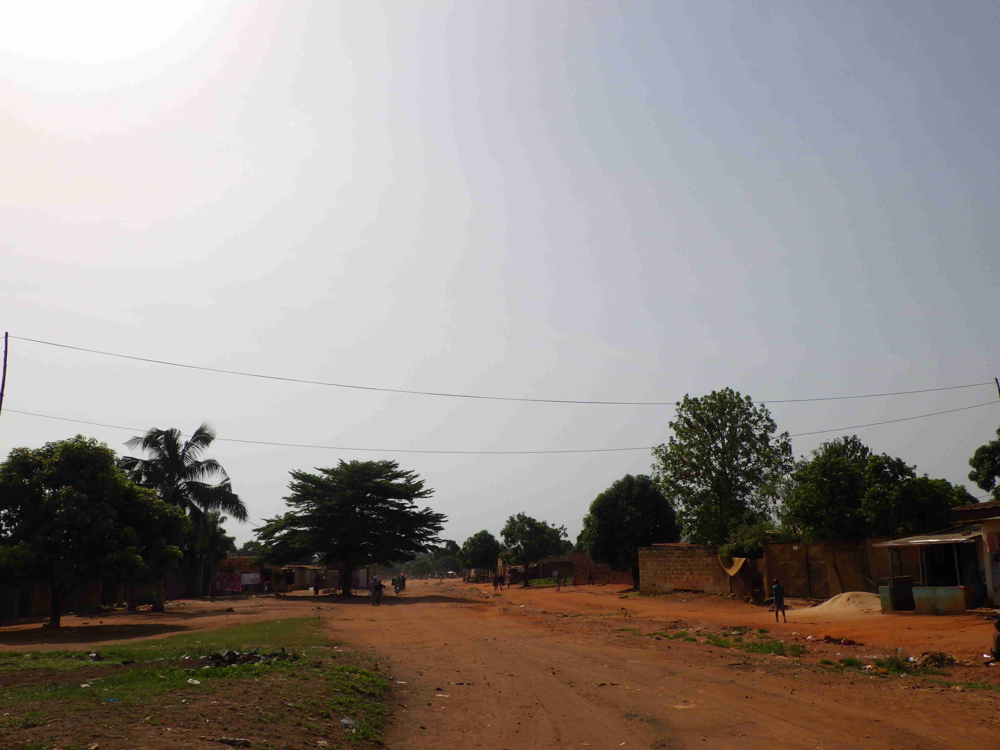
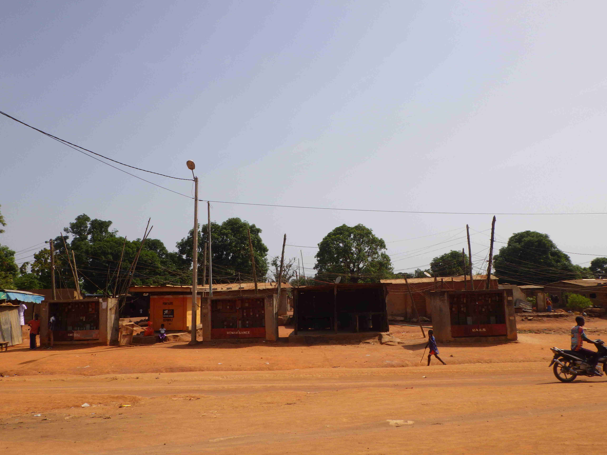
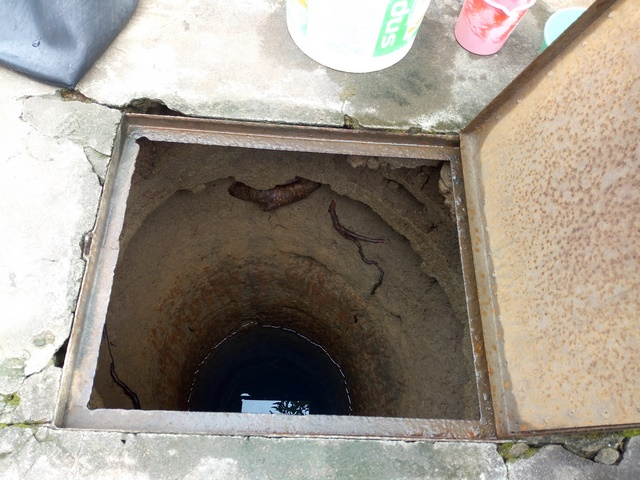
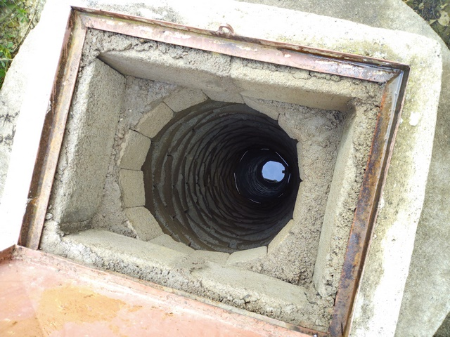
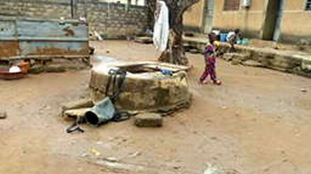
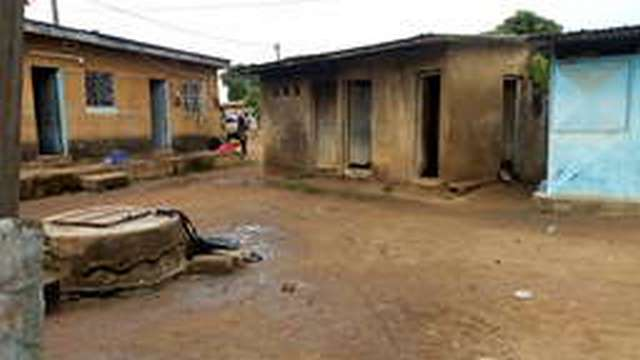
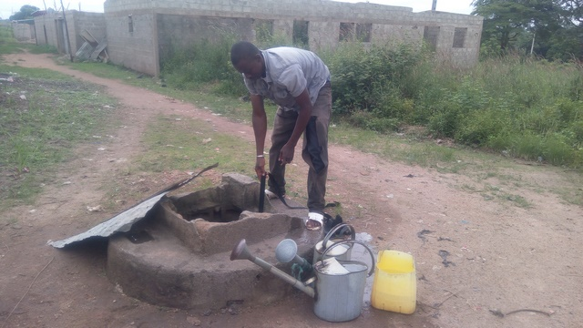
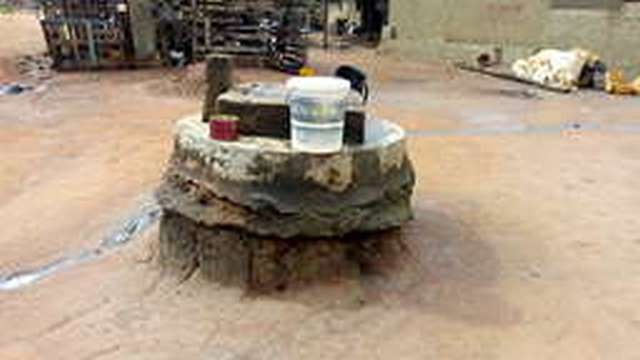

date: 2019-05-10
template: article
title: Zone Industrielle – Djézoukouamékro
slug: zoneindustrielle
tags: Urbain
authors: BROU Yves Oscar Kouadio, SORO Doba, MAILLARD Thomas, DIAKITE A. Cheick, KOHE A. Christelle, OUATTARA Mafine, SERI A. Jonathan, N'GUESSAN Firmain Kouakou
latitude: 7.70400
longitude: -5.05500
zoom: 14
localisation: Quartier à l'ouest de Bouaké

|Informations générales||
|:--|--:|
| Nom de la localité : | Zone Industrielle - Djézoukouamékro | 
| Population (2014) : | 48787 habitants | 
| Aire : | 5 km² | 
| Dessertes en eau potable | Totalement raccordé au réseau SODECI | 
| Gestion des excrétas | Assainissement autonome | 

## Socio-Anthropologie
Appelé à l’origine Djézoukouamékro, Zone Industrielle est un ancien village baoulé, chef-lieu d’un royaume Akan. Situé à l’origine à l’emplacement actuel du Centre Hospitalier Universitaire de Bouaké.  
L’urbanisation et l’industrialisation du quartier ont attiré de nouveaux habitants. Les autochtones Baoulés sont plus concentrés dans les villages de Djezoukouamékro, Kouakro Assoumankro, Sarakakro et parfois à la Zone Extension considérés comme des sous-quartiers.  Les secteurs Zone Terminus, Zone Extension et présentent une communauté diversifiée composée d’Akan (majoritairement baoulé), de Mandé (nord, sud), de Gur et de Krou. Le secteur de Djézou Rail et Zone extension présente une forte communauté originaire d’autres pays de la CEDEAO  principalement  maliennes, burkinabé et guinéennes. 
Les religions présentent dans le quartier reflète la diversité de sa population: mosquées et église catholique ou évangéliques. 
Les activités économiques sont variées et les loyers sont bas. Le quartier accueille aujourd'hui de nombreux fonctionnaires (employés administratifs, enseignants) et de nombreux étudiants du fait de la proximité avec le campus universitaire.

## Configuration spatiale
Le quartier de Zone Industrielle est un quartier majoritairement loti de standing bas, mais englobe des poches plus récentes de zones non loties. Il est délimité au sud par la voie ferrée, à l'est par un quartier spontané qui est Soussonoubougou, au nord par des quartiers lotis de moyen standing (Gonfreville et Beaufort) et à l’ouest par un village intégré à la ville qui est Sarakakro. Le quartier dispose des infrastructures de base : centres de santé et écoles. Il est desservi par une voie principale bitumée, mais la voirie secondaire n'est pas bitumée et n'a pas de réseau de drainage. En conséquence, certaines zones souffrent d’importants problèmes d'érosion. 

Le tissu urbain est hétérogène. Les parcelles de la zone lotie forment un plan en damier et sont raccordées aux réseaux d'eau potable et d'électricité.  
Dans les zones non loties, le plan est moins régulier, mais les habitations sont raccordées aux réseaux.

## Paysage urbain

   

 

## Diagnostic des points d'eau analysés
Les enquêtes sanitaires ont porté sur un ensemble de 31 points d’eau : 26 puits familiaux dont deux construit par des ONG musulmanes, trois puits communautaires situés dans des mosquées et deux points d’eau de surface (un marigot et un bras du barrage de Gonfréville). 

### Forages
*Aucun forage diagnostiqué dans le quartier*

### Puits
Les 29 puits analysés dans ce quartier sont majoritairement de type traditionnel : 24 puits n’ont pas de parois cuvelées, les cinq autres sont maçonnés. Seuls 16 puits ne tarissent pas pendant la saison sèche.

L’aménagement de surface est constitué généralement d’une margelle couverte d’une dalle avec une trappe pour faciliter la collecte de l’eau. La plupart du temps, les superstructures ne sont pas en bon état. 18  puits visités présentent des fissures sur la dalle de couverture ou la margelle. Certains puits présentent un risque d'éboulement à cause de l’érosion. 
Si certains puits sont dotés de poulies ou de treuils, ceux-ci ne sont pas utilisés pour l’exhaure de l’eau, ce qui augmente considérablement les risques de contamination.

L’inspection sanitaire des puits à usage domestique de la Zone industrielle révèle que la grande majorité dans points d’eau est vulnérable aux risques de pollution. 

|Niveau de vulnérabilité|Très élevé|Élevé|Moyen|Faible|
|:--:|:--:|:--:|:--:|:--:|
|Effectif des puits|11|14|4|0|

 Les risques potentiels observés sont dus à :
 
 
* Un défaut d’étanchéité sur les trois mètres en dessous de l’ouvrage et de la superstructure à cause de fissures et craquelures sur 28 puits,
* Mauvais conditionnement du système d’exhaure sur 21 puits
* Des latrines ou toilettes sont construites à proximité de points d’eau : 19 puits concernés
* L’absence ou l’inadaptation du couvercle de 19 puits
* Un manque d’hygiène autour de 17 puits

L’analyse de la qualité des eaux vient confirmer la vulnérabilité sanitaire des ouvrages. En effet, 20 puits sont contaminés par la bactérie *E. coli*. La présente de *E. coli* dans les eaux indique une contamination fécale d’origine humaine ou animale à moins de 30 mètres. Cette contamination pourrait s’expliquer par un défaut d’étanchéité des fosses des latrines, une mauvaise gestion des ordures ménagères et la présence d’enclos à bétail.  Les puits ne sont quasiment pas traités au chlore.
L’analyse des paramètres chimiques révèle que les ouvrages sont sujets à une pollution azotée : l’ammoniac et le nitrate. Cinq puits ont des concentrations en ammoniac supérieures à la norme admissible (1,5 mg/l) recommandée pour les eaux de boisson par l’OMS. Seul un des puits a une concentration en nitrate supérieure à 50 mg/L mais les concentrations restent élevées dans de nombreux ouvrages (supérieures à 44 mg/L).
Les eaux de puits  dans le quartier de Zone industrielle ont un pH acide (4,91 à 5,33). Leur goût, leur couleur et leur odeur sont globalement jugés acceptables par les consommateurs.

### Eaux de surface
Deux sources d’eau de surface sont utilisées par les populations de zone industrielle en cas de pénurie. Il s’agit de marigots situés dans un bas-fond entre la zone industrielle et le quartier municipal, et un bras du barrage de la Gonfréville situé dans le village d’Assoakro. Les marigots sont également exploités par des maraîchers. Ces eaux sont très fortement contaminées par *E. coli*. Il importe de souligner qu’aucune trace d’arsenic n’a été détectée au niveau de ses deux points d’eau.

## Pratiques et modes d’approvisionnement en eau
La population du quartier s'approvisionne au réseau de la SODECI, dans des puits communautaires (puits de mosquées ou d'églises) et dans des puits privés situés dans la cour de l'habitation ou à l'extérieur de la parcelle. Les coupures récurrentes dans l'approvisionnement de la SODECI les incitent à privilégier les puits. Les plans d'eau de surface (mare et réservoir de barrage) sont utilisés principalement en période de crise (coupure longue du réseau et tarissement des puits). Lors de la crise de 2018, le quartier  a été approvisionné en eau par des camions-citernes de l'Office National de l'Eau Potable (ONEP).  
Certaines personnes signalent qu'elles n'utilisent l'eau des puits que pour les tâches ménagères et privilégient l'eau de la SODECI pour la boisson. 

## Mode de gestion
L’eau courante est gérée par la SODECI. C’est une structure privée qui a un contrat d’affermage avec l’État et s’occupe de l’hydraulique urbaine. Celui ou celle qui veut avoir de l’eau courante se réfère à la Direction régionale qui se charge de lui vendre le compteur et envoie un agent faire l’installation.

Les points d'eau communautaires (mosquées et églises) sont gérés par un comité local. Ces comités sont créés et composés de membres de la congrégation. Ils sont chargés de la collecte des fonds.

Les puits privés relèvent de la responsabilité de leur propriétaire.

Le marigot n’est pas géré. Tous ceux qui le désirent peuvent s’approvisionner selon leur besoin. 

## Personnes ressources 
* Le chef central des communautés Baoulé de Djézoukouamekro
* Présidente des femmes de la Zone Industrielle
* Président des jeunes de la Zone Industrielle
* Les imams de la mosquée centrale et de la mosquée de Zone extension

## Gestion des excrétas
Le quartier de la Zone industrielle ne dispose pas d’un réseau de drainage des eaux usées. L’assainissement y est autonome, chaque habitation gère ses eaux usées domestiques. On retrouve différents types d’ouvrages d’assainissement : fosses septiques, latrines sèches individuelles ou collectives. Les fosses, une fois pleine sont vidangées par des artisans ou des entreprises privées.

## Desiderata des habitants
 |Type d'entretien | Date | 
 |:-- | :--: | 
 |10 entretiens individuel auprès de personnes ressources|15-28 Octobre 2018| 
 |4 Focus group femmes|15-28 Octobre 2018| 
 |2 Focus group hommes|15-28 Octobre 2018| 
 |2 Focus group jeunes|15-28 Octobre 2018| 
 |1 Focus group Chefferie|15-28 Octobre 2018| 

Les entretiens montrent que la population utilise l'eau des puits en réaction à l'irrégularité des approvisionnements de la SODECI. Une distinction une différence des connaissances et des  vœux des hommes et ceux des femmes apparaît dans les entretiens que nous avons menés. Les hommes souhaiteraient voir une amélioration de la qualité sanitaire de l'eau des puits afin de continuer à consommer cette eau gratuite comme eau de boisson. Les femmes préfèreraient que les approvisionnements de la SODECI soient plus réguliers. Cela leur éviterait des corvées d'eau fatigantes qui leur prennent beaucoup de temps et leur occasionnent des troubles musculo-squelettiques.

## Tensions ressenties lors des entretiens

### Tensions générales
Il n’y a pas de tensions notables entre les habitants du quartier Zone Industrielle. Les habitants cohabitent sans conflits. 

### Tensions autour de l'eau
Les tensions majeures autour de la question de l’eau ont eu lieu pendant la pénurie d’eau de 2018. Les habitants évoquent des querelles dans la file d’attente des citernes de l’Office Nationale de l’Eau Potable (ONEP). Ces disputes portaient sur la ration d’eau distribuée et le non-respect de l’ordre de la file. Les femmes ont été particulièrement touchées par ces tensions, car ce sont elles qui sont chargées de l’approvisionnement en eau dans les ménages. Des tensions ponctuelles sont apparues autour de certains puits privés lorsque leurs propriétaires décidaient d’en restreindre l’accès. Ces tensions sont exclusivement liées aux épisodes de pénurie.

### Relations avec les localités voisines
Lors de la pénurie de 2018, certaines résidentes du quartier partaient s’approvisionner en eau de boisson dans les quartiers sud de la ville. En effet, ceux-ci souffraient moins de la pénurie, car ils sont approvisionnés par le lac du barrage de camp. Ce réservoir a une capacité potentielle plus faible (3 millions de m3) que la Loka (25 millions de m3), mais il n’est pas comblé par les sédiments.
L’eau était parfois payante, mais dans la majorité des cas, les habitants des quartiers sud fournissaient gratuitement de l’eau à leurs amis, collègues ou aux membres de leur famille résidant dans des quartiers plus exposés à la pénurie. La crise de l’eau a donc réactualisé les liens de solidarité existants et en a parfois suscité de nouveaux. Si l’eau était gratuite, le déplacement et le transport présentaient un coût non négligeable dans le budget familial.
